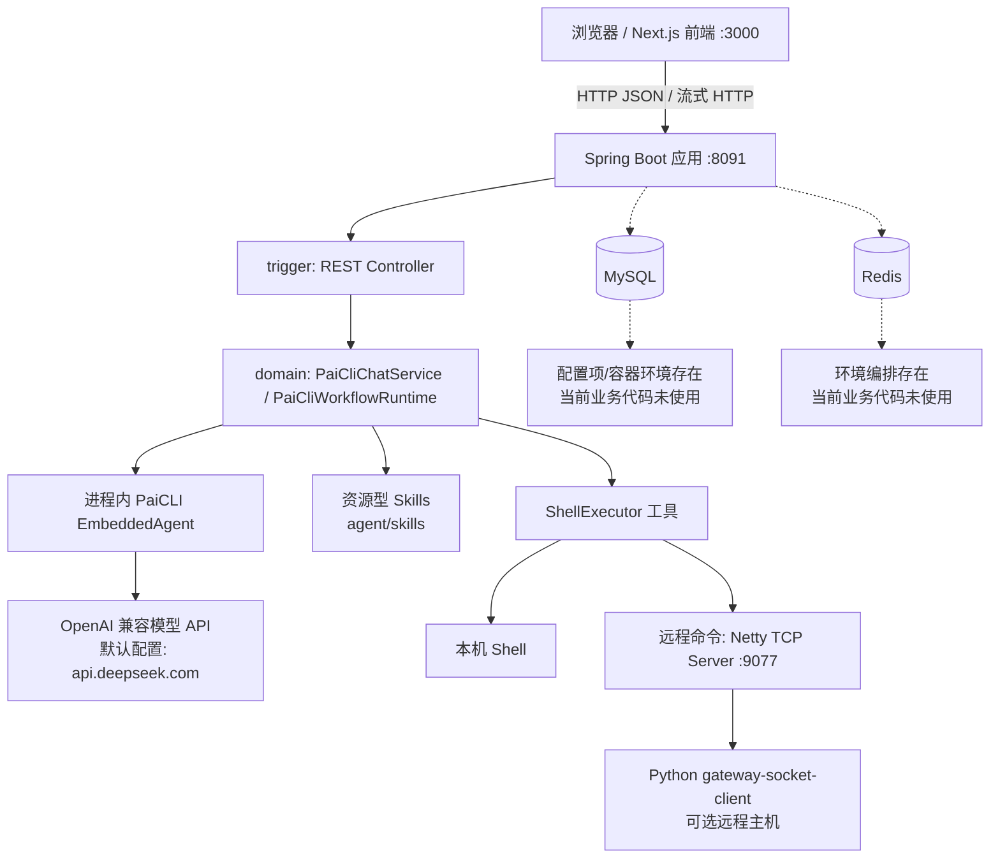
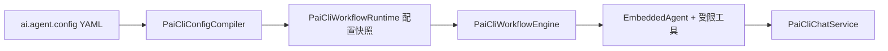
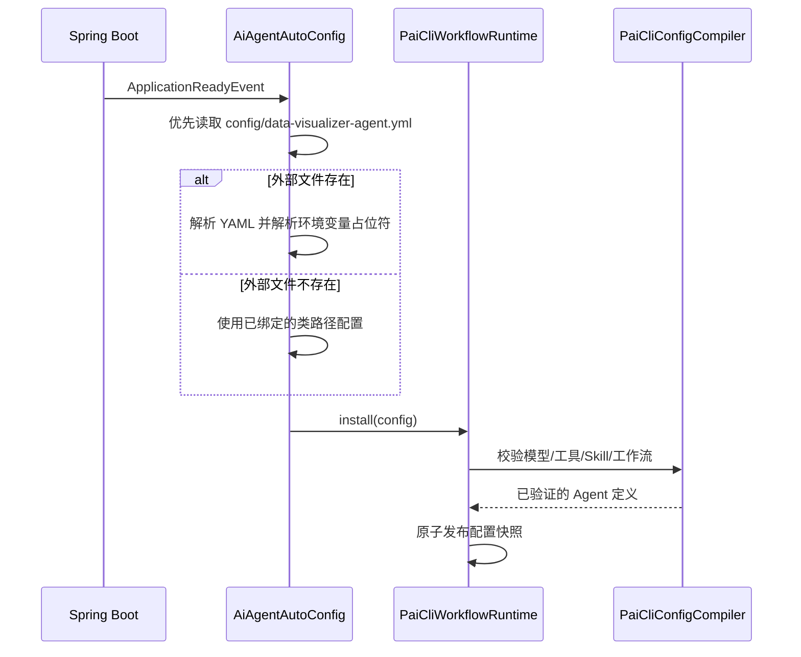
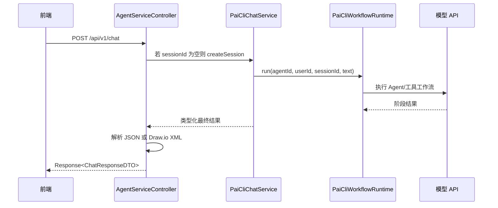
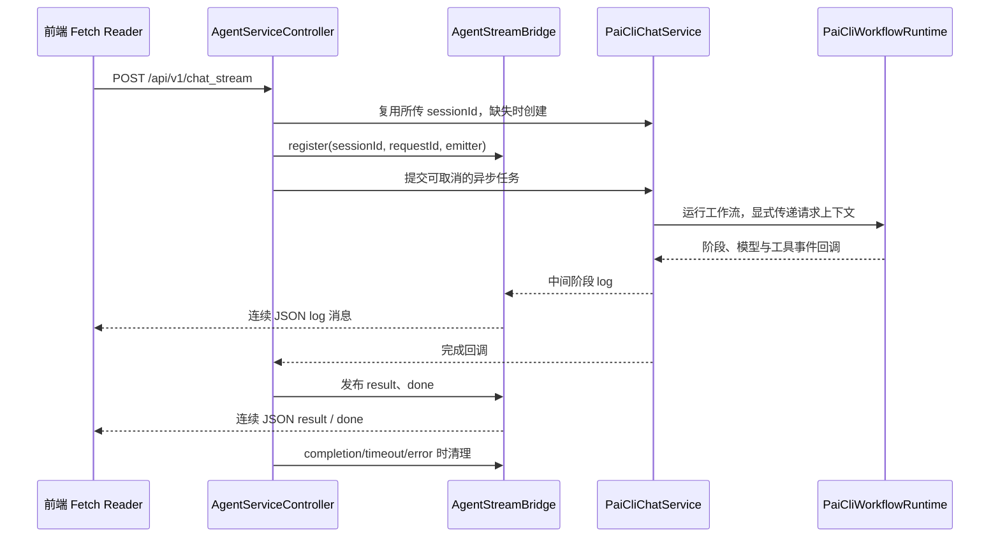

# Architecture

> 本文以仓库当前源码、配置、SQL 和容器文件为依据，描述已实现的架构。未由代码证明的内容均标为“未知/待确认”。

## 1. 系统概览

该仓库当前是一个**模块化单体后端**与独立 Next.js 前端组成的 AI 绘图应用，不是微服务系统。Maven 聚合的 Java 模块在一个 Spring Boot 进程中运行；前端通过 HTTP 直接访问后端。生产对话入口将 YAML 定义的 Agent 装配为进程内 PaiCLI 工作流，通过 OpenAI 兼容接口调用配置的模型，并把最终结果解析为普通文本或 Draw.io XML。Agent 运行源码与依赖已从 Google ADK / Spring AI 切换到本仓库的 PaiCLI 模块。还存在一个可选的 Netty TCP 命令网关：Agent 可调用本机 shell，或经 TCP 长连接请求远程 Python 客户端执行命令。

当前默认 Agent 配置为“分析 → 绘图 → 审核”的串行工作流，配置目标模型端点为 DeepSeek 的 OpenAI 兼容 API。绘图阶段（时序图除外）输出紧凑的 `drawio_graph` JSON DSL（节点、连线、语义类型，无坐标无 XML），由服务端 `JsonToDrawioConverter` 确定性生成 Draw.io XML；时序图仍由 LLM 按旧协议直接生成 XML。前端包含普通对话、流式联调、Agent 配置编辑与 Draw.io 展示页面；登录是仅在前端实现的演示 Cookie 校验，并非后端认证。

## 2. 项目结构

| 路径/模块 | 当前职责 | 分类 |
| --- | --- | --- |
| `data-visualizer-app` | Spring Boot 启动模块、自动装配、线程池配置和资源配置 | 核心启动/配置 |
| `data-visualizer-paicli` | 迁入的 PaiCLI ReAct 内核源码、资源和受限嵌入 API；生产对话路径使用 | 内核模块 |
| `data-visualizer-trigger` | HTTP Controller，适配 API DTO 到领域服务 | 核心入口层 |
| `data-visualizer-domain` | PaiCLI 工作流与会话、流式桥接、MCP/Skills/Shell 工具 | 核心领域层 |
| `data-visualizer-infrastructure` | Netty TCP 服务端与 `IBusinessPort` 实现 | 基础设施 |
| `data-visualizer-api` | 对外 Java 接口、请求/响应 DTO、统一响应模型 | API 契约 |
| `data-visualizer-types` | `AppException`、响应码和通用常量 | 共享类型 |
| `data-visualizer-front` | Next.js 前端、对话和 Agent 配置 UI、Draw.io 渲染 | 独立前端 |
| `netty-socket-server` | 独立 Python 异步 TCP 服务端及 Python 网关客户端实现 | 辅助/可选工具 |
| `docs/dev-ops` | MySQL/Redis 环境编排、应用编排、SQL 初始化 | 运维辅助 |

Maven 直接依赖关系为：`app → trigger → (api, domain, types)`，`app → infrastructure → domain`，`domain → types`。`api` 仅提供接口与 DTO，`types` 为底层共享模块。`data-visualizer-front` 不在 Maven reactor 中。

`data-visualizer-domain` 依赖 `data-visualizer-paicli`，并提供 `IPaiCliWorkflowService` / `PaiCliWorkflowRuntime`。服务先校验配置、解析 Skill 资源，再原子发布可查询、可执行的配置快照；按 YAML 执行 sequential、parallel、loop 工作流。会话显式绑定 agentId、userId 和配置版本，同一会话的 turn 串行化，配置更新后旧会话在后续请求中失效。PaiCLI 嵌入入口使用可信 system instruction、受限工具注册表和内存记忆；仅装配 YAML 声明的 Shell/stdio MCP 工具，不开放 PaiCLI 内置 Shell、文件或 Web 工具。旧式 SSE MCP 配置在装配时明确拒绝。HTTP 与管理员配置入口均使用 PaiCLI 快照。

领域包目前主要集中在 `domain.agent`；`business`、大部分 `adapter/repository`、`dao`、`gateway`、`redis` 包只有 `package-info.java` 或空壳定义，不能视为已实现的业务/持久化层。

## 3. 技术栈

| 技术 | 代码/配置证据 | 当前使用结论 |
| --- | --- | --- |
| Java 17 | 根 `pom.xml` 的 `java.version`、编译 source/target | 已使用 |
| Spring Boot 3.4.3 | 根 POM parent | 已使用 |
| Spring MVC / Spring Web | REST Controller、`ResponseBodyEmitter` | 已使用 |
| PaiCLI 迁入源码 | `data-visualizer-paicli`、`EmbeddedAgent`、`PaiCliWorkflowRuntime` | 承担 Agent/ReAct 执行；源提交见 `UPSTREAM-SOURCES.txt` |
| OpenAI 兼容模型 API | `ConfiguredOpenAiClient` 使用 YAML 模型端点；默认 YAML 指向 DeepSeek | 已使用，具体模型/供应商可由 YAML 改变 |
| MCP | PaiCLI 受限工具装配；local Shell 与 stdio MCP | 生产路径支持 local/stdio；旧 SSE 配置明确拒绝 |
| Netty | `NettySocketServer` | 已使用，应用启动时绑定配置端口 |
| Next.js 16.2.10 / React 19.2.4 / TypeScript | 前端 `package.json` | 已使用 |
| `react-drawio` | 前端依赖和 Draw.io 面板 | 已使用 |
| MySQL / HikariCP | dev 数据源配置、Docker 环境、SQL | 数据源配置和环境存在；当前模块未引入有效 MyBatis 依赖，未发现业务 DAO 调用 |
| MyBatis | XML 配置/Mapper 文件存在，但 starter 与 YAML 配置均被注释 | 当前未启用 |
| Redis | 环境 compose 存在 Redis | 当前无 Redis 客户端依赖及业务调用，未使用 |
| RocketMQ / Kafka / Nacos / Elasticsearch | 未发现相关配置或源码调用 | 未使用/未知 |

## 4. 系统架构

后端以单个可部署 JAR 运行。Controller 位于 `trigger` 模块，调用 `domain` 中的 `IChatService` / `IPaiCliWorkflowService`；领域层依赖 `infrastructure` 提供的 TCP 网关端口实现。不存在服务注册、网关路由或跨服务 RPC 的代码。

当前生产 Agent 装配路径：

`AiAgentAutoConfig` 在 `ApplicationReadyEvent` 后优先读取工作目录 `config/data-visualizer-agent.yml`；若该文件不存在，才使用类路径已导入的 `agent/data-visualizer-agent.yml`。解析、装配异常会被记录，应用继续启动。

## 5. 模块职责

- `trigger`：`AgentServiceController` 提供 Agent 列表、会话、同步对话、流式对话；`AgentAdminService` 提供当前 Agent 配置查询和运行期更新。
- `domain`：`PaiCliWorkflowRuntime` 管理配置快照、显式归属的会话和工作流；`PaiCliChatService` 适配 HTTP 对话。`domain.agent.service.chat.converter` 包提供 `drawio_graph` JSON DSL 到 Draw.io XML 的确定性转换（解析校验、样式模板、分层网格布局）。PaiCLI 工具装配仅开启 YAML 声明的 Shell 或 stdio MCP 工具。
- `infrastructure`：`BusinessPort` 把领域网关请求转发给 `NettySocketServer`；Netty 以远端 IP 为键维护客户端 Channel，并按请求 ID 等待响应。
- `api`：固定 API DTO/接口和 `Response<T>` 返回格式。
- `types`：应用异常和错误码。
- `app`：启动 Spring；在启动完成时安装 PaiCLI 配置快照。
- `front`：`NEXT_PUBLIC_API_BASE`（默认 `http://127.0.0.1:8091`）决定 API 基地址。流式页面以 Fetch ReadableStream 读取连续 JSON 对象，不使用浏览器 `EventSource`。

## 6. 核心业务流程

### 6.1 启动与 Agent 装配

默认资源 YAML 定义 `testAgent03`（agent ID `100003`）。其中串行工作流依次执行需求分析、图形结构 JSON DSL 生成（时序图仍为 XML）、审查；循环与并行工作流也被配置，但 Runner 入口指定为串行工作流。配置可以由管理接口在运行期替换并重新装配。

### 6.2 同步对话

同步接口在 HTTP 请求线程等待整个 PaiCLI 工作流完成。Controller 仅解析工作流最终结果中的 JSON（`user`、`drawio`、`drawio_done`、`drawio_graph` 等）或 `<mxfile>/<mxGraphModel>`；识别到 `drawio_graph` 时调用 `JsonToDrawioConverter`（解析校验 → 布局 → 样式）生成 XML，失败则回退旧类型与 XML 提取，并统一返回 `type` 与 `content`。

### 6.3 流式对话

`ResponseBodyEmitter` 超时为 20 分钟。控制器使用专用的流式任务执行器和可取消的 `Future`；完成、超时和断开时幂等取消工作流、待审批项及请求专属 shell。前端按 JSON 花括号边界增量解析响应。

流式消息类型为 `log/result/error/done`，另有审批类型 `approval_required`/`approval_resolved`（stage=approval）。命令命中审批规则时，`CommandApprovalService` 创建待审批记录并通过 Bridge 发送 `approval_required`；用户决定经 `POST /api/v1/chat_stream/{requestId}/approval` 提交，Controller 只发布 Spring ApplicationEvent（进程内同步），监听器完成 `PENDING → APPROVED/REJECTED/EXPIRED/CANCELLED` 原子迁移并唤醒等待中的 `ShellExecutor`，随后发送 `approval_resolved`。待审批记录的并发数量受两级上限约束：整个 JVM 的 `command.execution.policy.max-pending-approvals`（默认 5）与单个 requestId 的 `max-pending-approvals-per-request`（默认 1）；超限的命令不创建记录、不发送审批事件、不进入等待，直接返回 `forbidden`，从而不会占用 Agent 执行线程。

命令执行上下文（requestId 等）作为不可变值传给工作流，并由 PaiCLI 的 `ToolInvocationContext` 显式带入并行工具线程。仅在 Shell 工具适配器入口设置 `CommandExecutionContextHolder`，在同一线程的 `finally` 中清理；无流式上下文时 Prompt 命令安全失败。取消会传至 PaiCLI 模型和工具调用，但已送往外部进程或远程主机的副作用不保证可撤销。

### 6.4 Shell 工具与远程命令（仅在 Agent 调用该工具时）

默认 YAML 的 `ShellExecutor` 被映射为受限 PaiCLI 工具 `mcp__ShellExecutor__execute`，仍调用原 `ShellExecutor`。旧外部 YAML 使用的 `ShellExecutorToolCallbackProvider` 名称作为兼容别名保留；两者均不创建 Spring AI 工具回调。命令在真正执行前统一经过策略审查；普通前缀规则模式的决策如下（全量审批模式见下文）：

工具 schema 明确将 `commandType` 限定为 `local|remote`（执行目标，不是 `cmd/bash/shell` 等 shell 类型），本地 `hostName` 应省略或为空，并向模型说明后端 OS 与 shell 选择顺序。Shell 适配器在调用执行器前校验参数；参数错误不执行命令，也不返回包含原始参数的 Jackson 异常。包含 `mcp__ShellExecutor__execute` 的工具批次按原顺序串行执行，避免同请求多个命令竞争审批槽位。

- `Allow`：命中本地/远程允许规则，直接执行；
- `Prompt`：命中可配置的审批规则，进入交互审批（见 6.3）；审批是每次命令的一次性用户决定，不是授权或策略修改；
- `Forbidden`：未命中任何规则、无法解析、包含危险控制结构、host 不在白名单等，直接拒绝且不可被审批绕过。

普通前缀规则模式按 `Allow < Prompt < Forbidden` 合并：复合命令任一子命令 Forbidden 则整体 Forbidden。`CommandExecutionPolicyProperties`（前缀 `command.execution.policy`）的类默认 prompt 规则为空；显式配置 prompt 为 `['*']` 时进入全量一次性审批模式，忽略直接执行规则，不使用普通模式的管道/重定向/多行结构限制，整段命令含独立 `rm` 词（大小写不敏感，包括路径及 `rm.exe`）则拒绝，其余有效命令均 Prompt。`format` 等单词不会因包含 rm 子串被拒绝。该检查是文本词匹配与简单引号/转义归一化，不是完整 shell 解析或沙箱。

当前 `application-dev.yml` 显式清空 local/remote allow，local/remote prompt 均为 `['*']`，remote host 列表也为 `['*']`（任意非空 host，实际执行仍需客户端在线）。命令非空、长度、NUL、类型和 host 一致性校验继续生效；无流式通道、审批拒绝/过期/取消及并发容量限制仍阻止执行。test/prod 未配置此模式，继续采用类默认策略。决定见 ADR-009。

`ShellExecutor` 按**请求作用域**持有本地 shell 进程（ADR-004）：作用域 key 默认为当前流式请求的 `requestId`，且只在 `LocalShellScope.resolve()` 一处解析，因此同一请求内的多条本地命令复用同一进程、请求之间互不共享。作用域内的 shell 依次尝试 `pwsh.exe`、`pwsh`、`bash`、`sh`。`clients` 是查询当前 Netty 客户端的特殊命令，不触碰本地 shell。`remote` 类型命令经 `BusinessPort` 发送至 Netty 客户端，按 UUID 请求 ID 等待最长 30 秒。

本地命令不会直接写入 shell，而是先提交到 core/max 均为 1 的有界单线程执行器（队列容量 `command.execution.policy.local-execution-queue-capacity`，默认 64），调用线程以 `Future.get` 等待（`local-execution-timeout-millis`，默认 30 秒，上限默认 300 秒）。超时只销毁**触发超时的那次请求**的 shell 并返回 `timeout`；执行器已关闭、队列满（`CallerRunsPolicy` 兜底会在调用线程被拒绝）、被中断或存活 shell 数达到 `max-concurrent-shells`（默认 8，达上限时按 LRU 淘汰空闲 shell，无可淘汰时拒绝）时返回 `unavailable`。因此同一时刻只有一个线程写入任一 shell，且挂死命令不会永久占用它。

shell 的生命周期由 `AgentServiceController.cleanupStream` 与 `LocalShellRegistry` 管理：请求结束时调用 `closeRequestShell(requestId)` 销毁该请求的 shell；`shell-idle-timeout-millis`（默认 20 分钟）在新建 shell 前做机会式空闲回收，只回收“当前空闲且请求已不在 `AgentStreamBridge` 中”的 shell；无请求上下文（如同步 `/api/v1/chat`）时使用一次性 shell，命令结束后立即销毁；Spring 上下文关闭时销毁全部 shell 与执行器。任何销毁都会重置该 shell 的 `cd`/环境变量。

审批相关状态由 `CommandApprovalService` + `PendingApprovalStore`（内存 `ConcurrentHashMap`，approvalId 主索引）维护，不在 `ShellExecutor` 单例中保存当前请求或审批 Future；每条记录使用独立 `CompletableFuture` 等待，超时/拒绝/取消通过 `AtomicReference` CAS 原子迁移。命令、审批事件与审计均对 Token、密码、Secret 等脱敏。

Python `gateway-socket-client` 代码会重连到 TCP 服务端，并将接收到的命令交给 `SafeCommandExecutor`。该 Python 工具是否在实际部署中运行、以及允许执行的具体命令白名单，需确认。

## 7. 数据层架构

开发配置包含 MySQL 8 JDBC URL 和 HikariCP 参数；根 POM 管理 MySQL/MyBatis 版本，`docs/dev-ops/mysql/sql/xfg-frame-archetype.sql` 可创建 `xfg_frame_archetype` 数据库及 `employee`、`employee_salary`、`employee_salary_adjust` 三张表。

但当前事实是：

- `data-visualizer-app` 和 `infrastructure` 的 MyBatis starter 依赖已注释；`application-*.yml` 的 MyBatis 配置也被注释。
- 未发现启用的 `@Mapper`、Mapper Java 接口、Repository 实现或对这些表的业务访问。
- 会话、Agent 当前配置、流式 Emitter 和 Netty 请求等待表均保存在 JVM 内存，不落 MySQL。

因此 MySQL/SQL 目前属于预留或环境脚手架，不能认定为当前 Agent 功能的数据持久层。数据库表与本项目当前功能的业务关联未知。

## 8. Redis 架构

`docs/dev-ops/docker-compose-environment.yml` 与阿里云变体会启动 Redis 6.2、Redis Commander；基础设施中有 `infrastructure.redis` 包说明。

未发现 Redis 客户端依赖、连接配置、缓存读写、发布订阅或分布式锁实现。当前 Redis 对运行中 Agent、会话、流式消息和配置不产生作用；Redis 与 MySQL 一致性机制不存在。

## 9. 消息队列架构

未发现 RocketMQ、Kafka 或其他消息队列的依赖、生产者/消费者或相关配置。`trigger.listener` 的包注释仅提及可以采用 Spring Event、Guava EventBus 或 Redis 发布订阅，未构成实际实现。

当前异步行为来自 PaiCLI 工作流、模型调用和流式任务执行器，不是消息队列。没有 MQ 与数据库的一致性、消费幂等或重试机制。

## 10. 事务与一致性

未发现 `@Transactional`、数据库写入流程、分布式事务、Outbox、消息可靠投递或补偿事务。

当前一致性边界主要是进程内并发容器：

- `PaiCliWorkflowRuntime.sessions`、`AgentStreamBridge.requestEmitters`、Netty 的 `clientMap`/`pendingResponses` 使用 `ConcurrentHashMap`。
- 流式清理使用 `AtomicBoolean` 确保同一请求的 dispose/clear 只执行一次。
- 命令待审批记录使用 `ConcurrentHashMap`（approvalId 主索引）保存，状态经 `AtomicReference` CAS 从 `PENDING` 原子迁移到终态，每条记录持有独立 `CompletableFuture`，由 `onCompletion/onTimeout/onError` 幂等取消。
- Netty 命令使用请求 ID 关联 `CompletableFuture` 和响应；等待 30 秒超时后删除 pending 项。
- 工作流按会话串行执行；请求上下文显式传到 PaiCLI 阶段与工具工作线程。

结论：当前系统无需处理已实现数据库/MQ 写入的一致性，但也没有持久化保证。应用重启或多实例部署会丢失会话映射、动态更新配置和在途流状态；没有跨实例一致性方案。

## 11. 异常处理

- 两个 HTTP Controller 在每个端点内捕获 `AppException` 和通用 `Exception`，并返回统一 `Response<T>` 错误码；未发现全局 `@ControllerAdvice` / `@ExceptionHandler`。
- `chat_stream` 返回的是 `ResponseBodyEmitter`，执行中的异常通过 `error` 流消息和清理逻辑处理；在 Emitter 注册前发生的异常只会结束 Emitter，响应契约不同于普通 JSON 接口。
- PaiCLI 工具失败异常保留首个失败工具名称与脱敏、限长的结果说明，不附带原始调用参数；工具失败时若取消上下文已取消，则归类为取消异常。
- Agent 启动装配失败仅记录日志并允许 Spring Boot 继续运行。因此应用可能健康启动但没有已注册 Agent。
- Netty 启动、协议 JSON 解析、连接异常会记录日志；发送命令的失败或超时转为 `RuntimeException`。
- 未发现 Spring Retry、Resilience4j、熔断、限流、降级或面向外部模型/MCP 的重试逻辑。

## 12. 配置与部署

### 应用配置

`application.yml` 默认 profile 为 `dev`。dev profile 使用 HTTP 端口 `8091`、Netty 端口 `9077`，导入默认 Agent YAML 与 `application-secret.yml`。test/prod 文件保留相同 HTTP/线程池配置，但其数据源和 MyBatis 配置被注释；根 POM 的 prod profile 设置 `-Dspring.profiles.active=release`，而资源中未发现 `application-release.yml`，其实际生效配置待确认。

Agent API key 通过 `${open-ai.key}` 从 `application-secret.yml` 解析。该文件当前位于源码资源目录且包含明文凭据；文档不重复其具体值。

### 容器部署

根 `Dockerfile` 多阶段构建后端 JAR 与前端，并在 Node 22 Alpine + OpenJDK 17 runtime 中由 `start.sh` 同时运行 Next.js（3000）和 Spring Boot（8091），暴露 TCP 9077。镜像复制 skills 到 `/app/frontend/agent/skills`，但 `AiAgentAutoConfig` 查找的是当前工作目录下的 `config/data-visualizer-agent.yml` 或后端 JAR 类路径资源；该复制目录是否供运行期 Skills 正确解析需在实际容器中确认。

根 `docker-compose.yml` 将 3000、8091、9077 映射到宿主机，并默认通过 `host.docker.internal` 访问 MySQL 与 HTTP(S) 代理。它不启动 MySQL/Redis；二者可由 `docs/dev-ops/docker-compose-environment.yml` 单独启动。旧的 `data-visualizer-app/Dockerfile` 和 `docs/dev-ops/docker-compose-app.yml` 只部署后端，与根容器方案不同。

开发与生产差异中已明确的部分是：dev 默认配置包含数据源和 Agent YAML import；prod 数据源仍被注释。生产外部模型、MCP、数据库、反向代理、TLS、日志采集及多副本拓扑均无法从当前代码确认。

## 13. 当前架构风险

1. **明文凭据位于受版本控制的资源目录。** `data-visualizer-app/src/main/resources/application-secret.yml` 包含模型服务凭据，且 dev profile 直接 import。泄露仓库、镜像或构建产物时，凭据可能暴露。
2. **Agent 可被跨域匿名请求调用，且默认具备本机 shell 工具。** 两个 Controller 设置 `@CrossOrigin(origins = "*")`，未见后端认证/授权；默认 Agent YAML 启用 `ShellExecutor`，它可将模型工具调用写入本地 shell。若服务被非受信网络访问，可能造成高风险命令执行。
3. **所有关键运行状态仅在单进程内存。** PaiCLI 会话、动态 Agent 配置、Emitter 注册表、Netty 客户端、pending 请求和命令待审批记录都在内存。重启会丢失状态；部署多个实例时状态不共享，导致会话/流式/远程命令关联和交互审批不稳定。
4. **流式任务执行器没有队列上限。** `AgentServiceController` 使用专用的缓存线程池；并发慢模型或等待审批会占用执行线程，未配置总并发与队列限额。
5. **同步对话会阻塞 HTTP 请求线程。** `PaiCliChatService.handleMessage` 等待整个模型/工具工作流结束。外部模型或 MCP 延迟高时，Servlet 工作线程被占用，吞吐会下降。
6. **运行期 Agent 配置更新仍不持久化。** 管理接口完整校验并原子发布新快照，旧会话随后失效；重启后更新丢失。
7. **Netty 远程命令通道以源 IP 识别客户端且无认证。** `NettySocketServer` 使用 `remoteAddress.hostString` 作为键，新的同 IP 连接会覆盖旧 Channel；协议为未认证的换行 JSON TCP。NAT、多客户端同 IP 或非受信网络接入会造成命令投递错误或被冒用。
8. **当前默认配置的可用性依赖外部模型和本机环境。** 默认装配需要有效模型凭据及可达 DeepSeek API；Shell 工具依赖可执行的 `pwsh.exe`/`pwsh`/`bash`/`sh`。装配异常不会阻断应用启动，可能形成 HTTP 服务正常但 Agent 不可用的状态。
9. **交互审批不等于后端授权。** 当前无后端认证，任何能同时拿到 `requestId` 与 `approvalId` 的调用方都能提交一次性审批决定；审批记录只存活于当前 JVM 与当前流式连接，断连即取消，事件经进程内 ApplicationEvent 同步传递，不承诺崩溃恢复或跨实例一致性。

## 14. 后续演进建议

以下为建议，不是当前已实现能力：

- 将模型密钥移出版本控制资源，使用部署环境密钥管理，并立即轮换已写入文件的凭据。
- 在公开部署前为 API 与 Netty 网关增加认证、授权、来源限制和审计；审查并限制 Agent 可调用的本机/远程命令。
- 若需要多实例或重启恢复，将会话、动态配置和必要的任务状态迁移到明确的持久化/共享状态方案，并定义配置更新的版本与并发语义。
- 为模型、MCP 和流式执行配置有界专用执行器、超时、重试/熔断策略及可观测性指标。
- 若 MySQL/Redis 是未来目标，先补齐实际 Repository/Mapper、迁移与事务边界，再在架构文档中将其列为运行时数据层。

## 15. AI 开发注意事项

- 修改 `AiAgentConfigTableVO`、`AiAgentAutoConfigProperties` 或 `agent/*.yml` 时要同时考虑 `PaiCliConfigCompiler` 的校验。`runner.agent-name` 必须指向已定义的阶段或工作流；`tool-mcp-list` 的 local 名称使用 `ShellExecutor`，旧名称仅作为兼容别名。非空的旧 `plugin-name-list` 会被明确拒绝。
- Agent ID 由 PaiCLI 配置快照管理，也是前端 API 传入的 `agentId`；会话显式绑定 agentId、userId 和配置版本。更新配置后旧会话失效。
- 维护流式接口时应保持连续 JSON 消息格式及 `log/result/error/done` 类型，且每条必须包含 request ID。前端 `consumeJsonMessages` 依赖该格式；`ResponseBodyEmitter` 的注册、完成、超时和错误路径都必须清理相同请求。
- Draw.io 输出兼容性依赖后端 `parseChatResponse` 和前端 `extractDrawIoXml`：它们识别 `user`、`drawio`、`drawio_node`、`drawio_edge`、`drawio_done`、`drawio_graph` JSON，以及 `<mxfile>`/`<mxGraphModel>` XML。`drawio_graph` 由 `JsonToDrawioConverter` 转换为 XML（节点 id 重编号、样式来自 `StyleTemplates`、坐标来自 `SimpleGridLayout`），转换失败必须回退旧路径。修改提示词或解析逻辑前应保留这些约定。
- 维护流式日志时要以每次请求的 `requestId` 路由事件；PaiCLI 工具线程的不可变请求上下文只在 Shell 适配器入口绑定，并在 `finally` 清理。
- 修改 `GatewayCommandEntity`、`GatewayResponseVO` 或 Netty 编解码时，同时检查 Java Netty 服务端与 Python `netty-socket-server`/`gateway-socket-client`；双方使用换行分隔 JSON、请求 ID 关联和主机字符串匹配。
- MySQL、MyBatis XML、Redis compose 文件当前未接入业务代码。不要假定修改 SQL 或 Redis 配置会改变现有 Agent 行为；接入前需同步补齐依赖、配置、实现与验证。
