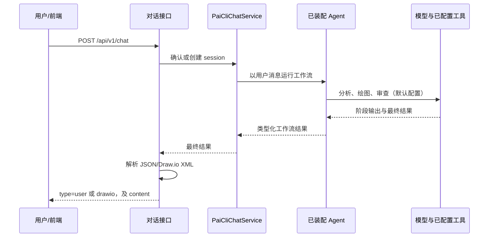
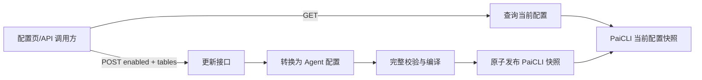
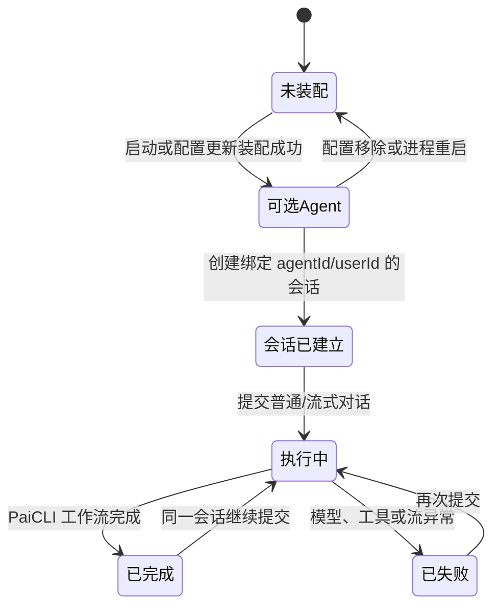

# Business

> 本文仅描述当前代码能证明的业务行为。仓库根 README 是 DDD 脚手架说明、前端 README 是 Next.js 模板说明，均不作为业务结论依据。未由代码确认的信息明确标为“未知/待确认”。

## 1. 业务概览

当前系统呈现为一个面向交互式 AI 绘图的工作台。前端从配置列表中展示 Agent，用户可选择其 ID 并输入自然语言请求；默认 Agent 会依次分析需求、输出图形结构 JSON DSL（时序图仍直接生成 XML）、审查输出，服务端将 JSON DSL 确定性转换为 Draw.io XML。若用户信息不足，默认配置要求 Agent 返回补充信息；若可生成图，前端会展示最终 XML 对应的 Draw.io 图。

> 配置列表与实际可运行 Agent 由同一 PaiCLI 快照提供；启动装配失败时对话接口和列表查询会返回错误。

用户也可以使用普通对话页或流式联调页。流式页会展示 Agent、模型和工具执行过程中的日志，并在结束后显示最终文本或图形。前端还有“Agent 配置”页面，可读取并提交当前运行中的 Agent 配置，使后端重新装配 Agent。

默认资源配置中的唯一 Agent 是 ID `100003`、名称“单一智能体”。它的实际入口工作流为“需求分析 → 绘图 → 审查”。配置还定义了循环优化和并行生成工作流，但默认 Runner 不以它们作为入口。

系统没有实现用户注册、后端登录、角色管理、图表保存/删除/分享、会话历史查询、支付、订单等业务。MySQL 初始化表与当前 Agent 功能无已证明的业务关联。

## 2. 业务角色

| 角色 | 当前可执行操作 | 权限或限制 |
| --- | --- | --- |
| 工作台访问者（前端） | 使用 `admin/admin` 演示账号进入前端；选择 Agent；发起普通或流式对话；查看图形结果；访问配置页 | 前端路由仅检查浏览器 Cookie 中是否有 `user`；此 Cookie 可由客户端构造，且后端不校验 |
| API 调用方 | 查询 Agent 列表、创建会话、调用对话/流式对话、查询/更新 Agent 配置 | 后端 Controller 未实现身份认证、角色鉴权、数据归属校验或管理权限校验 |
| Agent 配置维护者（业务含义） | 提交 `enabled` 与 `tables` 形式的配置，触发运行期 Agent 重装配 | 当前没有代码将其限制为管理员；任何可访问接口的调用方均可尝试操作 |
| 已装配 AI Agent | 根据自身 YAML 指令处理用户输入，调用配置的模型、Skills 或工具，并输出文本/Draw.io 内容 | Agent 是否能处理某一请求由模型和 YAML 指令决定；不是后端强制业务规则 |
| 可选远程命令客户端 | 当 Agent 决定调用 remote shell 工具时，接收命令并返回执行结果 | 是否实际部署、客户端可执行命令范围、客户端操作人员均待确认 |

“管理员”在前端仅作为硬编码演示账号名称出现，不代表后端已存在管理员业务角色。

## 3. 核心业务对象

| 对象 | 业务含义与来源 | 生命周期/归属 |
| --- | --- | --- |
| Agent 配置表（`AiAgentConfigTableVO`） | 定义 Agent 的标识、描述、模型端点、工具、子 Agent、工作流和 Runner 入口。默认来自类路径 YAML，也可来自工作目录配置或管理 API | 先完整校验，再发布当前 JVM 内的 PaiCLI 快照；列表、管理查询和执行从同一快照读取。重启后回到启动配置 |
| 可运行 Agent 定义 | 由配置编译出的 PaiCLI 工作流、阶段指令、模型和受限工具定义 | 以 `agentId` 保存在当前配置快照中；更新时完整替换可用 Agent 集合，移除的 Agent 不再可创建会话 |
| 会话（PaiCLI 会话） | 以调用方提供的 Agent ID 与 user ID 运行的上下文容器，用于连续对话 | 每次创建均生成独立 session ID，显式绑定 agentId、userId 和配置版本；同一会话 turn 串行执行，配置更新后旧会话失效，不跨进程恢复 |
| 对话请求/结果 | 用户发送的 `agentId`、`userId`、可选 `sessionId` 和文本消息；结果是文本或 Draw.io XML | HTTP 请求级对象，不落库；当前公开 HTTP DTO 仅支持文本 |
| 流式执行记录 | 一个 `requestId` 对应一次流式 Emitter、执行日志、最终结果/错误/完成信号 | 仅在请求执行期间内存存在；完成、超时或异常后清理；前端不保存日志 |
| Draw.io 图 | Agent 输出 `drawio_graph` JSON DSL 时由服务端 `JsonToDrawioConverter` 生成的 `<mxGraphModel>` XML，或 Agent 直接输出的 `<mxfile>`/`<mxGraphModel>` XML；前端解析并展示 | 没有图表 ID、持久化、版本、编辑提交或删除业务 |
| 网关命令/响应 | Agent 的 Shell 工具对远程客户端发出的命令和带相同 ID 的响应 | 只在 TCP 往返期间存在；成功/错误由客户端响应携带，不落库 |

## 4. 核心业务流程

### 4.1 进入工作台（演示登录）

**业务目标：** 让前端访问者进入对话工作台。

**前置条件：** 在前端输入的账号和密码均为 `admin`。

**操作与结果：** 前端在浏览器写入包含用户和时间戳的 Cookie，保存期为 7 天，然后跳转至流式对话页。各前端页面只要读取到合法 JSON 且存在 `user` 字段，便视为已登录。

**异常：** 空账号/密码或不匹配会在前端显示错误，不调用后端。

**重要边界：** 这是演示 UI 行为，不是后端身份认证；后端 API 不读取此 Cookie。

### 4.2 查询并选择可用 Agent

**业务目标：** 用户了解当前可用的 Agent，并选择其处理对话。

**前置条件：** 前端页面能访问后端，且 PaiCLI 配置快照已安装成功。

**操作步骤：**

1. 前端请求 `GET /api/v1/query_ai_agent_config_list`。
2. 后端从当前 PaiCLI 配置快照读取每个配置的 Agent ID、名称和描述。
3. 前端将列表放入选择器，用户选定 `agentId`。

**后置结果：** 用户得到 Agent 元数据，不得到模型密钥、工作流或工具完整配置。

**异常：** 列表查询或启动装配失败时返回统一错误响应；前端将其显示为后端不可用/列表加载失败。

### 4.3 创建或复用会话

**业务目标：** 让同一用户对同一 Agent 的连续消息在一个 Agent 会话上下文中处理。

**前置条件：** `agentId` 必须存在于当前 PaiCLI 快照；`userId` 由调用方提交，当前无真实性校验。

**操作步骤：**

1. 调用方请求 `POST /api/v1/create_session`，或发送对话时没有传 `sessionId`。
2. 后端校验 Agent 存在与 ID 非空。
3. 创建新的 session ID，并将 Agent ID、user ID 与配置版本绑定。

**状态变化：** 当前 JVM 增加一条 `sessionId → (agentId, userId, 配置版本)` 映射。

**后置结果：** 每次创建请求得到新的 session ID；后续对话传入该 ID 才能延续会话。

**异常：** Agent 不存在、会话归属不匹配或配置更新后会话失效会走类型化领域错误，并由 Controller 返回统一错误响应。不存在结束会话、可信用户身份验证或跨实例会话同步。

### 4.4 普通对话与绘图结果返回

**业务目标：** 用户提交文本请求，并一次性获取 Agent 的最终回答或 Draw.io 图。

**前置条件：** Agent 存在；调用方传入可用的 `agentId`、`userId` 和消息。`sessionId` 可省略，省略时后端创建/复用会话。

**状态变化：** 可能首次建立内存会话；没有消息记录或图表记录落库。

**后置结果：** Controller 只取工作流最终文本作为候选结果，识别 `user`、`drawio`、`drawio_done`、`drawio_graph` 等 JSON 或 XML；识别到 `drawio_graph` 时由服务端转换器生成 XML（失败回退旧类型）。识别到 XML 时返回 `type=drawio`；否则以 `type=user` 返回文本。

**异常：** Agent 对应 Bean 不存在时，当前实现可能由 Spring 缺失 Bean 异常进入通用 `0001`；代码中的 `E0001` 分支并不能保证覆盖该情形。模型、工具或其他异常同样通常进入 `0001`（未知失败）。请求结果是等待整个 Agent 工作流完成后才返回，并非后台任务成功确认。

### 4.5 流式对话与执行可见性

**业务目标：** 用户在 Agent 执行期间看到运行、Agent、模型和工具日志，并获取最终回答/图形。

**前置条件：** 与普通对话相同。流式 Controller 复用请求中的 sessionId；未传时新建会话。

**操作步骤：**

1. 前端发起 `POST /api/v1/chat_stream` 并持续读取 HTTP 响应体。
2. 后端创建 `requestId`，注册流式上下文，并异步运行 Agent。
3. PaiCLI 阶段、模型正文和工具事件经请求回调转成 `log` 消息。
4. 完成时后端按最终文本解析并发送 `result`，随后发送 `done`；失败时发送 `error`。
5. 完成、超时（20 分钟）或异常会关闭并清理流上下文。

**状态变化：** 仅创建临时内存流上下文；最终结果并不会自动保存为图表或会话历史。

**后置结果：** 用户在同一 HTTP 响应中收到连续 JSON 对象。前端将 XML 结果显示在 Draw.io 面板。

模型正文日志按阶段聚合为完整行，较长的无换行正文分段发送，纯空白片段不展示；工具、状态或阶段事件前，以及最终结果或错误前，会发送尚未推送的正文。日志不再按单个 token 展示。

**异常：** 模型/工具错误会尽量以 `error` 推送；Emitter 写入失败、超时或早期异常可能使浏览器只看到连接失败。用户点击“停止”会触发服务端清理并向 PaiCLI 发出取消信号；已经交给外部进程或远程主机的副作用不保证撤销。

工具失败时，流式错误包含首个失败工具名称及脱敏、限长的原因，便于区分参数错误、策略拒绝和执行失败。Shell 的 `commandType` 仅接受 `local|remote`；`cmd/bash/shell` 等值会被判为参数错误，命令不执行。

### 4.6 查看与更新运行中 Agent 配置

**业务目标：** 查看当前生效的 Agent 配置，或在不重启应用的情况下提交新配置重新装配 Agent。

**前置条件：** 调用方可访问 `/api/v1/admin/*`；当前没有后端管理员认证。提交结构必须可被转换为 `AiAgentAutoConfigProperties`，并含可装配的 tables。

**状态变化：** PaiCLI 当前配置快照被原子替换，旧版本会话在后续请求中失效。更新不写配置文件、数据库或缓存。

**后置结果：** 管理查询接口返回当前快照中的 `enabled` 和 `tables`；列表与新请求从同一快照读取。新配置中移除的 Agent 不能继续创建会话；在途请求保留进入时的配置版本。

**异常：** 配置结构错误、不支持的 MCP/Skill/插件配置装配失败时接口返回 `0001` 或具体 `AppException`；旧快照继续生效。没有持久化回滚或审计记录。

### 4.7 Agent 调用本机或远程命令（条件流程，含策略审查与交互审批）

**业务目标：** 当模型认为需要检索本地环境或执行命令时，为 Agent 提供工具结果。默认 Agent 配置已提供 `ShellExecutor` 工具，但是否调用由模型决定。命令执行前必须先通过服务端策略审查与交互审批；当前 dev 配置要求所有有效的非 rm 命令均由用户允许一次。

**前置条件：** Agent 已被配置该工具；应用环境存在 `pwsh.exe`、`pwsh`、`bash` 或 `sh` 中至少一个。远程执行还需对应 IP 的 TCP 客户端在线。命中审批规则的命令还要求调用来自有效的流式请求（已生成并注册 requestId）。

**主路径：**
1. 审查：local/remote 命令统一由策略审查。普通模式按 allow/prompt 前缀和命令结构判断；显式 prompt `['*']` 切换为全量审批模式：独立 `rm` 命令或词直接拒绝，其他有效命令（含管道、重定向、多行）进入 Prompt，不通过 allow 直接执行。当前 dev 对 local/remote 均启用该模式，并允许选择任意非空、实际在线的远程 host。无效参数和审批容量限制仍会拒绝；Forbidden 不可被审批绕过。
2. `Prompt`：服务端创建内存待审批记录（approvalId 绑定 requestId、命令类型、host、命令摘要），通过当前流式连接发送 `approval_required`，等待 Agent 工具线程返回决定。
3. 用户在前端选择“允许一次”或“拒绝”，调用 `POST /api/v1/chat_stream/{requestId}/approval`；后端校验 `requestId + approvalId`、待审批状态与有效期后，把状态原子迁移到 `APPROVED/REJECTED`。
4. 批准后重新校验命令摘要、host 白名单与当前策略；二次审查通过才执行 local/remote 命令，批准不等于执行成功。

**结果：** local 命令由该请求专属的本地 shell 执行（同一请求内多条命令复用同一 shell，请求结束或超时后销毁，环境状态不跨请求）；remote 命令通过 TCP 客户端执行并最多等待 30 秒。命令结果返回 Agent，作为后续回答/绘图的输入。`clients` 是 local 类型下查询当前远程客户端的特殊命令。

**异常：** 找不到 shell、命令执行失败、目标客户端不存在或 30 秒超时会使工具调用失败；拒绝、超时、取消、无流式上下文或二次审查失败时不执行命令并返回 `forbidden`。命令参数中的 Token、密码、Secret 等以脱敏值展示与审计。

**限制：** 审批状态仅存当前 JVM 内存（重启/多实例丢失）；审批依赖当前流式连接，断连即取消；当前无后端认证，能拿到 requestId/approvalId 的调用方即可提交一次性决定，不能视为真实授权。普通 `/api/v1/chat` 没有交互审批通道，无流式上下文时 Prompt 命令安全失败。

## 5. 业务状态流转

当前没有订单、审批等持久化业务状态机，也没有统一状态对象、状态字段或迁移校验。下图仅是根据代码归纳的运行期生命周期示意，不是已实现的持久化业务状态机。

- 会话没有显式结束或删除 API；配置更新会使旧版本会话在后续请求中失效，服务重启会使内存会话丢失。
- 流式请求有“已注册 → 日志/结果/错误 → done 或清理”的生命周期，但没有对外可查询的任务状态。
- 命令审批有内存态 `PENDING → APPROVED/REJECTED/EXPIRED/CANCELLED`，只能从 `PENDING` 原子迁移一次；超时（默认 60s）变 `EXPIRED`，流式完成/超时/错误/断开时未决审批变 `CANCELLED`，随请求清理一并移除，不落库。
- 配置中的 loop 工作流有 `max-iterations`（默认 3）限制；默认资源配置的 `loop_refinement` 明确设置为 3 次。它不是默认入口状态机的一部分。

## 6. 业务规则

以下规则由代码直接体现：

1. **对话与创建会话依赖当前 PaiCLI 快照。** 运行前按 `agentId` 查找已编译 Agent 定义；不存在时返回统一错误响应。
2. **会话显式校验归属。** 单 JVM 内以随机 session ID 关联 Agent ID、user ID 和配置版本；错误归属及旧版本会话不能继续执行。userId 仍由调用方自行声明，不构成认证。
3. **默认 Agent 的业务处理顺序是分析、绘图、审查。** 默认 YAML 的 Runner 指向 `sequential_draw_process`，其子 Agent 顺序固定为 `agent_analyst`、`agent_drawer`、`agent_reviewer`。
4. **默认绘图交付协议要求结构化输出。** YAML 指令要求绘图 Agent（时序图除外）输出单行 `drawio_graph` JSON DSL（nodes: id/label/kind，edges: source/target/label/kind），坐标与样式由服务端转换器生成；时序图仍按旧协议输出 drawio_node/drawio_edge/drawio_done XML；信息不足时应输出 `{"type":"user","content":"..."}`。这是默认 Agent 提示词规则，模型不遵守时后端会回退旧类型尽力解析。
5. **服务端对可识别的最终结果统一为文本或图形。** Controller 支持 `user`、`drawio`、`drawio_done`、`drawio_graph`，以及 XML 片段；`drawio_graph` 由服务端转换器生成 XML 后以 `type=drawio` 返回；`drawio_node`/`drawio_edge` 可被识别为支持类型，但单独不会形成最终图形响应。
6. **流式接口结果有 20 分钟传输窗口。** 超时后 Emitter、审批与请求 shell 清理，向 PaiCLI 传递取消信号；已经发生的外部副作用不保证撤销。
7. **本机/远程命令仅在 Agent 工具调用时发生。** 业务 API 没有独立的 shell 命令接口；默认模型可见该工具，实际调用由模型决定。
8. **运行期更新完整替换 Agent 快照。** 更新请求仅有 `enabled` 和 `tables`；配置先校验再原子切换。新配置中移除的 Agent 立即从列表和创建会话入口消失；旧版本会话在下次执行时失效。
9. **命令策略由显式配置选择。** 普通模式默认拒绝未命中 allow/prompt 的命令，决策按 `Allow < Prompt < Forbidden` 合并。全量审批模式（prompt 含 `*`）拒绝独立 rm 词，其余有效命令必须审批；当前 dev 使用该模式，test/prod 仍使用类默认规则。同批次 Shell 调用按顺序逐条执行与审批，避免单请求审批槽位竞争。
10. **Prompt 只在有效流式请求中产生一次性审批。** 请求上下文显式传至 PaiCLI 工具线程；Shell 入口缺少有效上下文或流式连接已不存在时 Prompt 安全失败，不等待也不执行。一次审批对应唯一 `approvalId`，并绑定唯一 `requestId`、命令类型、host 与命令摘要，前端不能借审批修改命令内容。
11. **审批决定只能一次生效。** `approve_once/reject` 经 `PENDING → APPROVED/REJECTED` 原子迁移；重复决定不能改变已确定的终态，错误 approvalId/requestId 不影响其他审批；批准不等于命令执行成功。
12. **审批批准后必须二次审查。** 重新校验审批状态、requestId、命令摘要、host 与当前策略；二次审查为 `Forbidden` 或请求已取消/清理时不执行。
13. **审批随流生命周期清理且上下文不泄漏。** 超时变 `EXPIRED`；流完成/超时/错误/断开未决审批变 `CANCELLED`。Shell 的 ThreadLocal 上下文只在工具调用线程入口设置，并在同一线程的 `finally` 中清理。
14. **审批非授权与展示脱敏。** 当前无后端认证，能访问接口的调用方在持有 requestId/approvalId 时可提交一次性决定，不能视为可信授权；审批事件、日志与审计对 Token、密码、Secret 脱敏。第一版不落库、不支持多实例共享、不提供永久/会话级授权与审批历史查询。
15. **本地命令串行执行且有超时。** 本地命令由单线程执行器串行执行，默认超时 30 秒（可配，上限 300 秒）；超时后强制销毁并重启本地 Shell，命令返回 `timeout`，后续命令仍可执行。执行器队列满、已关闭或被中断时返回 `unavailable`。超时只保证调用方不再等待，不保证已发出的底层命令没有产生副作用。
16. **命令审批有并发上限。** 同时处于待审批（PENDING）的命令数量受整个服务（默认 5）与单个请求（默认 1）两级限制；超限的命令直接返回 `forbidden`，不创建待审批记录、不发送审批事件、不占用执行线程等待。审批进入终态或被请求清理后槽位立即释放，因此同一请求可以先后产生多次审批，但不会同时挂起多个等待线程。
17. **本地 shell 按请求隔离且为短生命周期。** 一次流式对话请求（`requestId`）独立持有自己的本地 shell，同一请求内的多条命令顺序复用，不同请求之间不共享工作目录、环境变量与 shell 变量。请求结束（完成/超时/断开/异常）即销毁该 shell；本地命令超时只销毁触发超时的那次请求的 shell，不影响其他请求；存活 shell 数受上限约束（默认 8），达上限时淘汰最久未使用的空闲 shell。任何销毁都会重置 shell 的工作目录与环境变量，因此不承诺跨请求状态保持。命令被拒绝、审批未通过或不需要本地执行的命令（`remote`、`clients`）不会创建任何进程。

工作流运行时会拒绝空白消息并校验主要 Agent 配置字段；HTTP 层仍未限制消息最大长度、验证 userId 真实性、完整校验旧格式图形 XML 或鉴别管理操作权限。

## 7. 权限与数据归属

当前前端有访问门槛，但后端没有对应权限边界：

- 前端页面通过名为 `ai_agent_login` 的 Cookie 决定是否跳转到登录页；登录成功仅表示浏览器写入了 `{ user, ts }`。
- 普通/流式对话请求的 `userId` 由前端请求体提供，后端直接使用它创建/查找会话，不与 Cookie、Token 或服务端用户绑定。
- `/api/v1/admin/query_current_agent_config` 与 `/api/v1/admin/update_agent_config` 没有权限检查，虽路径含 `admin`，但不能认定为管理员专属能力。
- 管理查询接口将当前 `tables` 原样放入响应；该配置可包含模型 `apiKey`。在当前无认证条件下，不能把该接口当作安全的内部配置读取能力。
- Controller 对所有来源设置 `@CrossOrigin(origins = "*")`，未实现后端会话、Token 或 Owner 校验。

结论：当前没有可由后端强制执行的“谁只能操作自己的数据”规则。会话校验所传 agentId/userId 与创建时绑定值一致，但 `userId` 来自客户端，真实性无法保证。

## 8. 幂等与重复操作

| 操作 | 当前重复行为 |
| --- | --- |
| 重复创建会话 | 每次获得新的随机 session ID；调用方需保留要继续使用的 ID |
| 不同 Agent 或 user ID 使用现有会话 | 归属不匹配时拒绝执行；user ID 仍由调用方声明 |
| 同一对话请求重复提交 | 每次都会运行一次 Agent；没有请求幂等键、消息去重或结果缓存 |
| 同一审批决定重复提交 | 第一次成功的决定生效（`AtomicReference` CAS 原子迁移）；重复提交返回 already_resolved/not_found 等，不会改变已确定的终态，也不影响其他审批 |
| 同一流式请求重复提交 | 每次生成新的 request ID 并再次运行 Agent；没有去重 |
| 重复更新 Agent 配置 | 每次都会执行重新装配；没有版本、幂等键或变更比较 |
| 远程命令 | 每次工具调用生成 UUID 请求 ID；这只用于响应关联，不阻止命令重复执行 |

应用重启、多实例或并发配置变更时，创建会话的“复用”保证不成立或范围未知，因为映射仅存在本地进程。

## 9. 异步业务

流式对话是当前明确的异步用户体验：接口建立后立即返回可读取的响应体，Agent 在后台执行，用户随后陆续收到日志和最终结果。用户收到 `done` 才表示该次流式调用的 PaiCLI 工作流已完成；收到 HTTP 连接建立成功或首条日志不代表图形已经生成。

普通对话没有业务异步：用户请求持续等待，直至工作流完成才得到结果。

远程命令在业务上是“Agent 等待工具结果”的同步步骤：Netty 通过 `CompletableFuture` 最多等待 30 秒，因此 Agent 完成前仍依赖该结果或失败。不使用消息队列、延迟任务或后台落库任务。

## 10. 数据一致性语义

- 对话结果、图形和流日志只在当前请求/浏览器状态中可见，不存在“最终异步落库后再可见”的语义。
- 会话创建成功后，当前 JVM 内的 PaiCLI 会话立即可供归属匹配的后续请求使用；应用重启后不保证保留。
- 配置更新接口成功返回时，PaiCLI 快照已原子替换；管理查询、列表和新请求读取同一版本，旧会话随后失效。没有持久化副本或跨实例同步。
- MySQL 和 Redis 没有被当前 Agent 业务读写，所以不存在当前已实现的缓存-数据库、消息-数据库一致性规则。
- 流式日志允许逐步可见，最终文本/XML 在完成回调中集中发出；用户可能先看到执行日志，后看到最终图形，或仅看到错误/连接终止。

## 11. 删除语义

当前没有业务对象删除 API，也没有会话、配置、图形、对话记录的删除/逻辑删除/物理删除流程。

提交不含某个 Agent 的新 `tables` 会从当前 PaiCLI 快照移除它；列表和创建会话接口不再接受该 Agent。旧版本会话随后失效。

可以观察到的清理仅是技术生命周期：流式 Emitter 在完成、超时或错误后被从内存移除；Netty 断开时客户端 Channel 从内存移除。它们不等同于用户可操作的业务删除。

## 12. 异常业务场景

| 场景 | 当前处理 | 用户/调用方可见结果 |
| --- | --- | --- |
| Agent ID 不在当前快照 | PaiCLI 返回类型化领域错误 | 普通接口转换为统一错误响应，流式接口发送 `error` 或在早期失败时结束 Emitter |
| Agent 配置或装配失败 | 启动期记录错误但应用继续；运行期更新返回错误，保留原快照 | 首次启动可能没有可用 Agent；运行期失败不产生部分新配置 |
| 模型、MCP、Skill 或 Shell 工具调用失败 | 异常向上抛出；流式日志插件尝试发送 `error` | 普通对话通常得到 `0001`；流式用户可能收到 `error` 或连接异常 |
| 远程命令客户端未连接 | Netty 抛出 `E0003` | 工具调用失败，最终对话表现取决于 Agent/接口异常处理 |
| 远程命令 30 秒未响应 | Netty 删除 pending 请求并抛出运行时异常 | 工具调用失败；没有自动重试或补偿 |
| 登录演示凭据不正确 | 前端本地校验失败 | 页面提示账号或密码错误，不请求后端 |
| 后端不可访问 | 前端捕获 Fetch 错误 | 页面记录“接口不可用/加载失败”并显示错误信息 |

## 13. 业务不变量

当前没有发现由持久化模型或状态机强制执行的领域不变量。以下是不同层级的当前约束，不能都视为业务不变量：

1. **运行前置约束：** 对话运行前必须能从当前 PaiCLI 快照按 `agentId` 取得工作流定义。
2. **内存实现约束：** 单 JVM 内，session ID 显式绑定 agentId、userId 和配置版本；同一会话 turn 串行执行。
3. **网关协议约束：** 一次远程网关命令的响应必须以相同请求 ID 关联，才能完成等待中的命令。这是技术协议约束，不是用户业务规则。
4. **默认配置约束：** 默认串行绘图流程中，审查 Agent 的输入依赖绘图 Agent 的 `draft_diagram` 输出，绘图 Agent 的输入依赖分析 Agent 的 `analysis_result` 输出。它仅适用于默认 YAML 工作流；运行期可提交不同配置，不能泛化为所有 Agent 的系统不变量。

未发现持久化数据的唯一性、不允许回退的业务状态或金额/库存等领域不变量。

## 14. 跨模块业务流程

### 用户请求到图形展示

- `data-visualizer-front` 负责选择 Agent、提交 `userId`/消息、接收文本或连续 JSON、提取 Draw.io XML 并展示。
- `data-visualizer-trigger` 是 HTTP 业务入口，负责创建/确定会话、将结果适配为 API 响应。
- `data-visualizer-domain` 负责按 Agent 配置构建工作流、调用模型与工具、管理内存会话和流日志桥接。
- `data-visualizer-api` 固定前后端可见的请求/响应数据结构。
- `data-visualizer-types` 提供 Agent 不存在等业务错误码。

这条链路的业务目的，是将用户自然语言请求转换为可展示的文本答复或 Draw.io 图；各模块没有各自独立部署或独立数据库。

### Agent 请求远程环境信息/命令结果（可选）

- `domain` 的 `ShellExecutor` 作为模型工具决定 local 或 remote 命令路径。
- `infrastructure` 的 `BusinessPort`/Netty 服务把远程命令交给按 IP 连接的客户端，并等待响应。
- `netty-socket-server/gateway-socket-client` 的 Python 客户端执行接收的命令并返回文本结果。

这条链路的业务目的，是在 Agent 对话中补充本机或远程环境信息；不是独立的终端管理产品流程。远程客户端实际部署与授权规则未知。

## 15. 当前业务风险

1. **前端演示登录不保护后端业务操作。** 用户可通过前端 Cookie 进入页面，但后端不验证 Cookie/Token；对话 `userId` 可由请求方任意指定，配置接口也无管理员授权。影响是会话归属和“配置维护者”边界无法可信执行。
2. **管理配置接口可能暴露模型密钥。** 管理查询将 `tables` 原样返回，其中可包含模型 `apiKey`；接口无认证且允许任意来源跨域。影响是能调用该接口的任意方可能获取模型访问凭据。
3. **默认 Agent 能在模型决定时调用受限 Shell 工具。** 默认配置启用 Shell 工具，且控制器允许任意来源跨域调用。命令仍经过 Allow/Prompt/Forbidden 策略与一次性审批；后端缺少可信调用者身份。
4. **Agent 配置更新可能由任意 API 调用方触发。** `/admin` 路径不做鉴权，更新只保存在内存；虽然新快照完整替换旧 Agent 集合，重启后仍会丢失运行期更新。
5. **对话、图表和会话没有业务留存。** 所有内容和会话映射均为内存/浏览器状态。影响是刷新、服务重启或更换实例后，用户无法查询历史对话、恢复图表或继续原有上下文。
6. **重复提交会重复运行模型和工具。** 普通/流式对话均无幂等键；同一请求可能多次调用模型、生成不同图形或重复执行工具命令。影响是成本、结果一致性及远程命令副作用不可控。
7. **会话归属仍缺少可信身份保护。** PaiCLI 会话绑定 agentId/userId，但 `userId` 由调用方声明；知道其他用户 ID 与 session ID 的调用方可能冒用身份。
8. **Agent 结果的业务格式只做宽松解析。** 默认提示词要求严格 JSON/XML；后端会从文本中扫描候选 JSON/XML，`drawio_graph` 会经过解析校验（悬空边跳过、重复 id 保留首个、未知类型回退默认样式），但旧路径不会验证完整 Draw.io XML。影响是模型输出偏离协议时，用户可能看到普通文本、残缺图形或不可渲染结果。
9. **配置中的 `enabled` 不构成已证明的启停规则。** `AiAgentAutoConfigProperties.enabled` 会被返回和更新，但装配流程未据此跳过 Agent 装配。影响是业务页面显示“禁用”时，Agent 是否不可用不受当前代码保证。

## 16. 后续业务规划

当前代码没有明确的产品路线图，以下仅是代码中可观察到的未完成/可扩展方向，不能视为已实现业务：

- 公开 HTTP 对话 API 尚未接收文件或图片，因此面向用户的多模态上传流程未实现。
- 配置模型支持 directory/resource Skills、local/stdio/SSE MCP；默认仅实际配置 local Shell 工具。外部 MCP、目录 Skills 是否准备提供给用户，待确认。
- Agent 配置定义 loop 与 parallel 工作流，默认入口未使用它们；是否要向用户提供多方案并行生成或循环优化选择，待确认。
- 数据库、Redis、MyBatis XML 和环境编排存在，但当前没有与 Agent 对话、图表或配置绑定的数据业务。是否计划保存用户、会话、图表或配置，待确认。

## 17. AI 开发注意事项

- 不要把前端 `admin/admin` 当作后端管理员权限；若新增敏感业务能力，应先明确并实现服务端身份、授权和用户 ID 可信来源。
- 不能破坏“已注册 Agent 才能对话”的检查；会话由显式 `sessionId` 绑定 Agent、用户和配置版本，调整绑定或失效规则时必须定义迁移/隔离语义。
- 默认绘图链路依赖 `analysis_result → draft_diagram → final_result` 的 output key 和分析、绘图、审查顺序；调整 Agent YAML、工作流或解析逻辑时必须一并评估最终 Draw.io 交付。`drawio_graph` JSON DSL 的样式/布局规则固化在 `StyleTemplates` 与 `SimpleGridLayout` 中，修改 kind 枚举时需同步更新提示词与 SKILL.md。
- 流式调用必须保留 `log`、`result`、`error`、`done` 消息语义和 request ID 关联；前端以此决定日志展示、最终图形与结束状态。
- 对话和工具调用不是幂等的。若新增重试、前端自动重发或后台队列，必须先定义模型调用和 shell/远程命令的重复执行业务后果。
- `enabled` 当前只是配置字段和查询结果，不能假定它会自动禁用 Agent；若要赋予启停含义，需要明确影响范围并实现一致行为。
- 图形、会话、配置更新均没有持久化。新增保存、删除、分享或多实例能力时，应先定义数据归属、访问权限、历史版本和重启恢复规则。
- Shell/远程命令是 Agent 对话的一部分，不应在未定义授权、审计和执行范围前扩大暴露面。

### 待确认的业务信息

- 目标用户是否仅限内部开发/运维人员，还是面向一般终端用户。
- 运行期 Agent 配置是否应仅由管理员维护，以及实际的认证/审计要求。
- 生成的 Draw.io 图是否需要保存、版本化、分享或导出；当前均未实现。
- `userId` 的真实来源、用户身份体系和会话跨设备/跨实例连续性要求。
- Shell 与远程命令的允许范围、Python 客户端的实际部署位置和执行授权。
- Agent 配置 `enabled` 的预期业务含义。
