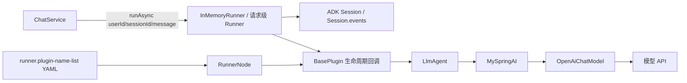
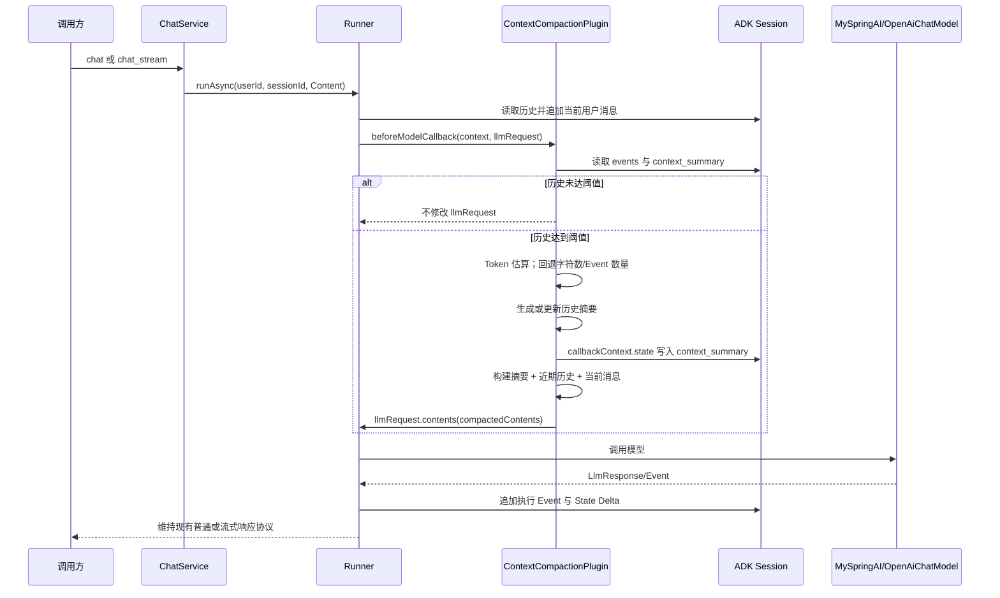

# TASK-001 模型上下文压缩插件

## 1. 背景

当前 AI Agent 的多轮对话使用 Google ADK `InMemoryRunner` 与 `InMemorySessionService`。同一会话不断追加用户消息、Agent 输出和工具调用结果，导致每次模型调用的历史上下文及 Token 消耗持续增长，长会话可能超过模型上下文窗口。

本任务引入请求侧上下文压缩：历史达到阈值时，将较早历史归纳为摘要，保存为 Session State 中的 `context_summary`，并让模型接收“摘要 + 最近完整历史 + 当前请求”。该过程不得删除或改写 `Session.events`。

本任务不实现 Session 持久化、物理裁剪或跨实例共享。

## 2. 当前状态

### 2.1 已具备能力

- `data-visualizer-domain` 已通过 `ArmoryService → RunnerNode` 将 YAML 的 `runner.plugin-name-list` 装配为 `BasePlugin` 列表，并传给 `InMemoryRunner`。
- 默认 Agent YAML `data-visualizer-app/src/main/resources/agent/data-visualizer-agent.yml` 已配置 `myTestPlugin`、`myLogPlugin`。
- `MyLogPlugin` 已实现 ADK 的 `beforeModelCallback(CallbackContext, LlmRequest.Builder)`，证明当前版本可在模型调用前读取/修改 `LlmRequest.Builder`。
- `ChatService` 以 `agentId:userId → sessionId` 的 JVM 内存映射复用会话；Session 由 `runner.sessionService().createSession(appName, userId)` 创建。
- 同步对话直接使用注册的 `InMemoryRunner`；流式对话以 `Runner.builder()` 创建请求级 Runner，并复用原 Runner 的 `sessionService()`、`artifactService()`、`memoryService()`、Agent 和插件列表。
- `MySpringAI` 最终将 ADK `LlmRequest` 转为 Spring AI `Prompt`，再调用 `chatModel.call(prompt)` 或 `streamingChatModel.stream(prompt)`。

### 2.2 当前实现链路



`RunnerNode` 按配置名从 Spring 容器获取 `BasePlugin`，写入 `AiAgentRegisterVO.plugins`，再构造 `InMemoryRunner`。`ChatService.createRequestRunner` 在流式请求中复制插件列表，仅将名为 `MyLogPlugin` 的插件替换为带 `requestId` 的请求专属实例；其他插件保持复用。

`ChatService.userSessions` 只保存 Session ID 映射；ADK `Session` 保存 Event 历史和 State。当前使用 `InMemorySessionService`，重启后丢失。

### 2.3 涉及模块、接口与数据设施

| 项目项 | 当前情况 | 本任务关系 |
| --- | --- | --- |
| `data-visualizer-domain` | Agent 装配、会话执行、插件、模型适配 | 必须修改 |
| `data-visualizer-app` | 默认 Agent YAML、Spring Boot 测试 | 必须修改配置；应补充测试 |
| `data-visualizer-trigger` | HTTP 对话与流式接口 | 不需要修改 |
| `data-visualizer-api` | HTTP DTO 与服务接口 | 不需要修改 |
| MySQL / MyBatis | 当前 Agent 对话未使用 | 不涉及 |
| Redis | 当前 Agent 对话未使用 | 不涉及 |
| MQ | 当前未使用 | 不涉及 |
| HTTP API | 已有 `/api/v1/chat`、`/api/v1/chat_stream` | 不新增、不变更 |

仓库中未发现与本功能相关的 ADR 或历史 Task。`docs/bug-notes/chat-stream-session-and-emitter-summary.md` 已确认：请求级流式 Runner 必须复用原 Runner 的 `sessionService()`，否则会出现 `Session not found`。

### 2.4 当前缺口

当前 `Session.events` 会持续累积，而 `MyLogPlugin.beforeModelCallback` 仅记录日志，不会控制发给模型的 `LlmRequest.contents`。长会话存在上下文窗口耗尽、输入 Token 成本上涨和模型响应质量下降风险。

本任务解决模型输入上下文无限增长，不应扩大为 Session 存储、持久化或历史审计重构。

## 3. 功能目标

在多轮会话历史超过可配置或集中定义的阈值时，将较早历史归纳为 `context_summary`，并在每次模型调用前将请求上下文限制为“既有摘要 + 最近完整历史 + 当前请求”，同时保留 ADK `Session.events` 的完整原始记录。

## 4. 用户场景

工作台访问者或 API 调用方在同一 Agent 会话中连续发起普通或流式对话。对话历史达到阈值后，后端自动压缩早期上下文；调用方继续使用原有接口，不需要提交新参数或改变 API 调用方式。

普通接口仍返回文本或 Draw.io XML；流式接口仍发送 `log`、`result`、`error`、`done` 类型的连续 JSON 消息。

## 5. 前置条件

- 请求指定的 `agentId` 已成功装配为可运行的 Agent Runner。
- 请求使用 Runner 可找到的 `sessionId`；缺失时仍沿用现有创建/复用流程。
- Agent 的 `runner.plugin-name-list` 已配置新的上下文压缩插件 Bean 名，且名称与 Spring Bean 名严格一致。
- 参与摘要生成的模型能力或摘要服务可用；其具体模型来源见 Open Questions。

本任务不新增登录、权限或用户归属校验。

## 6. 后置条件

历史未达到阈值时，模型请求内容与当前行为等价，不生成或更新摘要。

历史达到阈值且压缩成功时：

- 当前 Session State 包含或更新字符串键 `context_summary`。
- 当次模型请求不再携带全部早期 Event，而携带摘要和完整保留窗口内的近期上下文。
- `Session.events` 不被删除、截断或重排。
- 同一 `sessionId` 的后续调用可读取并继续更新既有摘要。
- HTTP 响应、Draw.io 解析规则和流式协议不变。

## 7. 任务范围

### 7.1 Goals

- 新增独立的 `ContextCompactionPlugin`，使用 ADK `beforeModelCallback` 在模型请求发送前执行压缩策略。
- 基于 `CallbackContext.events()` 读取会话历史，并基于 `CallbackContext.state()` 读取/写入 `context_summary`。
- 定义明确的阈值策略：优先 Token 估算；不可用时按字符数；仍不可用时按 Event 数量兜底。
- 定义上下文组成规则：保留系统指令、已有摘要、当前用户请求、最近若干轮完整历史，以及不可拆分的工具调用/工具响应关联内容。
- 使用 `LlmRequest.Builder.contents(...)` 改写当前模型请求，不修改 Session 原始 Event 历史。
- 在默认 `data-visualizer-agent.yml` 的 `runner.plugin-name-list` 中注册插件。
- 确保同步和流式请求均能使用该插件；流式请求不得丢失该插件。
- 为压缩逻辑增加聚焦测试和至少一个 Agent 会话集成验证路径。

### 7.2 Non-Goals

- 不继承、复制或修改 ADK `InMemoryRunner` 源码。
- 不将 `InMemoryRunner` 替换为自定义 `BaseSessionService`、MySQL/Redis SessionService 或其他持久化会话方案。
- 不删除、裁剪、归档或改写 `Session.events`。
- 不引入 MySQL、Redis、MQ、任务队列、向量数据库、外部记忆服务或新微服务。
- 不增加或修改 HTTP API、DTO、Controller、前端页面、前端流式解析协议。
- 不修改 Agent 编排顺序、`analysis_result → draft_diagram → final_result` 工作流约定或 Draw.io 输出解析。
- 不顺带修复 `chat_stream` Session ID 覆盖、认证授权、线程池、模型重试等既有问题。
- 不设计历史查询、图表保存、会话删除或跨实例恢复能力。

## 8. 业务规则

1. 压缩只影响送往模型的 `LlmRequest.contents`，不得删除或修改 `Session.events`。
2. `context_summary` 是 Session State 内部键；不得通过现有 HTTP API 新增响应字段。
3. 只有历史达到阈值时才允许生成或刷新摘要；未达到阈值不得额外发起摘要模型调用。
4. 新摘要必须以已有摘要为输入进行累积更新，不能仅概括新截取的一段历史。
5. 最近保留窗口必须包含当前用户消息；工具调用和对应工具结果不得拆开后只保留一侧。
6. 系统指令、模型/工具配置及既有 Agent 指令必须保留，压缩只处理对话历史。
7. 摘要生成失败时，主对话不得因压缩功能失败；必须记录可诊断信息，并按明确降级策略继续执行。
8. 同一 Session 的并发请求没有业务级串行化保证；不得假设 `context_summary` 的读-改-写天然原子。
9. 不改变 `agentId:userId → sessionId` 复用语义。
10. 流式请求临时 Runner 必须继续复用原 Runner 的 `sessionService()`、`artifactService()`、`memoryService()`、入口 Agent。

## 9. 核心业务流程



## 10. 数据变化

### 10.1 Session 内存数据

不修改数据库。唯一新增运行时数据是 ADK Session State 中的：

| 项 | 类型 | 写入时机 | 说明 |
| --- | --- | --- | --- |
| `context_summary` | `String` | 历史达到阈值且摘要成功时 | 供后续模型请求拼接的历史摘要 |

`Session.events` 保持完整。Session/State 仍由 `InMemorySessionService` 保存在 JVM 内存，重启后丢失。

### 10.2 MySQL

不涉及新表、字段、索引、读写或迁移。

### 10.3 Redis

不涉及 Key、TTL、缓存读写或失效策略。

### 10.4 MQ

不产生消息、不增加消费者，也没有幂等消费或失败重试设计。

## 11. API 变化

无 API 变化。继续复用：

- `POST /api/v1/chat`
- `POST /api/v1/chat_stream`
- `POST /api/v1/create_session`

请求参数、响应 DTO、普通响应码及流式 `log/result/error/done` 消息格式不得变更。压缩在服务端内部自动生效。

## 12. 技术实现方案

### 12.1 推荐方案：独立 ADK Plugin 的请求侧软压缩

在 `data-visualizer-domain` 的现有插件包下新增 `ContextCompactionPlugin`，继承 ADK `BasePlugin`。不要与 `MyLogPlugin` 合并。

在 `beforeModelCallback(CallbackContext callbackContext, LlmRequest.Builder llmRequest)` 中：

1. 获取 `callbackContext.events()`、`callbackContext.state()` 和 `llmRequest.build()`。
2. 计算待发送上下文：优先使用可获得的模型 Token 估算；无法精确估算时使用统一保守字符估算；无法形成有效估算时以 Event 数量作为最终阈值。
3. 未达到阈值时，不调用摘要服务、不改写请求。
4. 达到阈值时，分割“需要压缩的早期完整轮次”和“近期保留窗口”；必须识别用户、模型、工具调用/响应和部分 Event，避免切断工具关联。
5. 读取旧 `context_summary`，将旧摘要和新增纳入压缩范围的历史交给摘要组件，生成累积摘要。
6. `callbackContext.state().put("context_summary", summary)` 写入 State Delta。
7. 用系统指令、摘要、近期完整历史和当前用户消息组成 `List<Content>`，调用 `llmRequest.contents(compactedContents)`。
8. 返回允许 ADK 继续模型调用的 Plugin 返回值；不得在插件中伪造 `LlmResponse`。

推荐新增单一职责的摘要组件（例如 `ContextSummaryService`），负责 Event/Content 转换、摘要 Prompt、摘要模型调用和输出校验；Plugin 只负责阈值、Session State 与请求改写。

### 12.2 插件装配与流式兼容

`ContextCompactionPlugin` 必须注册为 Spring Bean，并将对应 Bean 名加入默认 YAML：

```yaml
runner:
  plugin-name-list:
    - myTestPlugin
    - myLogPlugin
    - contextCompactionPlugin
```

实际 Bean 名、插件名称和 YAML 名称必须一致。`RunnerNode` 已以 `getBean(pluginName)` 装配，无需增加装配框架。

流式 `ChatService.createRequestRunner` 仅替换 `MyLogPlugin`。新插件应设计为无请求共享可变状态，会话数据均从 `CallbackContext` 读取；如果实现确实持有请求状态，必须按 `MyLogPlugin` 模式在请求级 Runner 复制，避免并发串扰。

### 12.3 为什么不采用其他方案

| 方案 | 不采用原因 |
| --- | --- |
| 继承或修改 `InMemoryRunner` | Runner 负责 ADK 调度，且构造函数固定创建内存服务；会将上下文策略耦合到执行器，扩大改动面。 |
| 自定义/包装 `BaseSessionService` | 适合持久化、物理裁剪或跨实例会话；本任务不删除 Event，无需改变存储层。 |
| 在 `ChatService` 拼接历史 Prompt | `ChatService` 不负责 ADK Event 到 LLM Request 的构建，会绕开多 Agent、工具调用和统一 Plugin 生命周期。 |
| 合并到 `MyLogPlugin` | 日志和压缩职责不同；会增加带 `requestId` 的流式插件实例的并发风险。 |
| 引入 Redis/MQ/向量库 | 项目当前未使用，需求只需请求侧软压缩。 |

### 12.4 对现有系统的影响

- 影响长会话模型输入，短会话应保持等价行为。
- 默认 YAML 增加一个插件，默认 Agent 自动启用。
- 同步与流式路径均会执行压缩；流式协议不变。
- 触发压缩可能额外产生模型调用、延迟和成本，必须由阈值控制。
- Session 仍为内存态，摘要与原始历史均在重启后丢失。

## 13. 影响范围

### 13.1 必须修改

- `data-visualizer-domain`：新增上下文压缩 Plugin 与摘要组件；必要时增加仅供该功能使用的策略/配置对象。
- `data-visualizer-app/src/main/resources/agent/data-visualizer-agent.yml`：在默认 Runner 的 `plugin-name-list` 启用新插件。
- `data-visualizer-app/src/test/java`：补充阈值判断、请求改写、State 写入、同步/流式兼容性测试。

### 13.2 可能修改（Coding Agent 必须先确认）

- `data-visualizer-domain/.../service/chat/ChatService.java`：仅当新插件需要请求级实例或流式复制策略需要兼容时修改；无状态插件不应修改此文件。
- Agent 配置对象：仅当阈值必须由 YAML 配置且现有 `AiAgentConfigTableVO.Module.Runner` 无承载字段时扩展；优先确认现有字段。
- 测试资源：如需无外部模型依赖的 Event/Session fixture，可新增到对应 `src/test/resources`。

### 13.3 不应该修改

- `data-visualizer-trigger` Controller、`data-visualizer-api` DTO/API 契约。
- 前端 `data-visualizer-front`。
- `ArmoryService`、Agent 工作流节点、MCP/Shell 工具、Netty 网关。
- MySQL、MyBatis、Redis、MQ、Docker Compose。
- `docs/architecture.md`、`docs/business.md`。

## 14. 实施步骤

1. **确认 ADK 0.5.0 Plugin 回调与 Event 结构。** 明确 `beforeModelCallback` 的调用次数、`CallbackContext.events/state` 语义，以及 `LlmRequest.contents` 的内容结构；定义用户/模型/工具/部分 Event 的筛选与配对策略。
2. **定义压缩策略与集中阈值。** 明确 Token 优先、字符数回退、Event 数量兜底；定义近期窗口、最大摘要长度、摘要刷新与失败降级规则。
3. **实现摘要组件。** 负责旧摘要和早期历史的累积摘要、摘要 Prompt、模型调用及空结果/异常处理；不让异常破坏主对话。
4. **实现 `ContextCompactionPlugin`。** 在 `beforeModelCallback` 中读取历史/State、判断阈值、生成摘要、写入 `context_summary`、替换 `llmRequest.contents`；禁止修改 `Session.events`。
5. **接入 Agent 装配。** 注册 Spring Bean 并更新默认 YAML；验证 `RunnerNode` 与 `AiAgentRegisterVO.plugins`；确认流式 Runner 保留插件并复用原 SessionService。
6. **补充测试和验证说明。** 用 mock/fake 覆盖核心逻辑及会话兼容性；由开发人员按仓库约定手动运行测试，Coding Agent 不主动执行构建/测试命令。

## 15. Acceptance Criteria

- [x] 新增独立的 `ContextCompactionPlugin`，在 `beforeModelCallback` 执行压缩；不得将职责并入 `MyLogPlugin`。
- [x] 默认 `data-visualizer-agent.yml` 的 `runner.plugin-name-list` 已配置新插件 Bean 名，且装配后的 `AiAgentRegisterVO.plugins` 包含该插件。
- [x] 历史未达到阈值时，不调用摘要组件、不写 `context_summary`、不改写 `LlmRequest.contents`。
- [x] 历史达到 Token 阈值时，生成或更新 `context_summary`，并经 `callbackContext.state()` 写入。
- [x] Token 估算不可用时按字符数回退；Token/字符均无法可靠判断时按 Event 数量回退；三个分支都有测试。
- [x] 压缩后请求包含系统指令、已有/更新摘要、近期完整上下文及当前用户消息，不包含已被摘要替代的早期完整历史。
- [x] 工具调用与对应工具响应不会在压缩边界被拆开，测试覆盖该场景。
- [x] 压缩前后 `Session.events` 的内容和顺序不变。
- [x] 摘要生成异常、空内容或格式异常时，主对话继续执行，并记录可诊断信息。
- [x] 同步与流式对话均保留新插件；流式请求复用原 Runner 的 `sessionService()`，不因本任务产生 `Session not found`。
- [x] `/api/v1/chat`、`/api/v1/chat_stream` 的请求/响应结构和 `log/result/error/done` 语义未改变。
- [x] 新增或更新的 JUnit/Spring Boot 测试不依赖 `application-secret.yml` 中的真实凭据。

## 16. 测试要求

### 16.1 单元测试

至少覆盖：

- 未达到阈值时不压缩、不写 State、不调用摘要服务。
- Token 阈值触发压缩。
- Token 估算失败时按字符数触发。
- Token/字符均不能可靠判断时按 Event 数量触发。
- 已存在 `context_summary` 时，新摘要累积旧摘要和新增旧历史。
- 压缩后的 `LlmRequest.contents` 保留系统指令、当前消息和近期窗口。
- 工具调用与工具响应配对保留或共同摘要。
- 摘要服务异常、空摘要或非法摘要时的降级行为。
- 原 `Session.events` 未被修改。

### 16.2 集成测试

至少覆盖：

- Agent YAML 能装配 `contextCompactionPlugin`。
- 同一个 `agentId + userId` 的多次调用复用同一 `sessionId`，压缩 State 在后续调用可见。
- 流式请求创建请求级 Runner 后，新插件仍在插件列表中，且其 `sessionService()` 与注册 Runner 相同。

### 16.3 执行约束

仓库要求使用 PowerShell 7，且不需要由 Coding Agent 主动执行构建或测试命令。实现完成后由开发人员手动执行相关测试；交付中应列出建议验证命令与未执行原因。

## 17. Risks

| 风险 | 原因 | 降低措施 |
| --- | --- | --- |
| 压缩丢失关键信息，长会话回答质量下降 | 摘要不完整、保留窗口过小或工具关联断裂 | 使用结构化摘要模板；保留近期完整轮次；工具调用/响应成对处理；为 Draw.io 约束设置专门摘要字段。 |
| 摘要调用增加成本和延迟 | 每次达到阈值可能增加模型调用 | 仅阈值触发；避免重复压缩同一历史；限制摘要长度；记录触发次数。 |
| 递归压缩 | 摘要组件复用同一 Runner/Plugin 调用链 | 摘要调用必须绕开同一 Agent Runner Plugin 链，或使用明确内部调用标记/独立模型客户端；实现前确认。 |
| 并发覆盖 `context_summary` | 同一 Session 的读-改-写并非天然原子 | Plugin 不共享可变字段；测试同 Session 并发；明确最终语义。 |
| 流式 Session 不可见 | 新建 Runner 或未复用 SessionService 会产生另一内存仓库 | 保留现有 `createRequestRunner` 的 Service 复用逻辑，不新建流式 `InMemoryRunner`。 |
| 阈值估算不准确 | 字符/token 换算与实际 tokenizer 有偏差 | 使用保守阈值和安全余量；优先模型 tokenizer；记录实际输入 Token 供调优。 |
| 敏感工具结果进入摘要 | 摘要长期复用历史信息 | 摘要组件遵循既有安全策略；日志中不得输出完整压缩原文或敏感摘要。 |

## 18. Open Questions

- 摘要应使用业务对话同一模型，还是独立低成本摘要模型？当前没有独立摘要模型配置。
- Token 阈值、字符数阈值、Event 数量阈值、近期保留轮数、摘要最大长度和安全余量的具体数值由谁确定？
- 摘要失败时是否允许发送全量历史？若已接近模型窗口，全量历史仍可能失败；是否应改为“仅近期窗口 + 明确摘要不可用”？
- 同一 `sessionId` 并发消息是否要求严格按提交顺序更新摘要，还是允许最后完成的调用覆盖 `context_summary`？当前没有会话级串行化规则。
- 是否需要通过现有流式日志向前端暴露“已触发压缩”的非敏感状态？本任务默认不新增。

## 19. AI 开发注意事项

- 必须使用现有装配路径：YAML `runner.plugin-name-list` → `RunnerNode.getBean(pluginName)` → `AiAgentRegisterVO.plugins` → Runner；不要在 Controller 或 `ChatService` 硬编码插件。
- `ContextCompactionPlugin` 保持单一职责；`MyLogPlugin` 继续只承担流式日志/错误桥接。
- 不能修改 `Session.events`；本任务是请求侧软压缩，不是物理裁剪。
- 只能在模型调用前改写 `LlmRequest.Builder.contents(...)`；必须保留系统指令、工具配置、当前用户内容和既有 Agent 工作流语义。
- `callbackContext.state()` 的写入依赖 ADK 在执行 Event 时合并到 Session；不要另建静态 Map 保存摘要。
- 不得改变 `agentId:userId` 到 `sessionId` 的复用规则，也不要从前端 Cookie 推断用户身份。
- 流式 Runner 必须复用原始 Runner 的 `sessionService()`、`artifactService()`、`memoryService()` 和 Agent；否则会重新引入 `Session not found`。
- 不得改动普通/流式 API 契约，尤其 `log`、`result`、`error`、`done` 与 `requestId` 关联语义。
- 默认工作流的 `analysis_result → draft_diagram → final_result` 与 Draw.io JSON/XML 输出协议不属于本任务。
- 不引入 MySQL、Redis、MQ、向量库或持久化会话方案；若实现发现必须依赖这些能力，应先处理 Open Questions。
- Java 使用 4 空格缩进和现有 `top.lbwxxc.ai` 包结构；测试放在对应模块 `src/test/java`，测试类以 `*Test.java` 命名。
- 不提交模型 API Key、代理凭据或其他密钥；测试使用 mock/fake，不依赖 `application-secret.yml` 中的真实凭据。
