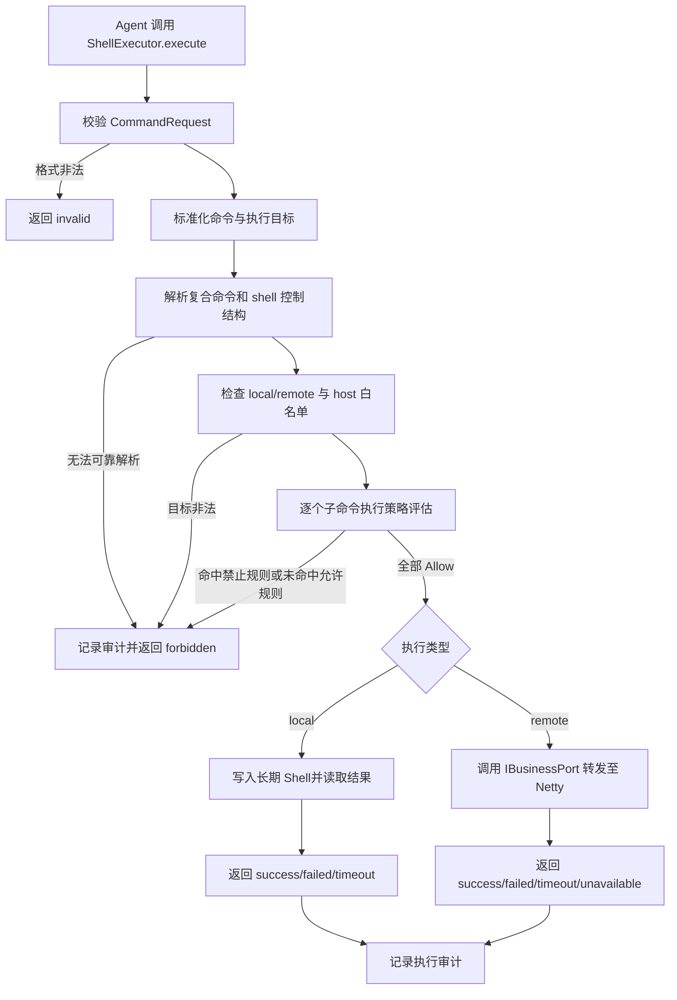

# TASK-002 命令执行自动审查

## 1. 背景

当前项目通过 `data-visualizer-domain` 中的 `ShellExecutor` 向 Agent 提供命令行 MCP 工具。Agent 可以请求执行本机命令，也可以通过 Netty 网关请求远程客户端执行命令。

当前 `ShellExecutor` 收到 `CommandRequest` 后，`local` 命令直接写入长期存活的 PowerShell/bash/sh 进程，`remote` 命令直接通过 `IBusinessPort` 转发到 Netty 客户端。Java 侧没有命令策略审查；远程 Python 客户端的 `SafeCommandExecutor` 只有按首个 token 判断的简单黑名单，不能处理复合命令、shell 包装、重定向或参数风险。

本任务参考 Codex 的命令策略思想，但不引入用户审批，也不实现 Codex 的文件系统沙箱。命令在执行前由服务端自动判断，只有明确命中允许规则的命令才会执行，其他命令直接拒绝。Docker 仅作为部署和资源隔离边界，不能替代命令策略审查。

## 2. 当前状态

### 2.1 当前已具备能力

- `ShellExecutor` 位于 `data-visualizer-domain`，通过 Spring AI `@Tool` 暴露 `execute(CommandRequest)`。
- `CommandRequest` 当前包含 `command`、`commandType`、`hostName`；命令类型为 `local` 或 `remote`。
- `local` 模式启动一个长期 Shell 进程，通过写入命令并读取 `__END__` 标记获取结果。
- `remote` 模式创建 `GatewayCommandEntity`，通过 `IBusinessPort.action` 转发到 `NettySocketServer`，等待最长 30 秒的响应。
- `local` 的特殊命令 `clients` 用于查询当前在线的远程客户端。
- `CommandResponse` 已经能够返回目标地址、原始命令、状态和结果消息，但当前主要使用 `success`，没有策略拒绝状态约定。
- 默认 Agent YAML 通过 `ShellExecutorToolCallbackProvider` 启用该工具，`command-gateway/SKILL.md` 指导 Agent 调用本地或远程命令。
- Python `gateway-socket-client` 的 `SafeCommandExecutor` 会在执行前检查简单黑名单，但仍将原始命令交给 shell 执行，Java 侧没有统一策略。
- 当前没有命令审查配置、命令审批 API、审批状态、审批缓存或审批前端。
- 当前应用的会话、流式状态和网关等待状态主要保存在 JVM 内存；命令审计也没有持久化实现。

### 2.2 相关模块、接口与数据设施

| 项目项 | 当前情况 | 本任务关系 |
| --- | --- | --- |
| `data-visualizer-domain` | `ShellExecutor`、命令 DTO、`IBusinessPort` | 必须增加命令标准化、策略审查和统一状态语义 |
| `data-visualizer-infrastructure` | `BusinessPort`、`NettySocketServer` | 保持远程转发协议；必要时补充远程目标校验边界 |
| `data-visualizer-app` | Spring Boot 启动、Agent YAML、应用配置 | 需要承载命令策略配置或默认规则，并补充测试 |
| `netty-socket-server/gateway-socket-client` | Python 远程客户端与 `SafeCommandExecutor` | 需要评估并补充客户端侧防护，避免绕过 Java 侧策略 |
| `data-visualizer-trigger` | 对话和流式 HTTP Controller | 不新增审批 API；仅在确有必要时确认拒绝结果如何随已有工具/对话错误返回 |
| `data-visualizer-api` | 对话 DTO 和统一响应 | 不新增命令审查 API |
| MySQL / MyBatis | 当前 Agent 命令功能未使用 | 不涉及 |
| Redis | 当前未接入命令业务 | 不涉及 |
| MQ | 当前未使用 | 不涉及 |
| 前端 | 现有对话和流式展示 | 不增加审批 UI；只需兼容现有流式错误/日志语义，不应新增审查交互 |

### 2.3 当前缺口

1. Agent 请求的命令会直接进入本地 Shell 或远程网关，缺少 Java 侧执行前审查。
2. 没有默认拒绝、显式允许的策略模型，无法可靠区分允许命令和禁止命令。
3. 复合命令和 shell 包装可能绕过仅按首 token 判断的黑名单。
4. 本地和远程命令没有统一的 host、命令类型和参数策略。
5. 命令被拒绝时没有稳定的结构化 `CommandResponse` 状态。
6. 远程客户端仍可在 Java 侧审查之后直接执行原始 shell 命令，缺少第二道策略边界。
7. 没有命令审查和执行结果的审计记录。
8. 当前 Docker 运行镜像没有明确证明使用非 root 用户、限制 capabilities、禁止 Docker Socket 等命令执行相关边界。

## 3. 功能目标

为 `ShellExecutor` 增加无用户参与的命令自动审查：命令执行前完成标准化、解析和策略判断，默认拒绝，只有明确允许的本地或远程命令才实际执行；被拒绝的命令以结构化结果返回，并记录审查与执行审计，同时通过 Docker 部署约束降低命令执行影响范围。

## 4. 用户场景

Agent 在处理用户请求时认为需要查询本机或远程环境，并调用 `ShellExecutor.execute`。系统先自动审查命令：

- 命中对应 `local`/`remote` 允许规则且目标合法时，执行命令并返回成功或执行失败结果。
- 命中禁止规则、未命中任何允许规则、无法可靠解析、远程 host 不在白名单或参数不满足限制时，不启动本地命令、不发送远程命令，直接返回 `forbidden` 结果。
- 用户不需要确认，不需要审批页面，不需要调用新的审批接口。

## 5. 前置条件

- `ShellExecutor` 已被 Spring 注册并作为 Agent 工具提供。
- 命令请求包含合法的 `command`、`commandType` 和与类型匹配的 `hostName`。
- 本地执行环境存在当前项目支持的 Shell；远程执行环境存在已连接且可识别的网关客户端。
- 命令策略已加载；如果策略配置缺失或无效，应采用默认拒绝，而不是放宽为允许。
- Docker 部署环境能够应用任务要求的非 root、资源和挂载边界；具体运行参数由部署文件和实际启动脚本共同确认。

## 6. 后置条件

### 6.1 允许执行

- 命令已通过本地或远程策略审查。
- 本地命令才会写入长期 Shell；远程命令才会调用 `IBusinessPort.action`。
- 返回 `success` 或 `failed`、`timeout`、`unavailable` 等执行状态。
- 记录审查结果、命中规则、执行状态和耗时。

### 6.2 拒绝执行

- 不启动子进程，不向本地 Shell 写入命令，不调用远程网关。
- 返回 `responseStatus=forbidden` 的结构化 `CommandResponse`。
- 返回可供 Agent 理解的拒绝原因，例如未命中允许规则、存在 shell 包装、目标 host 不在白名单或命中禁止操作。
- 记录拒绝原因和审查上下文，但不得在日志中泄露命令参数中的 Secret。

## 7. 任务范围

### 7.1 Goals

- 在 Java `ShellExecutor` 的本地和远程执行路径之前增加统一自动审查层。
- 实现 `Allow / Forbidden` 两态策略，不向用户发起执行申请。
- 采用默认拒绝、显式允许策略；不依赖“未检测到危险命令”来放行。
- 区分 `local` 和 `remote` 规则，并对远程 `hostName` 执行白名单校验。
- 对复合命令进行拆分检查；任意子命令不允许时，整个请求拒绝，禁止部分执行。
- 对 shell 嵌套、脚本解释器、重定向、命令替换、后台执行、权限提升、删除和 Docker 控制等风险形式执行拒绝或明确限制。
- 对无法可靠解析的命令默认拒绝。
- 扩展 `CommandResponse` 的状态语义，至少支持 `success`、`failed`、`forbidden`、`invalid`、`timeout`、`unavailable`。
- 增加命令审查和执行审计；当前可以使用进程内存和日志，但必须明确重启丢失及多实例限制。
- 评估并补充远程 Python 客户端的基础命令策略，避免远程执行端完全绕过 Java 侧规则。
- 通过 Dockerfile、Compose 或启动配置落实可验证的运行用户、挂载、权限和资源边界；不引入应用级沙箱。
- 补充纯策略单元测试、ShellExecutor 集成测试和远程路径测试替代方案。

### 7.2 Non-Goals

- 不实现用户审批、审批 UI、审批 API、审批状态机、审批等待或审批缓存。
- 不向 `CommandRequest` 增加由用户填写的审批字段。
- 不允许前端通过新的接口修改或临时放宽命令策略。
- 不实现 Codex 的文件系统沙箱、网络沙箱、权限升级重试或宿主机级隔离。
- 不把 Docker 描述为完整安全沙箱；不在本任务中实现容器运行时或 Kubernetes 安全平台改造。
- 不实现数据库持久化、Redis 状态同步、MQ 审计事件或多实例共享策略。
- 不重构 Agent 编排、MCP 装配、对话 API、Draw.io 解析或流式 JSON 协议。
- 不将命令执行扩展为独立终端产品，不增加命令历史查询、重放或用户管理页面。
- 不顺带实现后端认证、管理员授权或远程客户端身份认证；这些是已有架构风险，应在本任务中记录，不得用前端 `admin/admin` 代替。
- 不保证在没有操作系统沙箱的情况下对任意 shell、解释器或恶意脚本进行完备安全分析；无法可靠判断的输入必须拒绝。

## 8. 业务规则

1. 所有本地和远程命令必须在实际执行前经过同一个命令审查边界。
2. 审查决策只有 `Allow` 和 `Forbidden`；不创建 `Prompt`，不等待用户，不支持审批绕过。
3. 默认决策为 `Forbidden`；只有命中明确的允许规则才可执行。
4. 禁止规则优先级高于允许规则。命中禁止规则时，即使同时命中允许前缀，也必须拒绝。
5. 复合命令必须按子命令分别检查；任意子命令拒绝、解析失败或存在未处理的控制结构时，整体拒绝，不部分执行。
6. `local` 命令的 `hostName` 必须为空或符合既有约定；`remote` 命令必须提供允许的目标 host。
7. 远程 host 白名单由服务端配置控制，不能以用户或 Agent 提供的任意字符串自动加入白名单。
8. 空命令、超长命令、非法命令类型、非法 host、控制字符和不满足参数约束的请求返回 `invalid` 或 `forbidden`，不能进入执行器。
9. shell 嵌套和脚本解释器默认禁止，包括 `sh -c`、`bash -c`、`pwsh -Command`、`powershell -Command`、`python -c`、`node -e` 等等价形式。
10. 默认禁止权限提升、删除、格式化、关机重启、进程终止、挂载、网络规则修改、文件重定向和 Docker 控制命令。
11. `clients` 继续作为本地模式的特殊查询操作，但必须保留明确的特殊规则，不应因普通 Shell 规则缺失而被任意扩展。
12. `forbidden` 表示命令未执行，不应被当作远程连接失败或 Shell 执行失败。
13. 工具返回的策略拒绝必须是确定性结果；Agent 不应通过增加 shell 包装、脚本解释器或改变空白形式来重复绕过策略。必要时同步更新相关 Skill 指引。
14. 审计记录必须与实际执行结果一致：拒绝命令不能记录为已执行，远程未发送不能记录为远程执行成功。
15. 当前审计允许只保存在 JVM 内存和应用日志中；不承诺重启恢复、跨实例共享或历史查询。
16. Python 远程客户端可以增加更严格的二次拒绝策略，但不得削弱 Java 侧的拒绝结论。
17. Docker 配置必须避免 privileged、Docker Socket 和不必要的宿主机敏感目录挂载；如果现有启动方式无法在非 root 下工作，应明确暴露并修复与本任务直接相关的权限问题。

## 9. 核心业务流程



审查与执行的关键顺序必须保持：

```text
校验 → 标准化 → 解析 → 策略审查 → 执行 → 结构化返回 → 审计
```

任何执行器不得在策略审查前启动命令、写入 Shell 或调用远程网关。

## 10. 数据变化

### 10.1 JVM 内存和日志

当前任务不新增数据库业务数据。可以新增进程内的短生命周期审计记录或直接通过结构化日志记录：

- requestId（如果当前调用上下文可以可靠取得）
- agentId、userId、sessionId（如果当前工具调用上下文可以可靠取得）
- commandType
- hostName
- 原始命令摘要或脱敏命令
- 标准化结果
- 命中规则或拒绝原因
- 审查决策
- 执行状态、退出码、耗时和输出长度

如果现有 MCP 工具调用无法取得完整 Agent 请求上下文，不要伪造字段；记录可获得字段，并在实现说明中标明限制。

审计输出必须脱敏。命令中的 Token、密码、Authorization Header、私钥和 Secret 不得原样写入日志。

### 10.2 MySQL

不新增表、字段、索引，不使用现有初始化表保存命令审计。

### 10.3 Redis

不新增 Key、Value、TTL 或缓存策略。

### 10.4 MQ

不产生消息，不增加消费者，不引入异步审计队列。

### 10.5 配置

命令允许规则、禁止规则、远程 host 白名单、命令长度/输出大小/超时等限制可以配置化，但必须有安全默认值。Coding Agent 应优先复用现有 Spring 配置方式，并确认配置对象与 YAML 绑定方式后再决定具体配置位置。

## 11. API 变化

不新增 HTTP API，不增加审批 API，不修改现有对话请求结构。

`ShellExecutor` 的 MCP 工具输入字段原则上保持兼容：

```json
{
  "command": "命令",
  "commandType": "local 或 remote",
  "hostName": "远程地址；local 时为空"
}
```

`CommandResponse` 需要保持现有字段兼容：

- `targetIp`
- `command`
- `responseStatus`
- `responseMessage`

只扩展状态和消息语义，不删除字段、不改变字段名称。策略拒绝应返回结构化 `forbidden`，而不是抛出未区分的通用异常。

现有 `/api/v1/chat`、`/api/v1/chat_stream` 和前端流式 `log/result/error/done` 协议不新增审批消息。若策略拒绝最终导致 Agent 运行失败，应沿用现有工具异常/结果传递机制，并保证拒绝原因可诊断。

## 12. 技术实现方案

### 12.1 推荐方案

在 `ShellExecutor` 与两条执行路径之间引入独立策略服务。推荐的逻辑接口包括：

```text
CommandNormalizer
CommandParser
CommandPolicyReviewer
CommandAuditRecorder
LocalCommandExecutor
RemoteCommandExecutor
```

`ShellExecutor.execute` 只负责编排：

1. 校验请求。
2. 调用标准化与解析组件。
3. 调用策略审查组件。
4. 审查拒绝时生成 `CommandResponse`，记录审计并立即返回。
5. 审查允许时调用本地或远程执行器。
6. 将执行结果转换为统一状态并记录审计。

不要求一定新增多个公开类；Coding Agent 可以依据项目规模合并实现，但不得把审查逻辑继续堆叠在 local/remote 两个分支中形成两套规则。

### 12.2 策略判断

策略评估至少包含：

- 命令是否为空、过长或包含非法控制字符；
- 是否能被当前目标 Shell 的有限解析器可靠拆分；
- 是否包含复合命令、管道、重定向、命令替换、后台执行或嵌套 Shell；
- 是否命中全局禁止命令/模式；
- 是否命中 `commandType` 对应的显式允许规则；
- `remote` 的 host 是否在白名单；
- 参数中的路径、网络地址和敏感目标是否满足约束。

优先级建议：

```text
格式非法 / 无法解析 → Forbidden 或 Invalid
全局禁止规则        → Forbidden
远程 host 不允许     → Forbidden
任一子命令未允许     → Forbidden
所有子命令明确允许   → Allow
```

无法区分 `invalid` 与 `forbidden` 时，安全相关的不确定情况统一使用 `forbidden`；格式字段错误可以使用 `invalid`。

### 12.3 允许规则

允许规则应使用 token 或结构化前缀匹配，而不是任意字符串 `startsWith`。规则至少能够表达：

```text
执行类型：local / remote
远程目标：可选 host 白名单或 host 标识
命令 token 前缀
参数约束
规则说明
```

建议默认只放行低风险、只读诊断命令，例如 `pwd`、`ls`/`dir`、`git status`、`git diff`、`whoami`、`uname`、受限的文件查看命令和 `clients`。具体默认命令集合必须结合容器内实际 Shell 和业务 Skill 使用场景确定，不能凭空放行全部系统命令。

### 12.4 远程客户端二次防护

Java 侧审查是主策略边界。Python `SafeCommandExecutor` 可以保留并增强为远程执行端的第二道最小防护：

- 默认拒绝明显危险命令；
- 对脚本解释器和 shell 包装进行拒绝；
- 保留工作目录和执行时限约束；
- 不允许因为客户端规则配置而放宽 Java 侧拒绝；
- 保持现有换行 JSON 网关协议和请求 ID 关联。

本任务不重构 Netty 传输协议，不把 IP 识别升级为完整身份认证；该风险应在文档和实现限制中保留。

### 12.5 Shell 执行边界

当前本地执行使用长期 Shell，必须确保审查完成后才向 writer 写入原始命令。不得为了审查而先执行命令获取真实语义。

应同时限制：

- 命令最大长度；
- 单次输出最大大小；
- 执行超时时间；
- Shell 进程异常和重启行为；
- 并发写入同一个长期 Shell 的风险。

如果当前长期 Shell 无法在并发场景下保证命令和 `__END__` 标记的对应关系，Coding Agent 应记录风险并提供最小必要保护，但不得借此扩大为整体 Shell 架构重写。

### 12.6 Docker 运行边界

检查并按实际启动脚本落实：

- runtime 容器使用非 root 用户；
- 不使用 privileged；
- 不挂载 `/var/run/docker.sock`；
- 不挂载宿主机敏感目录；
- 只提供必要的工作目录和配置；
- 限制 CPU、内存和进程数量；
- 通过运行时环境提供 Secret，不把命令审查凭据或模型密钥写入镜像；
- 明确网络访问范围；
- 保留 Java、Next.js 和 Netty 现有启动能力。

如果修改非 root 运行会影响 `/app` 文件权限或 `start.sh`，必须一并处理直接相关的权限问题并增加部署验证说明。

### 12.7 为什么不采用其他方案

| 方案 | 不采用原因 |
| --- | --- |
| 用户审批 | 本需求不需要用户参与；会引入审批 API、前端交互、挂起任务和流式恢复复杂度。 |
| 只维护危险命令黑名单 | 无法覆盖未知命令、参数风险、复合命令和 shell 包装；与无审批的安全目标不匹配。 |
| 默认 Allow、异常时拦截 | 审查遗漏会直接变成命令执行；当前没有应用级沙箱，不适合。 |
| 只在 Python 客户端审查 | 本地命令不经过 Python；Java 远程调用也应在发送前阻断。 |
| 只在 Controller 审查 | Agent 工具调用不是独立 HTTP 命令接口，Controller 无法覆盖工具执行边界。 |
| Codex 文件系统沙箱 | 用户明确不考虑；Docker 部署边界和默认拒绝策略是本任务范围。 |
| MySQL/Redis/MQ 审计 | 当前相关业务设施未接入，增加持久化会扩大任务范围。 |

## 13. 影响范围

### 13.1 必须修改

- `data-visualizer-domain/.../ShellExecutor.java`：接入审查编排、拒绝返回和审计调用，保持 MCP 输入字段兼容。
- `data-visualizer-domain`：新增或整理命令标准化、解析、策略和状态模型；具体文件名由 Coding Agent 根据现有包结构确认。
- `data-visualizer-app`：增加命令策略默认配置/绑定，并补充 Spring 集成测试配置。
- `data-visualizer-app/src/test/java`：增加策略和 `ShellExecutor` 行为测试。
- Docker 部署相关文件：检查并落实与本任务直接相关的非 root、挂载和权限约束；至少验证根 `Dockerfile`、`docker-compose.yml` 和 `start.sh` 的兼容性。

### 13.2 可能修改

- `netty-socket-server/gateway-socket-client/.../command_runner.py`：增强远程客户端的二次拒绝规则和执行限制。
- `data-visualizer-app/src/main/resources/agent/skills/command-gateway/SKILL.md`：补充“工具返回 forbidden 表示未执行、不要通过包装命令绕过”的说明。
- `GatewayCommandEntity` 或 `IBusinessPort`：仅当审计上下文或远程规则确实需要传递额外信息时修改；优先不改变现有网关协议。
- `AgentServiceController` 或流式桥接：仅当现有异常传递无法保留结构化拒绝原因时最小修改；不得新增审批消息或改变既有流式协议。

### 13.3 不应该修改

- Agent 工作流顺序、MCP 装配方式和 Draw.io 业务流程。
- MySQL、MyBatis、Redis、MQ 业务接入。
- 前端审批页面或新的命令管理页面。
- Netty 换行 JSON 协议和请求 ID 关联机制。
- `architecture.md`、`business.md`，除非实现后确实产生文档中尚未描述的架构或业务事实；本 Task 本身不要求修改它们。
- 与命令执行安全边界无关的认证、会话、线程池和模型重试重构。

## 14. 实施步骤

1. **确认现有执行边界和测试基线。** 阅读 `ShellExecutor`、`IBusinessPort`、`BusinessPort`、`NettySocketServer`、Python `SafeCommandExecutor`、Agent Skill、Dockerfile、Compose 和启动脚本，明确本地/远程执行前后不能改变的协议与字段。
2. **定义策略配置和状态模型。** 确定默认拒绝、local/remote 规则、远程 host 白名单、禁止模式、长度/输出/超时限制和 `CommandResponse` 状态，不引入审批字段。
3. **实现命令标准化与有限解析。** 支持规则需要的 token 匹配和复合命令拆分；明确无法解析、shell 嵌套、脚本解释器、重定向、管道、命令替换等情况的拒绝策略。
4. **实现统一策略审查层。** 在 `ShellExecutor` 的 local/remote 分支前完成所有审查；确保拒绝时本地不写 Shell、远程不调用 `IBusinessPort`。
5. **接入结构化结果和审计。** 增加 `forbidden` 等状态及脱敏审计记录，区分策略拒绝、执行失败、超时和远程客户端不可用。
6. **补充远程客户端二次防护。** 在不改变网关协议的前提下增强 Python 客户端的最小黑名单/默认拒绝行为，并保证不会放宽 Java 侧策略。
7. **落实 Docker 约束。** 检查 runtime 用户、目录权限、挂载、capabilities、Docker Socket、资源限制和网络边界；只处理与命令执行安全直接相关的部署问题。
8. **增加测试并整理实现说明。** 覆盖允许、禁止、未命中、复合命令、不可解析命令、local/remote host、拒绝不执行、状态映射、审计脱敏和 Python 客户端黑名单；遵循仓库约定，由开发人员手动执行验证命令。

## 15. Acceptance Criteria

- [x] `ShellExecutor` 在 local 和 remote 执行前都经过统一命令审查层。
- [x] 策略只有 `Allow` 和 `Forbidden` 两种执行决策，不存在用户审批、审批等待或审批接口。
- [x] 没有命中显式允许规则的命令默认返回 `forbidden`，不会被执行。
- [x] 命中全局禁止规则的命令返回 `forbidden`，即使同时命中允许前缀也不会执行。
- [x] `local` 与 `remote` 使用独立规则；remote 命令的 `hostName` 不在白名单时不会调用 `IBusinessPort`。
- [x] 空命令、非法类型、非法 host、超长命令和超过约束的输入不会进入 Shell 或 Netty。
- [x] 复合命令中任意子命令未获允许、存在禁止结构或无法解析时，整个命令被拒绝，不能出现部分执行。
- [x] shell 嵌套、脚本解释器、命令替换、重定向、后台执行、权限提升、删除和 Docker 控制命令按策略被拒绝。
- [x] 被拒绝的 local 命令不会写入长期 Shell；被拒绝的 remote 命令不会调用 `IBusinessPort.action`。
- [x] `CommandResponse` 保持现有字段兼容，并能明确返回 `success`、`failed`、`forbidden`、`invalid`、`timeout`、`unavailable` 等状态。
- [x] Agent 能从工具结果区分“策略拒绝”和“执行失败”，不会把策略拒绝误报为网关或系统异常。
- [x] 审计记录包含可获得的命令类型、目标、审查决策、命中规则/拒绝原因和执行结果，并对 Secret、Token、密码和私钥进行脱敏。
- [x] Python 远程客户端至少保留或增强危险命令拒绝；其规则不会绕过 Java 侧的拒绝结论。
- [x] Docker 部署不使用 privileged，不挂载 Docker Socket，并按实际可行性使用非 root 用户和明确的工作目录/资源边界。
- [x] 现有 `clients` 查询、允许的本地诊断命令和允许的远程诊断命令仍能按既有工具字段调用。
- [x] 不新增 MySQL、Redis、MQ、审批 API、审批前端或命令历史持久化。
- [x] 新增测试覆盖策略核心分支、禁止时不执行以及 local/remote 两条路径；测试不依赖真实危险命令或不可控远程主机。
- [x] 普通对话、流式对话、Draw.io 解析和现有 Netty 换行 JSON 请求/响应协议未被改变。

## 16. 测试要求

### 16.1 单元测试

至少覆盖：

- 空命令、空白命令、超长命令、非法 `commandType`；
- 明确允许命令及允许的附加参数；
- 未命中允许规则的命令；
- 命中禁止规则的命令；
- `local`/`remote` 规则隔离；
- remote host 白名单通过和拒绝；
- `;`、`&&`、`||`、管道、重定向、命令替换和后台执行；
- `sh -c`、`bash -c`、PowerShell、Python、Node 等脚本包装；
- 删除、权限提升、Docker 控制等高风险命令；
- 无法解析时默认拒绝；
- 命令 token 前缀和参数约束；
- 审计字段脱敏。

### 16.2 ShellExecutor 行为测试

使用 mock/fake 执行端验证：

- Allow 才调用 local 执行器；
- Forbidden 不写入 Shell writer；
- Allow 才调用 `IBusinessPort.action`；
- Forbidden 不调用 `IBusinessPort.action`；
- 执行异常、超时和远程不可用转换为正确状态；
- `clients` 特殊流程仍可用且不扩大普通命令权限。

### 16.3 Python 客户端测试

如果修改 `SafeCommandExecutor`，增加不启动真实危险操作的测试，验证黑名单命令、shell 包装和普通诊断命令的结果。测试应使用 fake subprocess 或等效隔离方式。

### 16.4 部署验证

由开发人员手动确认：

- runtime 容器实际运行用户；
- `/app`、工作目录和日志目录的读写权限；
- 没有 privileged 和 Docker Socket；
- 命令超时、输出上限和容器资源限制符合配置；
- Java Shell、Next.js 和 Netty 仍能正常启动。

按照仓库指南，不要求 Coding Agent 自动执行构建或测试命令；完成后应汇报建议执行的验证命令及未执行原因。

## 17. Risks

1. **默认允许规则过宽导致命令绕过。** 如果只检查首个 token 或只维护黑名单，Agent 可能通过复合命令、shell 包装和脚本解释器改变实际行为。降低方式：默认拒绝、结构化 token 解析、未知语法拒绝，并用组合命令测试覆盖。
2. **Shell 解析不完整导致误判。** PowerShell、bash 和 Windows/Linux 语法差异较大，无法保证自制解析器覆盖全部 shell 语义。降低方式：限制支持的语法集合；不支持或无法解析的语法直接拒绝；不要宣称实现了完整沙箱。
3. **长期 Shell 的并发读写风险。** 多个 Agent 请求共享同一个 writer/reader，可能导致命令输出和结束标记串线。降低方式：保留或增加执行互斥、设置超时和输出上限，并单独测试并发行为；不在本任务中重构完整 Shell 生命周期。
4. **远程客户端规则不一致。** Java 侧允许的命令可能被 Python 客户端拒绝，或客户端策略过宽形成第二条绕过路径。降低方式：Java 侧作为主策略，Python 侧只允许更严格，不允许放宽；记录两端状态差异。
5. **Docker 配置不足。** 容器内命令仍可能访问敏感挂载、内网或 Docker Socket。降低方式：非 root、禁止 privileged 和 Docker Socket、减少挂载、限制 capabilities/资源/网络，并在部署验证中检查实际生效配置。
6. **审计泄露敏感信息。** 命令参数和输出可能包含密码、Token 或私钥。降低方式：参数脱敏、限制记录输出、记录摘要/哈希而非完整敏感内容，并在测试中验证常见凭据格式。
7. **策略变更与运行期 Agent 配置不一致。** 当前 Agent 配置可以运行期重装配，而命令策略可能是独立配置；多份配置可能导致实际行为难以预测。降低方式：明确命令策略的单一来源和加载时机，默认使用最严格配置；不实现未经定义的运行期策略管理接口。
8. **当前没有后端认证。** 任意可调用 Agent 的请求都可能间接触发允许的命令，命令审查不能代替身份授权。降低方式：本任务只收紧命令集合并保留审计，同时明确后续必须增加认证、授权和远程客户端身份校验。
9. **内存审计在重启和多实例下丢失。** 当前项目没有持久化命令审计设施。降低方式：本任务明确不承诺历史恢复和跨实例一致性；使用结构化应用日志作为当前可用的最低审计手段。

## 18. Open Questions

- 默认允许的完整命令集合是什么？当前业务 Skill 提到 `clients`、`ls`、`dir`、`pwd`、进程/端口检查，但没有给出最终生产白名单。
- local 命令是否允许访问整个容器文件系统，还是只允许访问某个工作目录？当前没有应用级沙箱，路径规则需要业务方确认。
- remote host 白名单由静态 YAML、环境变量还是未来配置中心提供？本任务不新增管理 API，需要确定第一版配置来源。
- 是否允许 `git`、`find`、`grep`、`curl`、`docker ps` 等命令？这些命令的参数约束和网络/文件副作用需要业务方确认。
- 是否需要保留 `clients` 以外的任意网关查询能力？当前 Skill 和测试存在远程 `ls`，但没有正式生产命令目录。
- 审计记录只写应用日志是否满足运维要求？若需要可查询、不可丢失或跨实例审计，应另立持久化/安全审计任务。
- Docker 运行是否必须切换到非 root？当前根镜像启动方式、Next.js 静态资源和 `/app` 权限需要在实际容器验证后确定具体改法。
- 是否需要把 Agent、用户和 session 上下文传入命令审计？当前 MCP 工具参数没有这些字段，需确认 ADK/Spring AI 工具调用上下文是否可获得。
- Python 远程客户端是否会在生产环境运行，以及其工作目录、执行用户和网络权限是什么？

## 19. AI 开发注意事项

- 不要实现用户审批、审批 UI、审批 API、Prompt 状态或等待用户确认；本任务是自动审查后直接 Allow/Forbidden。
- 默认必须拒绝，不能使用“未识别为危险则允许”的开放策略。
- 审查必须发生在本地 Shell writer 写入和 `IBusinessPort.action` 调用之前。
- 复合命令必须整体审查；不能因为第一段命令允许就执行后续未审查内容，也不能允许部分执行。
- 无法可靠解析、包含 shell 嵌套、脚本解释器、重定向、命令替换或后台执行的命令默认拒绝。
- `Forbidden` 必须是结构化工具结果，不能只抛出通用 RuntimeException；保持 `CommandResponse` 字段兼容。
- local 和 remote 的规则必须隔离；remote host 白名单不能由请求方动态扩大。
- 不要把 Docker 作为命令策略的替代品；检查并避免 privileged、Docker Socket 和敏感宿主机挂载。
- Python 客户端的二次防护只能比 Java 侧更严格，不能放宽 Java 侧策略；保持换行 JSON、请求 ID 和现有网关字段兼容。
- 不要新增数据库、Redis、MQ 或持久化审计，除非后续需求明确扩大范围；当前审计的重启丢失和多实例限制必须如实保留。
- 不要修改 Agent 工作流、Draw.io 协议、普通/流式 HTTP API 或前端审批交互。
- 不要把前端 `admin/admin` 当作执行权限；命令审查不能解决当前后端无认证的架构风险。
- 不要为了覆盖所有 shell 语法而编写不可验证的“完整安全解析器”；应限定支持范围，未知情况拒绝，并通过测试证明关键规则。
- 按仓库要求，完成实现后检查 `architecture.md`、`business.md` 和 ADR 是否因实际事实变化而需要更新；本 Task 文档本身不要求修改它们。
