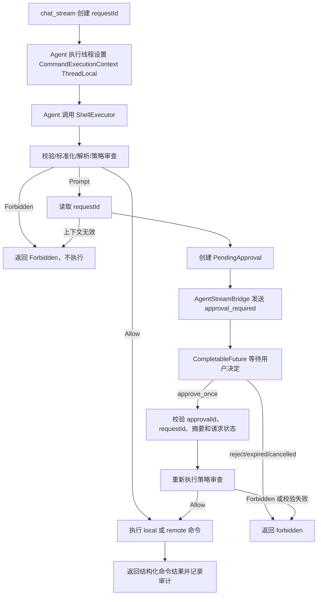
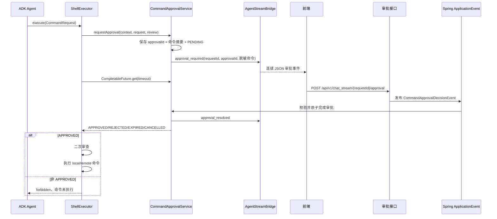

# TASK-003 命令执行交互审批

## 1. 背景

当前项目已经完成 TASK-002“命令执行自动审查”。`ShellExecutor` 在 local/remote 命令真正执行前进行策略审查，默认拒绝未明确允许的命令；命中禁止规则、无法解析、host 不在白名单或不满足参数约束的命令直接返回 `forbidden`，不会写入本地 Shell，也不会调用 `IBusinessPort.action`。

TASK-002 的策略只有两种结果：允许执行或禁止执行。当前业务希望增加类似 Codex 的交互审批能力：对于策略认为可以由用户决定的命令，服务端向正在进行的流式对话发送审批事件，前端展示批准/拒绝操作，用户决定后服务端唤醒等待中的 `ShellExecutor`，批准时继续执行本次命令，拒绝或超时则不执行。

本任务是 TASK-002 的后续扩展。它不能把所有被拒绝的命令都变成可审批命令；`Forbidden` 仍然是不可绕过的最终结果。审批只是对 `Prompt` 命令提供一次性、当前请求范围内的用户决定，不是认证、授权、沙箱或永久策略修改机制。

## 2. 当前状态

### 2.1 已具备能力

- `data-visualizer-domain` 中的 `ShellExecutor` 通过 Spring AI `@Tool` 暴露命令执行能力。
- `ShellExecutor` 支持 `local` 和 `remote` 两种命令类型。
- local 命令通过长期存活的 PowerShell/bash/sh 进程执行；remote 命令通过 `IBusinessPort.action` 转发到 Netty 网关。
- local 特殊命令 `clients` 用于查询在线远程客户端。
- TASK-002 已提供命令标准化/策略审查、local/remote 规则隔离、远程 host 白名单、结构化状态和审计能力。具体实现应以当前源码为准，不得绕过既有审查。
- `AgentStreamBridge` 使用 `requestId` 将 `AgentStreamResponseDTO` 发送到对应 `ResponseBodyEmitter`。
- `chat_stream` 由 `AgentServiceController` 生成 `requestId`，注册 `AgentStreamBridge`，再通过 `CompletableFuture.runAsync` 执行 Agent 流。
- `ChatService.createRequestRunner` 为每次流式请求创建请求专属的 `MyLogPlugin`，并将当前 `requestId` 固定在插件实例中。
- 当前流式消息类型为 `log`、`result`、`error`、`done`；前端通过 Fetch 读取连续 JSON。
- 当前 `ShellExecutor` 是 Spring 单例工具，通过 `Application` 中的 `MethodToolCallbackProvider` 注册；其工具方法本身没有 requestId 参数。
- 已通过运行日志确认，在当前实现和当前 Agent 执行方式下，同一个流式请求从 `CompletableFuture.runAsync`、ADK、Spring AI Tool 到 `ShellExecutor` 使用同一个请求专用线程。因此本任务允许使用 ThreadLocal 传递当前命令执行上下文，但必须保留线程模型限制和安全失败行为。

### 2.2 当前缺口

1. 策略没有 `Prompt` 结果，无法区分“绝对禁止”和“需要用户决定”。
2. `ShellExecutor` 没有可靠的审批上下文，不能向当前流式请求发送审批事件。
3. 当前流式协议没有审批请求和审批结果消息。
4. 没有待审批记录、审批超时、拒绝、取消和并发状态迁移。
5. 前端没有接收审批事件、展示命令和提交用户决定的流程。
6. `AgentStreamBridge.clear(requestId)` 只清理流式发送通道，不会自动唤醒等待中的审批 Future。
7. 当前普通 `/api/v1/chat` 没有持续事件通道，不适合在一次同步 HTTP 请求中暂停、等待用户操作并继续原 Agent 执行。
8. 当前项目没有后端认证、授权和多实例共享状态，不能安全实现永久授权或跨实例审批恢复。

## 3. 功能目标

在 TASK-002 命令审查基础上增加 `Prompt` 决策：当命令符合可配置的交互审批规则时，服务端通过现有流式通道向前端发送审批事件，等待用户针对本次命令做出批准或拒绝决定；批准后重新审查并执行，拒绝、超时、取消或上下文失效时不得执行命令。

第一版只支持流式对话中的一次性审批，不实现永久授权、会话授权或策略修改。

## 4. 用户场景

工作台访问者通过流式对话请求 Agent 查询或操作本机/远程环境。Agent 调用 `ShellExecutor` 后：

- 命令命中 `Allow`：直接执行，现有日志、结果和完成消息保持不变。
- 命令命中 `Prompt`：服务端创建待审批记录，通过当前 `requestId` 向前端发送 `approval_required`；前端展示脱敏后的命令、目标和原因。
- 用户点击“允许一次”：前端调用审批决定 API；服务端校验 `requestId`、`approvalId` 和待审批状态，发布审批决定事件，唤醒原 `ShellExecutor`。
- `ShellExecutor` 重新校验审批快照和命令策略；仍然允许时才执行 local/remote 命令。
- 用户点击“拒绝”、审批过期、流式请求断开或审批上下文失效：命令不执行，工具返回结构化拒绝结果，Agent 流按现有错误/结果完成。
- 命中 `Forbidden` 的命令不发送审批事件，用户不能通过审批 API 绕过禁止规则。

## 5. 前置条件

- `ShellExecutor` 已加载 TASK-002 的有效命令策略。
- 当前请求必须是 `chat_stream`，且已生成并注册有效的 `requestId`。
- Agent 执行线程已设置当前 `CommandExecutionContext` 到 ThreadLocal；当前已验证的执行链必须保持同线程。
- `AgentStreamBridge` 中仍存在对应的流式上下文，能够向前端发送审批事件。
- 审批服务可创建待审批记录，且审批等待数量没有超过配置上限（如实现该限制）。
- local/remote 命令的既有参数、host 白名单和命令解析约束仍然有效。

普通 `/api/v1/chat` 没有流式审批通道。第一版不要求普通同步对话支持交互等待；没有流式上下文的 `Prompt` 命令必须安全失败，不得等待或执行。

## 6. 后置条件

### 6.1 Allow

- 命令不需要用户审批，按 TASK-002 现有流程执行。
- local 命令才会写入本地长期 Shell；remote 命令才会调用 `IBusinessPort.action`。
- 审计记录保持现有执行状态语义。

### 6.2 Prompt 且批准

- 创建过的审批记录原子地从 `PENDING` 变为 `APPROVED`。
- `ShellExecutor` 被 `CompletableFuture` 唤醒。
- 服务端重新验证 `approvalId`、命令摘要、请求状态、策略和 remote host。
- 只有二次审查允许时才执行命令。
- 执行结果仍使用 `success`、`failed`、`timeout`、`unavailable` 等既有状态。
- 审批结果和命令执行结果分别记录审计，不把“批准”误记为“执行成功”。

### 6.3 Prompt 且拒绝、过期或取消

- 待审批记录进入 `REJECTED`、`EXPIRED` 或 `CANCELLED` 终态。
- `CompletableFuture` 被完成，等待中的 `ShellExecutor` 返回 `forbidden`。
- 不写入本地 Shell，不调用 `IBusinessPort.action`。
- 前端收到审批结果事件或现有错误/结果消息。

## 7. 任务范围

### 7.1 Goals

- 将命令策略决策扩展为 `Allow`、`Prompt`、`Forbidden` 三态。
- 保持 TASK-002 的默认拒绝和禁止规则不可绕过原则。
- 为每次 `Prompt` 创建带 `approvalId` 的内存待审批记录。
- 使用 `CompletableFuture` 等待用户决定，不使用全局锁、`wait/notify` 或共享审批 Future。
- 使用已验证的 ThreadLocal 将当前请求的 `requestId` 及相关上下文传递到 `ShellExecutor`。
- 通过 `AgentStreamBridge` 发送明确的 `approval_required` 和 `approval_resolved` 消息。
- 新增审批决定 HTTP API，支持一次性批准和拒绝。
- 通过 Spring `ApplicationEvent` 将审批决定传递到审批服务，并使用 `approvalId + requestId` 精确关联。
- 审批批准后重新校验命令摘要、策略、host 和请求状态。
- 在流式完成、超时、错误或断开时取消仍处于 `PENDING` 的审批，避免等待线程和审批记录泄漏。
- 增加审批状态、并发、超时、取消、ThreadLocal 清理和禁止不执行测试。
- 保持现有 local/remote 执行协议、Netty 换行 JSON 协议、普通对话结果协议和 Draw.io 解析行为不变。

### 7.2 Non-Goals

- 不把所有 `Forbidden` 命令变为可审批命令。
- 不实现用户注册、后端认证、管理员授权、用户身份可信来源或远程客户端认证。
- 不实现永久授权、session 级授权、规则自动写入、前缀规则自动放行或策略编辑 UI。
- 不实现普通 `/api/v1/chat` 的后台任务、审批恢复或长连接等待。
- 不实现审批历史查询、审批持久化、任务恢复或跨设备恢复。
- 不使用 MySQL、Redis、MQ 保存待审批记录或发送审批事件。
- 不实现多实例共享审批；不引入 Redis Pub/Sub、WebSocket 或新的消息中间件。
- 不重构 Agent 编排、MCP 装配、Draw.io 解析、Netty 传输协议或本地 Shell 生命周期。
- 不把用户批准解释为沙箱放宽、权限提升或命令安全保证。
- 不修改前端演示登录并将其当作审批权限控制。
- 不顺带解决 TASK-002 已记录的后端认证、命令审计持久化、Docker 沙箱和多实例架构问题。

## 8. 业务规则

1. 命令决策按严格程度合并：`Allow < Prompt < Forbidden`。
2. 复合命令必须先整体解析并逐个子命令审查；任意子命令为 `Forbidden`，整体为 `Forbidden`；任意子命令为 `Prompt` 且没有 `Forbidden`，整体为 `Prompt`。
3. `Forbidden` 优先于 `Prompt`，用户批准不能覆盖禁止规则、解析失败、非法 host、危险控制结构或其他 TASK-002 的硬性拒绝条件。
4. 只有 `Prompt` 才能产生审批事件；`Allow` 不产生审批；`Forbidden` 不产生审批。
5. 第一版审批决定只有 `approve_once` 和 `reject`。
6. 一次审批只对应一个 `approvalId` 和一个命令快照，不允许用户通过审批请求修改命令、命令类型或 host。
7. 审批请求必须绑定 `requestId`；审批 API 同时提交 `requestId` 和 `approvalId`，二者不匹配时拒绝处理。
8. 审批状态只能从 `PENDING` 原子迁移到 `APPROVED`、`REJECTED`、`EXPIRED` 或 `CANCELLED` 之一；终态不可重复迁移。
9. 用户批准只表示同意本次继续尝试，不表示命令已经成功执行。
10. 审批批准后必须重新审查。重新审查结果为 `Forbidden`、命令摘要不一致、host 不再允许、请求已取消或策略上下文无效时，不执行命令。
11. 审批超时、流式请求取消、Emitter 完成/超时/错误或 Agent 运行异常时，仍处于 `PENDING` 的审批必须取消或过期；不能因为用户未响应而默认批准。
12. `ShellExecutor` 读取不到有效的 ThreadLocal 请求上下文时，`Prompt` 命令必须返回拒绝或上下文不可用结果，不得等待，也不得执行。
13. ThreadLocal 只能在已验证的同线程执行链中使用。未来启用 parallel workflow、异步 Tool、不同 RxJava Scheduler、虚拟线程或其他线程切换时，必须重新验证上下文传播。
14. ThreadLocal 必须在 Agent 执行边界使用 `try/finally` 清理，并使用 `remove()`；异常、超时、拒绝、取消和正常完成都不能残留上下文。
15. 审批事件中的命令必须是脱敏展示值；Token、密码、Authorization、私钥和 Secret 不得发送到前端或原样写入日志。
16. 审批脱离当前流式连接后不继续执行。连接已经断开、Emitter 已清理或请求已取消时，后续审批决定不得唤醒并执行命令。
17. 同一个审批的重复批准/拒绝只有第一个成功的终态决定生效；错误的 `approvalId` 或 `requestId` 不得影响其他请求。
18. 审批和命令执行审计只保存于当前 JVM 内存和应用日志（如复用现有审计方式），不承诺重启恢复或多实例一致性。

## 9. 核心业务流程

### 9.1 主流程



### 9.2 用户审批流程



### 9.3 流式连接清理

`onCompletion`、`onTimeout`、`onError` 不负责传递 ThreadLocal；它们负责在流式生命周期结束时触发幂等清理。`cleanupStream` 应在清理 `AgentStreamBridge` 前取消当前 `requestId` 下仍处于 `PENDING` 的审批，并释放等待 Future。Agent 执行线程中的 ThreadLocal 仍由 `CompletableFuture.runAsync` 内部的 `finally` 清理。

推荐顺序：

```text
标记请求已清理
→ cancelByRequest(requestId)
→ dispose Agent 流
→ 清理 AgentStreamBridge
→ Agent 执行 finally 中 remove ThreadLocal
```

正常完成时没有待审批记录也必须安全；重复触发 completion/timeout/error 不能重复改变终态。

## 10. 数据变化

### 10.1 JVM 内存

新增短生命周期待审批记录，不新增业务持久化数据：

```text
approvalId → PendingApproval
requestId  → 当前请求的待审批记录索引（如实现需要）
```

待审批记录至少包含：

- `approvalId`
- `requestId`
- `commandType`
- `hostName`
- 标准化命令或其安全快照
- `commandDigest`
- 脱敏展示命令
- `ruleId` 和审批原因
- `PENDING/APPROVED/REJECTED/EXPIRED/CANCELLED` 状态
- 创建时间、过期时间
- `CompletableFuture<ApprovalDecision>`

待审批记录在终态完成后清理。需要保留最小审计信息时，复用 TASK-002 的进程内审计和应用日志能力。

### 10.2 MySQL、Redis、MQ

不新增表、字段、索引、Redis Key、TTL、MQ 消息或消费者。审批状态仅限当前 JVM，应用重启和多实例部署会丢失或无法共享待审批记录。

### 10.3 ThreadLocal

新增请求执行上下文 ThreadLocal，建议保存 `requestId` 以及可获得的 `agentId`、`userId`、`sessionId`。ThreadLocal 不作为业务状态、审批状态或跨线程存储使用，Agent 执行完成后必须清理。

## 11. API 变化

### 11.1 新增审批决定接口

现有 `/api/v1/chat_stream` 无法在同一个 POST 请求中让浏览器反向提交用户决定，因此新增独立接口：

```http
POST /api/v1/chat_stream/{requestId}/approval
Content-Type: application/json
```

请求体：

```json
{
  "approvalId": "approval-456",
  "decision": "approve_once"
}
```

`decision` 只允许：

```text
approve_once
reject
```

成功响应至少应包含：

```json
{
  "code": "0000",
  "data": {
    "requestId": "request-123",
    "approvalId": "approval-456",
    "status": "approved"
  }
}
```

接口必须校验：

- `requestId` 非空且存在；
- `approvalId` 存在且属于 `requestId`；
- 审批仍为 `PENDING`；
- 未超过审批有效期；
- 当前请求尚未完成、取消或清理；
- 决定值合法；
- 重复决定不能改变已经确定的终态。

当前项目没有后端身份认证，第一版只能按当前请求和内存关联进行校验，不能把前端登录 Cookie 视为可信授权来源。

### 11.2 流式消息变化

扩展 `AgentStreamResponseDTO`，新增明确的审批消息类型，不将审批信息伪装成普通 `log`：

```text
approval_required
approval_resolved
```

审批请求示例：

```json
{
  "type": "approval_required",
  "stage": "approval",
  "sessionId": "session-123",
  "requestId": "request-123",
  "approvalId": "approval-456",
  "commandType": "remote",
  "hostName": "10.0.0.8",
  "content": "git push origin main",
  "reason": "该命令需要用户确认",
  "expiresAt": 1775030400000,
  "timestamp": 1775030340000
}
```

如果当前 DTO 不适合直接增加专用字段，可以在保持现有字段兼容的前提下增加审批数据对象；不应让前端解析不稳定的日志文本。

审批结果示例：

```json
{
  "type": "approval_resolved",
  "stage": "approval",
  "sessionId": "session-123",
  "requestId": "request-123",
  "approvalId": "approval-456",
  "content": "approved",
  "timestamp": 1775030345000
}
```

原有 `log`、`result`、`error`、`done` 消息语义和 requestId 字段必须继续保持。

### 11.3 不修改的 API

不修改 `CommandRequest` 的公开字段：

```json
{
  "command": "命令",
  "commandType": "local 或 remote",
  "hostName": "目标地址"
}
```

不修改普通 `/api/v1/chat` 的既有请求结构、Draw.io 响应结构或 Netty 网关协议。

## 12. 技术实现方案

### 12.1 策略模型

在 TASK-002 当前策略模型上增加 `PROMPT` 决策。策略审查结果需要携带：

- `decision`
- 命中规则 ID
- 审批原因或拒绝原因
- 标准化命令/子命令摘要
- 可用于二次审查的策略上下文

合并规则必须使用：

```text
Allow < Prompt < Forbidden
```

不要用“检测不到危险就 Prompt/Allow”的开放策略。具体哪些命令配置为 `Prompt` 应复用现有命令策略配置方式，并以安全默认值启动。

### 12.2 ThreadLocal 执行上下文

增加专用 `CommandExecutionContextHolder`，建议保存不可变的上下文对象：

```java
record CommandExecutionContext(
    String requestId,
    String agentId,
    String userId,
    String sessionId
) {}
```

设置位置必须在真正运行 ADK/Spring AI Tool 的 `CompletableFuture.runAsync` 执行体内：

```java
CompletableFuture.runAsync(() -> {
    try {
        CommandExecutionContextHolder.set(context);
        // 执行完整 Agent Flowable
    } finally {
        CommandExecutionContextHolder.clear();
    }
});
```

如果当前使用 `subscribe` 会导致 `finally` 早于实际 Tool 执行结束，必须改为或等价实现完整生命周期等待，例如确认 `blockingSubscribe`/订阅 Disposable 的结束语义。不得在 Agent 仍可能调用 Tool 时清理 ThreadLocal。

ShellExecutor 读取不到上下文时，Prompt 命令直接返回安全失败，不得通过 userId、sessionId 或全局变量猜测 requestId。

### 12.3 PendingApprovalStore

新增独立审批服务和内存 Store，建议按 `approvalId` 主索引：

```text
ConcurrentHashMap<String, PendingApproval>
```

可按 `requestId` 提供取消查询。审批记录的状态迁移必须原子化，使用 CAS、同步状态对象或等价机制保证：

```text
PENDING → APPROVED
PENDING → REJECTED
PENDING → EXPIRED
PENDING → CANCELLED
```

审批等待使用每条记录独立的 `CompletableFuture`。不允许在 `ShellExecutor` 单例字段中保存当前审批 Future，也不允许使用一个全局锁或全局 Future。

### 12.4 审批服务

`CommandApprovalService` 建议负责：

1. 从 ThreadLocal 获取并校验当前上下文；
2. 创建 `approvalId` 和命令摘要；
3. 保存 `PendingApproval`；
4. 通过 `AgentStreamBridge` 发布 `approval_required`；
5. 在配置的超时时间内等待 Future；
6. 接收并校验审批决定；
7. 发布 `approval_resolved`；
8. 处理拒绝、过期、取消和重复决定；
9. 清理记录并记录审计。

`ShellExecutor` 只编排：

```text
策略审查
→ Prompt 时调用审批服务
→ 批准后重新审查
→ local/remote 执行
→ 统一返回和审计
```

### 12.5 ApplicationEvent

审批 Controller 不直接访问等待线程或 Future；发布包含完整关联信息的事件：

```text
CommandApprovalDecisionEvent(
    requestId,
    approvalId,
    decision
)
```

事件监听器调用 `CommandApprovalService.resolve`，由审批服务负责状态校验和原子完成 Future。事件为进程内同步事件，不使用 `@Async` 承担唤醒关键路径，避免接口已返回但 Future 尚未完成。

### 12.6 审批后重新审查

批准后必须验证：

- `approvalId` 与 `requestId` 匹配；
- 审批记录仍然是本次命令的记录；
- 标准化命令摘要一致；
- 命令类型和 host 一致；
- 请求仍然有效，没有被取消或清理；
- local/remote host 策略仍然允许；
- 当前策略不再返回 `Forbidden`。

只有通过这些检查才能调用本地 Shell 或 `IBusinessPort.action`。批准不能绕过策略审查。

### 12.7 流式清理

在现有 `AgentServiceController.cleanupStream` 中接入幂等的 `cancelByRequest(requestId)`，再执行流 Disposable 和 Bridge 清理。具体回调注册方式可以保持不变，但三个终止路径必须具有相同的审批清理语义：

```text
onCompletion
onTimeout
onError
```

如果普通完成时审批已经终态，取消操作必须无副作用。流清理不能直接尝试清理其他线程的 ThreadLocal；ThreadLocal 只能在 Agent 执行线程的 `finally` 中清理。

### 12.8 审计

扩展现有审计事件，至少区分：

```text
POLICY_REVIEWED
APPROVAL_REQUESTED
APPROVAL_APPROVED
APPROVAL_REJECTED
APPROVAL_EXPIRED
APPROVAL_CANCELLED
COMMAND_STARTED
COMMAND_FINISHED
COMMAND_FAILED
COMMAND_TIMEOUT
COMMAND_UNAVAILABLE
```

记录可获得的 `requestId`、`approvalId`、commandType、host、规则 ID、决策、状态、耗时和摘要。原始命令和结果必须遵循 TASK-002 的脱敏要求。

### 12.9 前端

流式消费逻辑增加 `approval_required` 和 `approval_resolved` 分支：

- `approval_required` 到达时显示当前命令和原因；
- 在审批决定完成前，避免重复提交按钮；
- 允许用户批准一次或拒绝；
- 调用审批 POST 接口时提交 `requestId + approvalId`；
- 收到 resolved 后更新审批状态；
- 继续处理后续 `log/result/error/done`；
- 流断开或审批过期时关闭审批操作状态。

前端不提交可信命令内容，也不提供永久放行、规则修改或管理员审批选项。

## 13. 影响范围

### 13.1 必须修改

- `data-visualizer-domain` 命令执行相关代码：扩展策略结果为 `Allow/Prompt/Forbidden`，接入审批服务，并保持禁止时不执行。
- `data-visualizer-domain`：新增 ThreadLocal 执行上下文、`PendingApprovalStore`、审批服务、审批状态/事件模型和 `CompletableFuture` 等待逻辑。
- `data-visualizer-domain/.../chat/stream/AgentStreamBridge.java`：增加审批事件发布能力，保持现有 requestId 路由和发送锁。
- `data-visualizer-domain/.../chat/stream/AgentStreamResponseDTO.java` 或等价流式 DTO：扩展审批消息数据，同时保持既有流式字段兼容。
- `data-visualizer-trigger/.../AgentServiceController.java`：增加审批决定接口，并在现有流终止清理中取消未完成审批；不改变既有普通对话流程。
- `data-visualizer-front` 流式对话页面和 API 调用：处理审批事件并提交一次性决定。
- `data-visualizer-app/src/test/java` 及相关模块测试：补充策略、审批服务、ShellExecutor 行为和流式协议测试。

### 13.2 可能修改

- `data-visualizer-app/src/main/java/top/lbwxxc/ai/Application.java`：仅当需要新增审批服务 Bean、配置绑定或调整 Tool 注册边界时修改；不得借机重构工具装配。
- `CommandExecutionPolicyProperties` 或对应配置类/YAML：增加 Prompt 规则、审批超时、并发上限等配置；必须保持安全默认值。
- Agent Skill `command-gateway/SKILL.md`：说明工具返回的 Prompt/Forbidden 语义和禁止通过包装命令绕过审查。
- `MyLogPlugin`：仅在验证流式审批日志关联确有必要时修改；不能把它作为审批状态管理器。
- API DTO 包：如果项目现有 DTO 约定要求新增审批请求/响应类型，可增加最小 DTO。

### 13.3 不应该修改

- `IBusinessPort`、Netty 换行 JSON 协议、Gateway 请求 ID 关联协议，除非审批实现证明必须传递网关字段；第一版不应修改。
- Agent 默认工作流顺序、MCP 装配方式、Draw.io 解析和普通/流式结果语义。
- MySQL、MyBatis、Redis、MQ 业务接入。
- 后端登录、认证、授权和远程客户端身份认证。
- `architecture.md`、`business.md`：本任务文档生成阶段不修改；功能实现完成后再按仓库文档规则判断是否需要同步事实。

## 14. 实施步骤

1. **确认现有策略和执行边界。** 阅读 TASK-002 已实现的策略、审计和 ShellExecutor 测试，确定哪些结果可以配置为 `Prompt`，确保 local/remote 执行前仍只有一个审查边界。
2. **增加执行上下文 Holder。** 在流式 Agent 的真实执行线程内设置不可变上下文，在 `finally` 中清理；为无上下文的 Prompt 建立安全失败路径，并增加线程切换限制说明。
3. **实现审批状态和内存 Store。** 增加 `PendingApproval`、状态原子迁移、按 approvalId 查询、按 requestId 取消和超时清理；使用每条审批独立的 `CompletableFuture`。
4. **实现 CommandApprovalService。** 完成创建审批、发送 `approval_required`、等待、批准/拒绝/过期/取消、`approval_resolved` 和审计；保证命令快照和 requestId/approvalId 关联。
5. **接入 ShellExecutor。** 处理三态决策；Prompt 时获取 ThreadLocal 上下文并等待审批；批准后二次审查；确保 Forbidden、无上下文、拒绝、超时和取消都不进入 local/remote 执行器。
6. **增加流式消息和审批 API。** 扩展 `AgentStreamBridge`/DTO，新增审批决定 Controller 接口，使用 Spring ApplicationEvent 传递决定；保持已有连续 JSON 和结果消息兼容。
7. **接入流终止清理。** 在 `cleanupStream` 中取消当前请求的 PENDING 审批，并验证 onCompletion/onTimeout/onError、正常完成、异常和客户端断开不会留下等待 Future或错误的 Bridge 映射。
8. **实现前端审批交互。** 消费 `approval_required`，展示脱敏命令和原因，提交 `approve_once/reject`，处理 resolved/过期/断开并继续已有结果展示。
9. **补充测试和文档说明。** 覆盖并发审批、ThreadLocal 清理、状态竞态、禁止不执行、二次审查、流式消息顺序和 API 校验；按仓库要求由开发人员手动执行验证命令。本任务生成阶段不执行构建或测试命令。

## 15. Acceptance Criteria

- [x] 命令策略可以明确返回 `Allow`、`Prompt`、`Forbidden`，并保持 `Forbidden` 高于 `Prompt`。
- [x] 未通过 TASK-002 既有格式、解析、host 或禁止规则的命令不会进入审批流程。
- [x] `Allow` 命令不生成审批事件并按原流程执行。
- [x] `Prompt` 命令只在有效流式请求上下文中创建审批；无 ThreadLocal 上下文时安全失败且不等待、不执行。
- [x] `Forbidden` 命令不生成审批事件，审批接口不能将其改为可执行命令。
- [x] 每条待审批记录具有唯一 `approvalId`，并绑定唯一的 `requestId`、命令类型、host 和命令摘要。
- [x] 前端能收到明确的 `approval_required` 消息，并能看到脱敏后的命令、目标和审批原因。
- [x] 审批决定接口只接受合法的 `requestId + approvalId + approve_once/reject` 组合。
- [x] 错误的 requestId、approvalId、过期审批、已终态审批和已取消请求不能影响其他审批。
- [x] 用户批准时，审批状态只能原子地从 `PENDING` 变为 `APPROVED`，并能唤醒对应 ShellExecutor 的 CompletableFuture。
- [x] 用户拒绝时，审批状态进入 `REJECTED`，ShellExecutor 返回 `forbidden`，本地 Shell 不写入命令，remote 不调用 `IBusinessPort.action`。
- [x] 审批超时进入 `EXPIRED`，不默认批准，并能唤醒等待中的 ShellExecutor。
- [x] `onCompletion`、`onTimeout`、`onError` 和客户端断开会取消仍处于 `PENDING` 的审批，且清理操作幂等。
- [x] ThreadLocal 在 Agent 正常完成、异常、拒绝、超时、取消路径都执行 `remove()`；后续复用线程不能读到上一次请求的 requestId。
- [x] 审批批准后会重新校验 approvalId、requestId、命令摘要、host 和当前策略；二次审查失败时命令不执行。
- [x] local 和 remote 命令在批准后仍分别使用原有执行路径；Netty 换行 JSON 协议和请求 ID 关联没有改变。
- [x] 执行成功、失败、超时和远程不可用仍使用现有 `CommandResponse` 状态；批准不被记录为命令执行成功。
- [x] 流式消息仍支持 `log`、`result`、`error`、`done`，并新增可识别的 `approval_required`、`approval_resolved` 消息，不依赖解析普通日志文本来判断审批。
- [x] 前端重复点击批准/拒绝不会导致重复执行；同一个审批最多只有一次有效终态决定。
- [x] 审计能够区分审批请求、批准、拒绝、过期、取消和实际命令执行状态，并对 Secret、Token、密码和私钥脱敏。
- [x] 不新增 MySQL、Redis、MQ、永久授权、审批历史查询或多实例共享状态。
- [x] 普通 `/api/v1/chat`、Draw.io 解析、Agent 工作流和现有 Netty 协议未因本任务改变。
- [x] 测试覆盖策略三态、审批状态竞态、ThreadLocal 并发隔离、流清理、local/remote 不执行和前端可消费的消息顺序。

## 16. 测试要求

### 16.1 策略单元测试

至少覆盖：

- `Allow`、`Prompt`、`Forbidden` 的基本结果；
- `Allow + Prompt = Prompt`；
- `Prompt + Forbidden = Forbidden`；
- 复合命令中任意禁止子命令使整体不可审批；
- TASK-002 的 shell 包装、重定向、命令替换、后台执行、脚本解释器、删除、权限提升和 Docker 控制规则仍然拒绝；
- remote host 白名单和命令类型隔离；
- 无法解析、非法输入和超长命令不会变成 Prompt。

### 16.2 审批服务测试

使用虚拟时钟或可控超时，覆盖：

- 创建审批并保存命令摘要；
- 发送 `approval_required`；
- `approve_once` 唤醒对应 Future；
- `reject`、超时和取消唤醒 Future；
- 重复批准/拒绝只有一次状态迁移成功；
- 批准与超时并发时只有一个终态生效；
- requestId/approvalId 不匹配时不影响其他记录；
- resolved 事件在正确的 requestId 上发送；
- 终态记录清理不会删除其他请求的审批。

### 16.3 ShellExecutor 行为测试

使用 fake local executor 和 mock `IBusinessPort`，验证：

- Allow 直接进入对应执行器；
- Prompt 在等待期间不写入本地 Shell、不调用 remote；
- 批准后才允许执行；
- 拒绝、过期、取消、无上下文和二次审查失败均不执行；
- remote host 在审批等待期间失效时不执行；
- 执行异常仍转换为正确的 `failed/timeout/unavailable` 状态；
- `clients` 特殊查询不绕过审批和既有策略边界。

### 16.4 ThreadLocal 和并发测试

至少验证：

- 两个并发流式请求分别获得各自的 requestId；
- 审批 A 只能唤醒 ShellExecutor A，审批 B 只能唤醒 ShellExecutor B；
- Agent 异常、超时、取消和正常完成后 ThreadLocal 已清理；
- 线程池复用时不会读取上一个请求的上下文；
- 当前已验证的同线程执行链中 Tool 能读取上下文；
- 如果人为模拟线程切换，Prompt 按安全失败处理，而不是错误路由。

### 16.5 Controller 和流式协议测试

验证：

- 审批 API 的参数和状态校验；
- 原流可以收到 `approval_required`；
- 批准/拒绝后能收到 `approval_resolved`；
- 批准后继续收到 `log/result/done`；
- 拒绝、过期和取消时不会执行命令，并能正常结束流；
- emitter completion、timeout、error 会取消待审批记录；
- 普通 `/api/v1/chat` 不会进入无流式上下文的审批等待。

### 16.6 前端验证

由开发人员手动确认：

- 收到审批事件后按钮状态正确；
- 重复点击不会重复提交；
- 审批批准后继续显示后续日志和结果；
- 拒绝、过期、连接断开时按钮被禁用并显示未执行；
- 命令、Token、密码等敏感内容按约定脱敏。

按照仓库指南，Coding Agent 不要求自动执行构建或测试命令；实现完成后应汇报建议执行的验证命令及未执行原因。

## 17. Risks

1. **ThreadLocal 在线程模型变化后失效。** 当前通过日志确认了现有执行链同线程，但并行工作流、异步 MCP、RxJava Scheduler 或 ADK 升级都可能切换线程。必须在 Holder 读取不到上下文时安全拒绝，并在相关执行模型变化后重新验证。
2. **ThreadLocal 在线程池中泄漏。** 异常路径未调用 `remove()` 会导致后续请求读取旧 requestId。必须把设置和清理放在同一 Agent 执行边界的 `try/finally`，并增加线程复用测试。
3. **流断开后审批仍然等待或执行。** `AgentStreamBridge.clear` 不会自动完成审批 Future。必须在统一流清理路径调用 `cancelByRequest`，并使用幂等状态迁移。
4. **批准与超时并发导致重复执行。** 用户批准和超时可能同时发生。必须用原子状态迁移，且只有 `APPROVED` 能进入二次审查和执行。
5. **审批事件路由错误。** 只使用 requestId 或只使用“允许”事件可能串扰请求。所有事件和 API 都必须同时校验 `approvalId + requestId`。
6. **批准后命令状态发生变化。** 审批等待期间策略、host 白名单或命令快照可能变化。批准后必须重新审查和比较摘要。
7. **审批等待占用 Agent 执行线程。** 多个请求长时间等待会消耗 common pool 或执行器容量。需要配置审批超时和必要的并发上限，不能通过无限延长等待掩盖线程池容量问题。
8. **前端展示敏感命令。** 工具命令参数可能包含 Token、密码或私钥。审批事件和审计必须使用脱敏值，不能把原始命令直接发送给浏览器。
9. **无后端认证导致审批权限不可信。** 当前任何可访问审批 API 的调用方都可能尝试批准请求。第一版只建立 requestId/approvalId 关联，不宣称实现了真实用户授权；后续公开部署前仍需补充认证和授权。
10. **单 JVM 状态限制。** 重启会丢失待审批记录，多实例下审批事件可能找不到原记录。第一版明确不支持多实例；如需支持必须另立持久化和共享事件任务。
11. **ApplicationEvent 不是可靠消息机制。** 进程崩溃、事件监听异常或实例切换不会自动恢复审批。只能用于当前 JVM 内同步唤醒，不能作为持久化审批事件总线。
12. **底层命令已发送后无法可靠撤回。** 流断开或用户停止只能保证尚未批准的命令不执行；local writer 或 remote 网关调用开始后，不能声称一定终止或撤回底层命令。

## 18. Open Questions

- 第一版 `Prompt` 规则的完整命令集合是什么？哪些命令允许用户批准，哪些即使用户批准也必须保持 `Forbidden`？
- 审批等待默认超时时间是否采用 60 秒，最大值是否限制为 300 秒？
- 流式连接断开后取消审批是否是最终业务规则，还是未来需要支持脱离连接继续审批？当前任务按“断开即取消”设计。
- 是否需要限制单个 requestId 或整个 JVM 同时处于 `PENDING` 的审批数量？如果需要，具体上限是多少？
- 前端审批按钮和命令展示位置由哪个现有流式页面承载，审批 API 的返回 DTO 是否必须遵循现有 `Response<T>` 结构？
- 当前无后端认证的前提下，是否允许第一版由任意能拿到 `requestId/approvalId` 的调用方提交审批决定？如不允许，需要另立认证授权任务，不能由本任务用前端 Cookie 临时解决。
- 是否需要记录审批人的可信身份？当前架构无法提供可靠身份，因此第一版只能记录请求关联和可获得的调用信息。

## 19. AI 开发注意事项

- 本任务扩展 TASK-002，不得删除或弱化其默认拒绝、禁止规则优先、无法解析即拒绝和 remote host 白名单。
- `Prompt` 不是 `Forbidden` 的别名。只有明确配置为 Prompt 的命令才能等待用户；高风险、无法可靠解析或违反硬规则的命令不能通过用户批准执行。
- 不要在 `ShellExecutor` 单例字段中保存当前 requestId 或当前审批 Future；requestId 放在已验证的 ThreadLocal 上下文，审批状态放在按 approvalId 管理的 PendingApprovalStore。
- ThreadLocal 必须在真正的 `CompletableFuture.runAsync` Agent 执行边界内设置，并在同一执行线程的 `finally` 中 `remove()`。不得在 Controller 线程设置后期待自动传播。
- 不要使用 `InheritableThreadLocal` 代替 ThreadLocal；线程池场景下不能可靠传播。
- 读取不到上下文时必须安全失败，不得按 userId、sessionId、最近一次 requestId 或全局变量猜测目标流。
- 审批 Future 必须支持超时、拒绝、取消和重复决定保护；不要使用全局锁、`wait/notify` 或一个共享 Future。
- 审批 API 必须校验 `requestId + approvalId`，ApplicationEvent 只传递决定，不负责保存业务状态。
- 审批批准后必须二次策略审查；批准不能跳过命令摘要、commandType、host 白名单或 Forbidden 规则校验。
- `onCompletion`、`onTimeout`、`onError` 的修改重点是取消未完成审批，不是传递 requestId，也不能在这些 Controller 回调中尝试清理其他线程的 ThreadLocal。
- 审批消息应使用独立的 `approval_required`/`approval_resolved` 类型，不要让前端从普通日志文本中猜测审批状态。
- 命令、审计和前端消息必须脱敏；不能为了展示完整命令而泄露 Secret。
- 不改变 `CommandRequest` 字段、普通 chat 请求结构、Draw.io 协议、Netty 换行 JSON 协议和既有 `log/result/error/done` 语义。
- 第一版不实现 session 永久授权、永久规则批准、审批历史、数据库/Redis/MQ、多实例共享或 WebSocket。
- 不把前端 `admin/admin` 视为审批授权；命令审批不能代替后端认证、授权和沙箱。
- 完成实现后，按仓库规则判断 `architecture.md`、`business.md` 是否需要同步当前事实，并判断是否需要新增 ADR。TASK-002 已完成且明确把审批列为 Non-Goal，不应直接修改 DONE 任务内容；本任务应作为独立 Task 执行。

