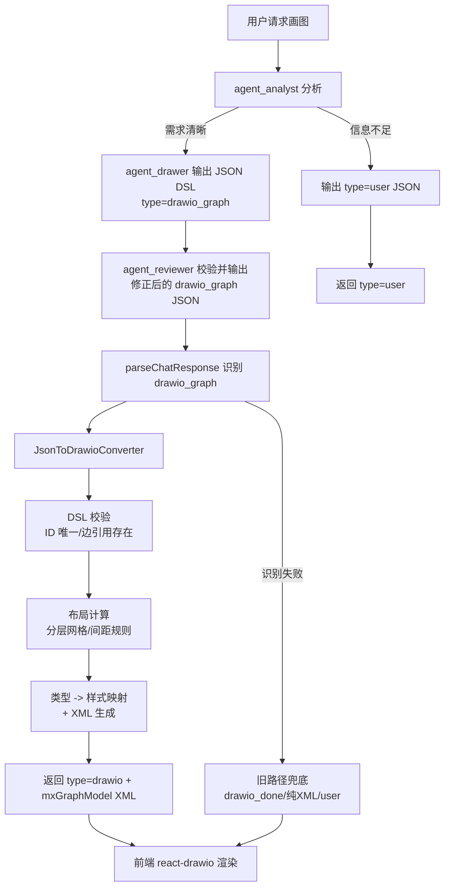

# TASK-004 Draw.io JSON DSL 中间表示与转换器

## 1. 背景

当前绘图链路要求 LLM 直接生成完整 Draw.io XML：`agent_drawer` 按提示词逐个输出内嵌 `<mxCell>` XML 的节点/连线 JSON，随后在 `drawio_done` 中把全部 XML 重复输出一遍，`agent_reviewer` 审查后又被要求"将修正过后的所有节点和连线重新输出一遍"。

这导致同一份图形内容被 LLM 生成约 3 次，且每次都包含 LLM 不擅长的信息：drawio 样式魔法字符串（`shape=cylinder3;fillColor=#ffe6cc...`）和节点坐标计算（提示词要求 LLM 做网格数学并保证间距）。以一张 10 节点架构图估算，整个工作流的输出 token 中约 70%~80% 花在 XML 语法与坐标上，模型输出速度成为端到端延迟的瓶颈；同时 LLM 手算坐标仍经常出现节点重叠、连线指向不存在的节点等错误。

本任务将图形的"语义"（有哪些节点、如何连线、节点是什么类型）与"呈现"（XML、样式、坐标）解耦：LLM 只输出紧凑 JSON DSL，由服务端新增的 `JsonToDrawioConverter` 确定性地生成 Draw.io XML，前端保持零改动。

## 2. 当前状态

### 2.1 当前已具备能力

- 默认 Agent `testAgent03`（agent ID `100003`）串行工作流 `agent_analyst → agent_drawer → agent_reviewer`，output key 链为 `analysis_result → draft_diagram → final_result`。
- `agent_drawer` 提示词已要求按行输出 `{"type":"drawio_node",...}`、`{"type":"drawio_edge",...}`，最后输出 `{"type":"drawio_done","content":"<mxGraphModel>..."}`；节点/连线 JSON 中内嵌完整 `mxCell` XML 字符串。
- 4 个绘图 Skill（`agent/skills/drawio-flowchart|architecture|uml|sequence/SKILL.md`）已沉淀了成熟的节点样式模板（database→圆柱体、queue→process 形状、decision→菱形等）与颜色语义约定，当前作为提示词上下文交给 LLM。
- `AgentServiceController.parseChatResponse` 已实现 JSON 平衡括号扫描（`extractBalancedJsonCandidate`），能识别 `user/drawio/drawio_node/drawio_edge/drawio_done` 五种类型，并用正则提取 `<mxfile>/<mxGraphModel>` XML；`drawio_node`/`drawio_edge` 当前被解析收集后在结果选择中被跳过（实际丢弃）。
- 同步对话 `POST /api/v1/chat` 与流式对话 `POST /api/v1/chat_stream` 均以 `type=drawio + XML content` 作为最终图形响应契约，前端 `extractDrawIoXml` + `react-drawio` 渲染，对 XML 的来源（LLM 或代码生成）无感知。
- 现有提示词已规定网格布局规则（起始 100,100 / 横向间距 ≥150 / 纵向间距 ≥120 / 同列同 x），说明布局约束已有明确定义，可代码化。

### 2.2 相关模块、接口与数据设施

| 项目项 | 当前情况 | 本任务关系 |
| --- | --- | --- |
| `data-visualizer-app/src/main/resources/agent/data-visualizer-agent.yml` | `agent_drawer`、`agent_reviewer` 的 instruction 要求输出内嵌 XML 的 JSON | 必须重写提示词为 JSON DSL 协议 |
| `agent/skills/drawio-*.md`（4 个） | 教 LLM 写 mxCell XML、算坐标 | 3 个需改写为 DSL 类型规范；sequence 保留旧路径 |
| `data-visualizer-trigger` `AgentServiceController` | `parseChatResponse` 解析最终输出 | 必须新增 `drawio_graph` 类型分支并调用转换器 |
| `data-visualizer-domain` | 无图形转换相关代码 | 新增转换器（解析、校验、样式映射、布局、XML 生成） |
| `data-visualizer-front` | `extractDrawIoXml` + `react-drawio` 渲染 | 不修改 |
| `data-visualizer-api` `ChatResponseDTO` | `type` + `content` 契约 | 不修改（转换器输出仍走 `type=drawio`） |
| MySQL / Redis / MQ | 当前绘图业务均未使用 | 不涉及 |

### 2.3 当前缺口

1. LLM 输出 token 中大部分是 XML 语法与坐标，生成慢、成本高，端到端延迟主要由输出速度决定。
2. 同一图形内容在 drawer 的 node/edge 行、`drawio_done`、reviewer 的重输出中被生成约 3 次。
3. LLM 手算坐标不可靠：节点重叠、间距不足、边指向不存在节点等问题依赖 reviewer 纠正，而 reviewer 本身也会再犯同类错误。
4. drawio 样式字符串作为提示词知识注入，token 开销大且 LLM 可能抄错或自创样式，图形风格不稳定。
5. `parseChatResponse` 已能识别 `drawio_node`/`drawio_edge` 但将其丢弃，没有服务端聚合与确定性转换能力。

## 3. 功能目标

将绘图 Agent 的输出协议从"LLM 生成完整 Draw.io XML"改为"LLM 输出紧凑 JSON DSL，由服务端 `JsonToDrawioConverter` 校验、布局并确定性生成 Draw.io XML"，在对外 API 与前端零改动的前提下大幅降低 LLM 输出 token 与端到端绘图延迟。

## 4. 用户场景

工作台用户在前端选择 Agent `100003`，输入"画一个电商系统的架构图，包含前端、网关、订单服务、MySQL 和 Kafka"。`agent_analyst` 判断需求清晰后，`agent_drawer` 输出一份单行 JSON DSL（节点带语义类型、不带坐标），`agent_reviewer` 校验后原样或修正输出。Controller 识别该 JSON，调用转换器生成带自动布局与标准样式的 `<mxGraphModel>` XML，以 `type=drawio` 返回。用户在前端看到与现在同等质量（样式统一、布局无重叠）的 Draw.io 图，但等待时间显著缩短；若模型偶发退回旧的 XML 输出行为，系统仍按现有逻辑兜底解析，用户结果不受影响。

## 5. 前置条件

- Agent 已装配成功（`100003` 对应 Runner Bean 存在），模型 API 可用。
- 用户请求通过前端或 API 正常进入 `/api/v1/chat` 或 `/api/v1/chat_stream`，会话已建立或可自动建立。
- 绘图需求不依赖时序图专用结构（时序图在本任务中继续走旧 XML 路径，见 Non-Goals）。

## 6. 后置条件

- 成功路径：Controller 返回 `type=drawio`，`content` 为由转换器生成的合法 `<mxGraphModel>` XML；节点无重叠、间距满足现有规则、样式来自服务端模板。前端零改动即可渲染。
- 对外 API 契约、流式消息 `log/result/error/done` 语义不变；`result` 消息的 `stage` 仍为 `drawio` 或 `user`。
- 会话、配置等内存状态行为不变；无新增持久化数据。
- 兜底路径：模型输出旧格式（`drawio_done` XML、纯 XML、`user`）时，解析行为与当前版本完全一致。

## 7. 任务范围

### 7.1 Goals

- 定义图形 JSON DSL：单行 JSON 对象，协议类型 `drawio_graph`，包含 `nodes`（id、label、kind）与 `edges`（source、target、label、kind）数组，不含坐标、不含 XML。
- 在 `data-visualizer-domain` 新增 `JsonToDrawioConverter` 组件，职责为：DSL 解析与校验（节点 ID 唯一、边引用存在、必填字段）、类型→样式映射（复用现有 4 个 SKILL.md 的样式模板）、自动布局（分层网格，满足现有间距规则）、生成 `<mxGraphModel>` XML。
- 扩展 `parseChatResponse`：识别 `drawio_graph` 类型，调用转换器，将生成的 XML 以 `type=drawio` 返回；同步与流式两条路径都支持。
- 重写 `agent_drawer` 与 `agent_reviewer` 提示词：输出/审查 JSON DSL，删除 XML 格式说明与坐标计算指令。
- 改写 `drawio-flowchart`、`drawio-architecture`、`drawio-uml` 三个 SKILL.md 为 DSL 类型枚举与选用规范（样式知识迁入转换器）。
- 转换失败时安全回退到现有解析路径，不向前端抛出新错误形态。
- 补充转换器与解析分支的单元测试。

### 7.2 Non-Goals

- 不修改前端任何代码（`extractDrawIoXml`、`react-drawio` 渲染、流式消费逻辑均不动）。
- 不修改对外 HTTP API：不新增/修改接口、请求/响应 DTO；`ChatResponseDTO` 的 `type`/`content` 字段不变。
- 不修改 Agent 装配链、工作流结构（仍是 analyst → drawer → reviewer 串行）、`output-key` 链路与 ADK Runner 注册机制。
- 不支持时序图 DSL：`drawio-sequence` 场景继续走现有"LLM 生成 XML"路径，本任务只保证其不被破坏。
- 不实现嵌套分组/容器（swimlane、VPC 区域框的 parent 嵌套坐标）。
- 不实现流式增量渲染（逐节点推送、前端渐进画图）；本任务完成时用户仍在最终结果一次性看到整图。
- 不实现增量编辑/patch 工具（`add_node`/`update_node` 等工具调用式绘图）。
- 不引入 ELK/dagre 等外部布局库依赖，v1 使用纯 Java 简单布局算法。
- 不引入 Mermaid 中间语言转换链路。
- 不新增数据库、Redis、MQ、持久化、缓存或新的配置管理接口。
- 不修改流式消息协议 `log/result/error/done` 与审批消息类型。
- 不做性能基准测试基建；token 收益以估算与人工验证为准。

## 8. 业务规则

1. **新增内部消息类型 `drawio_graph`**：仅存在于 LLM 输出与 Controller 解析之间，不透传到前端；Controller 消化后对外仍返回 `type=drawio`。
2. **旧类型全部保留兜底**：`user`、`drawio`、`drawio_done`、纯 XML 提取路径行为不变；解析顺序为先尝试新类型，失败后走现有逻辑。
3. **LLM 不再输出坐标与 XML**：drawer 提示词中删除坐标计算与 mxCell 格式要求（时序图路径除外）。
4. **坐标由服务端计算**：布局必须保证节点无重叠、横向间距 ≥150、纵向间距 ≥120，与现有提示词约束一致。
5. **样式由服务端模板决定**：DSL `kind` 映射到固定样式（来源为现有 SKILL.md 样式表），LLM 无法注入任意 style 字符串；未知 `kind` 回退到默认矩形/默认连线样式，不报错。
6. **转换器必须校验**：节点 ID 唯一、`source`/`target` 引用存在的节点、`label` 非空。校验失败的边跳过并记录日志（可诊断），校验失败的节点尽力渲染；整体无法解析时回退旧路径，不抛出中断用户请求的异常。
7. **reviewer 仍可修正 JSON**：reviewer 输出修正后的完整 `drawio_graph` JSON（JSON 成本远低于 XML，保留闭环）；转换器对 reviewer 输出同样做防御性校验，不信任任何 LLM 输出。
8. **时序图豁免**：drawer 对时序图请求继续按现有 XML 协议输出，reviewer 的旧格式兼容分支保留。
9. **一次对话多次运行仍不幂等**：本任务不改变重复请求重复执行的现状，仅降低单次执行成本。

## 9. 核心业务流程



必须保持的顺序：**LLM 输出 JSON → Controller 识别 → 转换器校验 → 布局 → 样式 → XML → 既有 drawio 响应链路**。转换器任何环节失败都不得中断请求，只能降级。

## 10. 数据变化

### 10.1 JVM 内存与日志

不新增业务数据。转换器校验失败、跳过的边、未知 `kind` 回退等异常情况写入应用日志（含 requestId/sessionId 等可获得的上下文，如果当前解析上下文取不到则不伪造字段），便于诊断模型输出质量。

### 10.2 MySQL / Redis / MQ

不新增表、字段、Key、消息。当前绘图业务与三者均无关联，本任务不改变该现状。

### 10.3 配置

样式模板与布局常量第一版放在 Java 代码常量中，不新增 YAML 配置项；避免为样式引入新的配置绑定面。若实现中发现必须配置化（如间距需要调优），须在实现说明中记录并最小化处理。

## 11. API 变化

**无对外 API 变化。**

- `POST /api/v1/chat`：请求结构不变；响应 `ChatResponseDTO.type` 取值仍为 `user` 或 `drawio`，`content` 仍为文本或 XML。
- `POST /api/v1/chat_stream`：流式消息类型仍为 `log/result/error/done`（及既有审批类型），`result.stage` 仍为 `drawio` 或 `user`。
- `drawio_graph` 是 LLM 输出的内部类型，不出现在任何 HTTP 请求/响应中。

## 12. 技术实现方案

### 12.1 推荐方案

在 `data-visualizer-domain` 新增转换器包（推荐位置 `domain.agent.service.chat.converter`，具体由 Coding Agent 按现有包结构确认），核心组件：

```text
DiagramDslParser    // 解析 drawio_graph JSON，输出类型化 DSL 对象；校验 ID 唯一、边引用、必填字段
StyleTemplates      // kind → drawio style 字符串映射（内容迁移自 4 个 SKILL.md 的样式表）
SimpleGridLayout    // 分层网格布局：按边关系分层（源节点层 → 下游层），同层横排、层间纵排，
                    // 起始 100,100、横向步长 ≥150、纵向步长 ≥120；无环按 BFS 分层，有环回退顺序网格
JsonToDrawioConverter // 编排：parse → layout → style → 生成 <mxGraphModel><root>... XML
```

DSL 示例（drawer 的目标输出，单行）：

```json
{"type":"drawio_graph","nodes":[{"id":"n1","label":"前端 Web","kind":"client"},{"id":"n2","label":"订单服务","kind":"service"},{"id":"n3","label":"MySQL","kind":"database"}],"edges":[{"source":"n1","target":"n2","label":"HTTPS"},{"source":"n2","target":"n3","label":"JDBC","kind":"data"}]}
```

节点 `kind` 枚举（v1，来自现有 SKILL.md 的类型体系）：

- 流程图：`start`、`end`、`process`、`decision`、`data`、`document`
- 架构图：`service`、`database`、`queue`、`client`、`boundary`
- UML：`class`、`interface`、`actor`、`usecase`

边 `kind` 枚举：`default`（可省略）、`async`（虚线）、`data`（橙色）等，映射自现有 SKILL.md 连线样式。

`AgentServiceController.parseChatResponse` 改动：

1. `isSupportedResponseType` 增加 `drawio_graph`。
2. 在 `tryParseJsonResponse` 的倒序选择中新增分支：识别 `drawio_graph` 后调用转换器，成功则返回 `buildChatResponse("drawio", xml)`，失败则继续向下兼容旧类型与 XML 提取。
3. 修复流式路径 fallback 不一致：`chatStream` 完成回调当前只把最后一个事件内容同时作为 result 与 fallback 传入 `parseChatResponse`，而同步路径传的是全量消息 join。应将流式执行期间的事件内容累积起来，完成时以（最后一条非空内容, 全量拼接）调用，与同步路径对齐。这是使新类型在流式路径可靠解析的必要最小修改。

提示词改动要点：

- `agent_drawer`：删除 XML 输出格式、网格坐标数学、样式引用三段指令；改为"输出单行 `drawio_graph` JSON，节点只含 id/label/kind，kind 从技能规范中选取；时序图按旧 XML 协议输出"。保留"输入是 user JSON 时原样输出"。
- `agent_reviewer`：审查对象从 XML 改为 JSON DSL（检查边引用、缺失节点、kind 选用），修正后输出完整 `drawio_graph` JSON；保留 `user` 直通分支与旧格式 XML 兼容分支（时序图）。
- Skill 文件：`drawio-flowchart/architecture/uml` 三个 SKILL.md 改写为"DSL kind 枚举定义 + 选用建议"，删除 mxCell XML 示例与布局数学；`drawio-sequence` 保持原样。

### 12.2 为什么采用这个方案

- **前端与 API 零改动**：转换器输出合法 XML，走既有 `type=drawio` 契约，改造封闭在后端，风险面最小。
- **token 收益直接作用于延迟**：输出 token 从约 3000+（10 节点示例）降到约 600，LLM 输出时间是端到端延迟主因，收益即延迟收益。
- **消除三类现网错误**：坐标重叠（布局算法保证间距）、样式错误（模板保证）、边引用悬空（校验保证）。
- **复用现有资产**：JSON 扫描骨架、样式表、布局规则全部来自现有代码/提示词，无新技术引入。

### 12.3 为什么不采用其他明显可行方案

| 方案 | 不采用原因 |
| --- | --- |
| 引入 ELK/dagre 自动布局库 | v1 的布局需求（网格分层）纯 Java 几十行可实现；引入外部依赖违反"现有架构 > 新技术"，且 ELK Java 集成成本高。可作为二期升级项。 |
| 前端转换 JSON + dagre.js | 需要修改前端渲染逻辑与 `type=drawio` 契约，破坏"前端零改动"目标；流式/同步两条链路都要变。 |
| Mermaid 中间语言 | 表达能力受 Mermaid 图类型限制；转换链路引入新依赖；且 LLM 也可能输出非法 Mermaid，可控性不如自定义 DSL + 严格校验。 |
| 工具调用式绘图（add_node/add_edge 工具） | 多轮工具调用往返开销大，首次生成可能更慢；实现复杂度最高。适合二期做增量编辑。 |
| 流式增量渲染（方案二） | 需要改前端消费与渲染逻辑；与解耦目标正交，可后续独立成任务。 |
| 让 reviewer 退出输出、只做意见 | 进一步省 token，但改变工作流语义（`final_result` 不再含图形），影响面大于本任务必要范围；本任务保留 reviewer 重输出 JSON 的闭环。 |

### 12.4 对现有系统的影响

- 提示词变更只影响默认 Agent YAML；运行期通过 `/admin` 更新配置的用户自定义配置不受影响（旧协议仍是合法输出，兜底路径保证可用）。
- `parseChatResponse` 是同步与流式共用的唯一出口，改动必须同时验证两条路径。
- 布局算法为纯函数、无并发状态，对并发无影响。

## 13. 影响范围

### 13.1 必须修改

- `data-visualizer-app/src/main/resources/agent/data-visualizer-agent.yml`：重写 `agent_drawer`、`agent_reviewer` 的 instruction。
- `data-visualizer-domain`：新增转换器（解析/校验、样式模板、布局、XML 生成）及配套模型对象；具体包位置由 Coding Agent 按现有结构确认。
- `data-visualizer-trigger` `AgentServiceController`：`parseChatResponse` 及相关私有方法新增 `drawio_graph` 分支；`chatStream` 完成回调的解析输入与同步路径对齐（累积事件内容）。
- `data-visualizer-app/src/test/java`：转换器与解析分支测试。

### 13.2 可能修改

- `agent/skills/drawio-flowchart/SKILL.md`、`drawio-architecture/SKILL.md`、`drawio-uml/SKILL.md`：改写为 DSL 类型规范。若实现时发现提示词中直接内联 kind 枚举已足够，可减少对 Skill 的依赖程度，但不得保留与新协议矛盾的 XML 教学内容。
- `ChatResponseDTO`：不修改字段；仅当实现中发现必须增加内部标记时再评估（默认不修改）。
- 类路径外 `config/data-visualizer-agent.yml`（如果部署环境存在）：属于运维侧外部配置，代码仓不修改，但实现说明中需提示部署同步。

### 13.3 不应该修改

- `data-visualizer-front` 全部代码。
- Agent 装配链（`AiApiNode`/`ChatModelNode`/`AgentNode`/`AgentWorkflowNode`/`RunnerNode`）、工作流定义、output-key 链路、动态 Bean 注册机制。
- 流式桥接 `AgentStreamBridge` 的消息语义与 request ID 关联；审批相关全部代码。
- Shell 工具、命令审查（TASK-002/003 成果）、Netty 网关协议。
- MySQL、MyBatis、Redis、MQ 相关配置与代码。
- `architecture.md`、`business.md`（按 AGENTS.md，仅当实现后事实变化时由实现任务检查更新，本 Task 文档不要求修改）。

## 14. 实施步骤

1. **确认解析与渲染基线。** 通读 `AgentServiceController` 的 `parseChatResponse`/`tryParseJsonResponse`/`extractJsonResponses`、前端 `extractDrawIoXml` 消费点、默认 Agent YAML 与 4 个 SKILL.md，明确不可破坏的契约清单（`type=drawio`、`user` 直通、XML 正则、流式 result 组装）。
2. **定义 DSL 模型与校验规则。** 在 domain 模块新增 `drawio_graph` 的类型化模型（nodes/edges/kind 枚举）与解析校验逻辑（ID 唯一、边引用、必填字段、未知 kind 回退策略）。
3. **实现样式模板与布局。** 从 SKILL.md 迁移样式字符串为 kind→style 映射；实现分层网格布局（间距/起始坐标与现有提示词规则一致）。
4. **实现 XML 生成与转换器编排。** 生成 `<mxGraphModel><root><mxCell id='0'/><mxCell id='1' parent='0'/>...</root></mxGraphModel>`；注意 XML 转义（label 中的引号、尖括号、换行），确保产出可被前端 `extractDrawIoXml` 正则与 react-drawio 加载。
5. **扩展 `parseChatResponse`。** 新增 `drawio_graph` 识别分支与转换调用；失败回退旧路径；同步 `chat` 与流式 `chatStream` 完成回调统一解析输入（累积事件内容作为 fallback）。
6. **重写提示词。** 修改 `agent_drawer`（JSON DSL 输出协议、时序图豁免）与 `agent_reviewer`（JSON 审查与重输出、旧格式兼容保留）的 instruction。
7. **改写 Skill 文件。** 三个 SKILL.md 更新为 DSL kind 规范；`drawio-sequence` 不动。
8. **补充测试并整理实现说明。** 转换器单测、`parseChatResponse` 新旧类型单测、提示词与 Skill 变更说明、建议的人工验证步骤（含真实模型调用验证与 token 对比观察）。

## 15. Acceptance Criteria

- [x] `agent_drawer` 新提示词要求输出单行 `drawio_graph` JSON，且不再要求输出坐标或 mxCell XML（时序图分支除外）。
- [x] Controller 能从 LLM 最终输出中识别 `drawio_graph` JSON（含被 Markdown 代码块包裹、前后存在其他文本的情况），调用转换器并以 `type=drawio` 返回生成的 XML。
- [x] 转换器对合法 DSL 生成的 XML 是良构的：`<mxGraphModel>` 结构完整、节点 id 唯一递增、边 source/target 均指向存在节点、label 中的特殊字符已正确转义。
- [x] 布局结果满足：任意两节点矩形无重叠，横向相邻间距 ≥150，纵向相邻间距 ≥120（对同一层级内节点与相邻层节点分别验证）。
- [x] DSL 中 `database`、`queue`、`decision`、`actor` 等已知 kind 分别映射到对应 drawio 形状/样式（圆柱体、process、菱形、umlActor 等，与现 SKILL.md 一致）；未知 kind 回退默认样式且不抛异常。
- [x] 校验失败的边（引用不存在节点）被跳过并记录日志，其余节点/边正常生成；全量无法解析时回退旧路径返回 `type=user` 原文或旧 XML，不向调用方抛出 500 类错误。
- [x] 旧格式兜底不回归：`drawio_done`（XML content）、裸 `<mxfile>/<mxGraphModel>`、`user` JSON 三种输入经 `parseChatResponse` 的返回与改动前一致。
- [x] 流式路径：`chatStream` 完成回调发出的 `result` 消息 `stage=drawio`、content 为转换器 XML；且解析输入包含请求期间累积的事件内容，不依赖"最终 JSON 恰好是最后一个事件"。
- [x] reviewer 提示词保留 `user` 直通与旧格式 XML 兼容分支；时序图请求的旧协议输出仍能被现有解析路径处理。
- [x] `ChatResponseDTO` 字段、对外 HTTP API、前端代码、流式消息类型 `log/result/error/done`、Agent 装配链与工作流结构无任何修改（以 diff 验证）。
- [x] 新增单元测试覆盖：DSL 解析（合法/非法/未知 kind）、边引用校验、布局无重叠与间距、XML 转义、`parseChatResponse` 新类型识别与旧类型回归；按仓库约定不自动执行，由开发人员手动运行并通过。
- [x] 不新增 MySQL/Redis/MQ 依赖、配置项或持久化代码。

## 16. 测试要求

### 16.1 转换器单元测试

- 合法 DSL（多类型节点、多 kind 边）→ XML 良构、可被现有 `DRAWIO_XML_PATTERN` 正则提取。
- 节点 ID 重复、边引用不存在节点、label 缺失/空、nodes 为空、edges 为空、未知 kind、超长 label、label 含引号/尖括号/换行。
- 布局：同层多节点的 x 坐标递增且间距达标；跨层 y 坐标递增且间距达标；10+ 节点图无矩形重叠。
- 边 kind（default/async/data）映射到对应 style 差异。

### 16.2 Controller 解析测试

- 输入为单行 `drawio_graph` → 返回 `type=drawio` + 转换 XML。
- 输入含多段内容（日志文本 + 代码块包裹的 drawio_graph）→ 仍能识别。
- 输入为旧 `drawio_done`/裸 XML/`user` JSON → 与改动前行为一致（回归用例直接固化改动前输出）。
- 转换器抛异常 → 回退旧路径，不抛出。

### 16.3 人工验证（由开发人员执行）

- 启动应用，通过前端流式页发起架构图/流程图请求，确认最终图形渲染正常、样式符合 SKILL.md 观感、无重叠。
- 观察流式日志中 drawer/reviewer 的输出形态与长度，对比改动前后 token/耗时。
- 发起时序图请求，确认走旧 XML 路径仍可出图。
- 模拟"信息不足"请求，确认返回 `type=user` 补充信息文案。

## 17. Risks

1. **模型不遵守新协议。** DeepSeek 可能仍输出 XML 或格式漂移（多行 JSON、加说明文字）。降低方式：提示词强调单行严格 JSON；`parseChatResponse` 本就做多候选扫描；旧路径兜底保证功能不中断（此时退化为旧性能而非故障）。
2. **布局算法对特殊图结构效果差。** 环状依赖、超宽图、孤立节点可能导致分层异常或画布过宽。降低方式：有环回退顺序网格、孤立节点单独成层；验收标准只约束无重叠与间距，不承诺美观最优；ELK 升级列为后续项。
3. **XML 转义遗漏导致前端渲染失败。** label 中的引号/换行/尖括号若未转义，会生成非法 XML。降低方式：转义单测覆盖特殊字符；生成后可选做一次自解析校验（DOM 解析回读）。
4. **流式路径解析输入变化引入回归。** 累积事件内容作为 fallback 改变了 `chatStream` 完成回调行为，可能让旧的"最后事件覆盖"语义暴露新问题。降低方式：新旧两条路径共用同一 `parseChatResponse`，用回归用例固化旧格式输出；灰度观察流式页人工验证。
5. **reviewer 改写 JSON 引入新错误形态。** reviewer 修正时可能破坏 JSON 结构。降低方式：转换器对所有输入防御性校验；reviewer 提示词强调"输出与输入同构的完整 JSON"。
6. **Skill 与提示词不同步。** Skill 改写滞后或残留 XML 教学，会稀释协议约束。降低方式：实施步骤将 Skill 改写列为必做；提示词内联关键枚举，Skill 作为补充而非唯一来源。
7. **运行期自定义 Agent 配置仍走旧协议。** 通过 `/admin` 提交的旧式配置不享受新链路，属预期行为而非缺陷；需在实现说明中记录，避免误判为回归。

## 18. Open Questions

- 时序图在 v1 明确走旧 XML 路径；若时序图请求占比高，是否需要二期专用 DSL（lifeline/message 结构）与专用转换逻辑？需要业务方确认使用频率。
- 节点嵌套分组（boundary/VPC 容器）是否为近期必需？DSL 已预留扩展空间，但 v1 布局不支持嵌套坐标；若架构图普遍需要区域框，应提前排期二期。
- 布局算法 v1 采用简单分层网格；若用户对布局美观度要求高（正交路由、紧凑排布），何时引入 ELK/dagre 需要业务方决策。
- 是否需要在本任务中输出一次前后 token/耗时对比报告（真实模型调用）作为量化验收？当前验收标准未强制，若需要应明确测量方式。
- `agent_analyst` 是否需要同步改为输出"建议的 kind 标注"以提升 drawer 的 kind 选用准确率？v1 不改，若实测 kind 选用经常不当再评估。

## 19. AI 开发注意事项

- 对外契约绝对不动：`ChatResponseDTO.type/content`、HTTP API、流式消息 `log/result/error/done` 与 request ID 关联、前端代码。`drawio_graph` 只存在于 LLM 输出与后端解析之间。
- 旧解析路径全部保留：`user`、`drawio`、`drawio_done`、`drawio_node`/`drawio_edge` 识别、`<mxfile>/<mxGraphModel>` 正则提取，任何一条都不能删除或改变行为——它们同时是时序图路径与模型不遵守协议时的兜底。
- 默认工作流的 output-key 链 `analysis_result → draft_diagram → final_result` 与子 Agent 顺序不能改；只改 instruction 内容。
- `runner.agent-name: sequential_draw_process` 与子 Agent 名称对应关系不能破坏。
- 转换器必须是无状态纯函数式组件，不持有请求间共享可变状态；校验与布局失败一律降级（跳过/回退/日志），绝不向上抛出中断用户请求的异常。
- 生成 XML 时的特殊字符转义（label 中的 `'`、`"`、`<`、`>`、换行）必须处理并有测试。
- 不要顺手优化：不引入 ELK/dagre/Mermaid、不做增量渲染、不做编辑工具、不动装配链/审批/Shell/Netty/数据库/Redis/MQ、不重构 `parseChatResponse` 之外的 Controller 逻辑、不修改前端与 `architecture.md`/`business.md`（实现后按 AGENTS.md 检查是否需要更新文档即可）。
- 测试类放在 `data-visualizer-app/src/test/java`，遵循 `*Test.java` 命名；按仓库约定不自动执行构建/测试命令，完成后汇报建议执行的验证命令。
- 提示词修改要保持中文、保持与现有 YAML 缩进与 `instruction: |` 块格式一致，避免破坏 Spring Binder 绑定。
