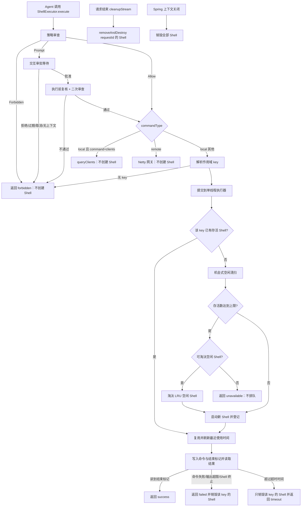

# TASK-005 ShellExecutor 每次请求独立短生命周期 Shell

> 本任务只生成实现文档，由后续 Coding Agent 执行；本文档生成阶段不修改任何业务代码。
>
> **需求解释（需确认，执行前请先确认）：** 需求原文为"ShellExecutor 每次请求起短生命周期 shell"。
> 本文档按 **"一次流式对话请求（`requestId`）对应一个本地 Shell，请求结束后销毁，请求之间不共享"** 解释，
> 并把"作用域 key 策略"设计为代码中的单一决策点，以便在需求确认为"每次 `execute()` 调用一个 Shell"时
> 只改一处。两种解释的差异与取舍见 `## 18. Open Questions`。

## 1. 背景

`ShellExecutor` 是 `data-visualizer-domain` 中通过 Spring AI `@Tool` 暴露给 Agent 的命令执行工具。其中 `local` 类型命令由**整个 JVM 共享的唯一长期存活 Shell 进程**执行：`ShellExecutor` 是 Spring 单例，`shellProcessRef` / `writer` / `reader` / `shellName` 都是单例字段，第一次命令时启动 `pwsh.exe`/`pwsh`/`powershell.exe`（Windows）或 `bash`/`sh`（Linux），之后所有请求复用同一个进程，直到进程异常终止才重建。

TASK-002 与 TASK-003 已经在执行前引入了策略审查与交互审批，ADR-003 又把本地执行改为"有界单线程执行器 + `Future.get` 超时"，解决了**并发写同一 Shell**与**挂死命令永久占用 Shell**两类问题。但 ADR-003 在同一份文档的"被否决的替代方案"与"后果"中明确把"每次请求启动独立短生命周期 Shell"记为**待评估的后续方向**：

> 每次请求启动独立短生命周期 Shell —— 能同时解决隔离与并发，但每条命令都要支付进程启动成本，且改变 `cd` 状态在单轮对话内不再保持；属于更大的架构改动，另行评估。

本任务就是该方向的具体落地：把 Shell 的**作用域**从"整个 JVM 一个"改为"一次请求一个"，并给请求结束、超时、空闲三条路径定义明确的销毁语义。

## 2. 当前状态

### 2.1 当前已具备能力

- `ShellExecutor`（`shell` 包，`@Service` 单例）通过 `@Tool` 暴露 `execute(CommandRequest)`；`CommandRequest` 字段为 `command` / `commandType`(`local`|`remote`) / `hostName`。
- 本地路径：`ThreadPoolExecutor(corePoolSize=1, maximumPoolSize=1, ArrayBlockingQueue(local-execution-queue-capacity=64), CallerRunsPolicy)`，专用 daemon 线程 `local-shell-executor`；调用线程以 `Future.get(local-execution-timeout-millis=30s)` 等待，超时后 `forceDestroyShellProcess()` + 返回 `timeout`；执行器已关闭/队列满被兜底执时返回 `unavailable`（任务体校验当前线程是否为专用执行线程）。
- `CommandStatus` 已支持 `success / failed / forbidden / invalid / timeout / unavailable`；`CommandResponse` 字段（`targetIp` / `command` / `responseStatus` / `responseMessage`）保持兼容。
- 状态字段划分：`shellProcessRef`（`AtomicReference<Process>`，允许超时线程跨线程销毁）+ `writer` / `reader` / `shellName`（只在持锁线程内读写）；`shellStateLock`（`ReentrantLock`）提供互斥与可见性；`@PreDestroy shutdown()` 关闭执行器并销毁 Shell 进程。
- `local` 的 `clients` 特殊命令走 `businessPort.queryClients()`，**不触碰 Shell**；`remote` 命令走 `businessPort.action(...)` → Netty，每次新建 `GatewayCommandEntity` + UUID 请求 ID，最多等 30 秒，**也不触碰本地 Shell**。
- 请求上下文：`CommandExecutionContextHolder`（ThreadLocal，`CommandExecutionContext(requestId, agentId, userId, sessionId)`）只在 `AgentServiceController.chatStream` 的 `CompletableFuture.runAsync` 执行体内 `set`，并在同一线程 `finally` 中 `clear()`；ADR-002 已确认"当前串行工作流下同线程链"成立，并限定该 Holder 的语义边界。
- 请求生命周期钩子：`chat_stream` 会在 `emitter.onCompletion/onTimeout/onError` 三处调用同一个幂等的 `cleanupStream(cleaned, requestId, disposable)`，其中已包含 `commandApprovalService.cancelByRequest(requestId)`、`streamDisposable.dispose()`、`agentStreamBridge.clear(requestId)`。**这是当前唯一可用的"请求结束"回调点。**
- 审批：`CommandApprovalService` + `PendingApprovalStore`（`approvalId` 主索引），`PENDING → APPROVED/REJECTED/EXPIRED/CANCELLED` 原子迁移，并发上限 `max-pending-approvals=5` / `max-pending-approvals-per-request=1`，超限直接 `forbidden` 且不占用执行线程。
- 测试基线：`ShellExecutorPolicyTest`、`ShellExecutorApprovalTest`、`CommandApprovalServiceTest`、`CommandApprovalConcurrencyLimitTest`、`ShellExecutorLocalExecutionTest`（含真实 Shell 的挂死/超时/恢复用例，无 Shell 环境用 `assumeTrue` 跳过）、`MCPTest`。

**当前源码中已知的一处状态（本任务不修改）：** `ShellExecutor.execute` 中 `review.isForbidden()` 分支与"审批后二次审查"均被注释，并用 `if (true) { ... }` 无条件进入审批；`CommandPolicyReviewer.review` 在返回前无条件执行 `promptMatched = true;`，使 `ALLOW` 不可达。因此**当前所有命令都会进入审批流程**，本地命令能否执行取决于审批结果而非 allow 规则。该状态是需求方明确要求保留的，本任务不得顺带修复（见 `## 19`），但它直接影响可执行路径与测试写法（见 `## 16`）。

### 2.2 相关模块、接口与数据设施

| 项目项 | 当前情况 | 本任务关系 |
| --- | --- | --- |
| `data-visualizer-domain`（`shell` 包） | `ShellExecutor`、`CommandExecutionContextHolder`、策略与审批组件 | 核心改造：Shell 作用域、注册表、销毁语义 |
| `data-visualizer-trigger` | `AgentServiceController`（`chat` / `chat_stream` / 审批接口 / `cleanupStream`） | 复用 `cleanupStream` 接入请求结束时的 Shell 销毁 |
| `data-visualizer-app` | `Application` 中的 `ShellExecutorToolCallbackProvider`、`application-dev.yml` 策略配置、测试 | 新增配置项与默认值；补充测试 |
| `data-visualizer-infrastructure` / Netty | `BusinessPort`、`NettySocketServer` | `remote` 路径与 `clients` 查询不变，不涉及 |
| Python `netty-socket-server/gateway-socket-client` | 远程客户端自有进程模型 | 不涉及（本任务只改 Java 侧本地 Shell） |
| MySQL / MyBatis | 当前命令功能未使用 | 不涉及 |
| Redis / MQ | 未接入命令业务 | 不涉及 |
| 前端 | 流式页面消费 `log/result/error/done` 与审批事件 | 不涉及（Shell 作用域变化不改变任何消息格式） |

### 2.3 当前缺口

1. **Shell 跨请求共享，状态会泄漏。** 长驻 Shell 保留前一请求的 `cd`、环境变量、shell 变量；串行化只能防止命令交错，不能提供请求级隔离。默认 allow 列表目前只有 `pwd`/`ls`/`dir`/`whoami`/`uname`/`git status`/`git diff`/`clients` 这类只读诊断命令，但一旦审批放行（或后续恢复 `ALLOW` 分支并放宽 allow 规则）允许 `cd` 等有状态命令，泄漏就会直接体现为业务行为。
2. **Shell 生命周期与请求无关，进程可能长期不退出。** 只有当进程意外死亡（`process.isAlive() == false`）或本地命令超时而强制销毁时才会重建。正常路径下，一个空转的 `pwsh.exe` 会在整个应用生命周期内一直存在，且不会被任何清理逻辑回收。
3. **无法在请求结束时释放资源。** 请求已经结束（流式 emitter 完成/超时/断开）与 Shell 是否仍被持有之间没有关联，`cleanupStream` 目前只清理审批、流 Disposable 和 Emitter 注册表。
4. **超时销毁的粒度是"全局唯一 Shell"。** 超时路径 `forceDestroyShellProcess()` 销毁的是那个共享 Shell：一次超时会影响**所有**请求后续的本地命令（都会被迫重建 Shell 并丢失各自依赖的上下文），而不仅仅是触发超时的那次请求。
5. **缺少 Shell 数量与存活时间的边界。** 当前没有 Shell 数量上限、没有空闲回收、没有按请求统计。若改为每请求一个 Shell，没有边界的实现会立刻放大进程数与内存占用（每个 `pwsh.exe` 通常数十 MB）。
6. **没有可观测性。** 无法知道当前有多少个 Shell、分别属于哪个请求、最近一次使用时间，无法验证"请求结束后是否真的销毁"。

## 3. 功能目标

把本地 Shell 的作用域从"整个 JVM 共享一个长期存活进程"改为"**一次对话请求独立持有、请求结束后销毁、请求之间互不共享**"，并为超时、请求结束、空闲三条路径定义明确且幂等的销毁语义，同时用数量上限与空闲回收保证进程数有界。

## 4. 用户场景

工作台访问者通过流式对话请求 Agent 查询本机环境。Agent 调用 `ShellExecutor.execute` 执行 `local` 命令时：

- 该请求第一次执行本地命令：服务端启动一个**属于本次请求**的 Shell，命令在其中执行。
- 同一请求后续再次执行本地命令：复用本次请求的同一个 Shell（在单次请求内保持 `cd`/环境变量连续性）。
- 另一个用户/另一个会话同时发起请求：使用**各自独立**的 Shell，看不到对方的目录、环境变量与 shell 变量。
- 请求结束（`result`/`done` 已发送、emitter 超时、连接断开或异常结束）：本次请求的 Shell 被销毁，进程退出。
- 同一请求内的本地命令超时：**只销毁该请求的 Shell**，其他请求的 Shell 与其上下文不受影响。
- 命令被策略拒绝、被用户拒绝审批、审批过期或流式连接已断开：**不会创建 Shell**（不产生任何进程）。

## 5. 前置条件

- `ShellExecutor` 已被 Spring 注册并通过 `ShellExecutorToolCallbackProvider`（`data-visualizer-app` 的 `Application` 中定义）提供给模型（现有装配方式不变）。
- 本地执行环境存在受支持的 Shell（`pwsh.exe` / `pwsh` / `powershell.exe` 或 `bash` / `sh`）。
- 命令已通过既有策略审查与（如命中）交互审批，且 `commandType == local` 且命令不是特殊命令 `clients`。
- 能取得本次请求的作用域 key（默认为 `CommandExecutionContextHolder` 中的 `requestId`）；取不到时按 `## 12` 定义的"无上下文"策略处理。
- 当前仍使用全局单线程执行器（本任务不改变并发模型），因此同一时刻只有一条本地命令在执行。
- 新增配置项有安全默认值，配置缺失或非法时不得放宽上限。

## 6. 后置条件

### 6.1 正常执行

- 本次请求首条本地命令时创建属于该请求的 Shell；后续命令复用同一 Shell。
- 命令返回既有的 `success` / `failed` / `timeout` / `unavailable` 状态，`CommandResponse` 字段与语义不变。
- 记录可观测信息：作用域 key、是否新建 Shell、Shell 最近使用时间、当前存活 Shell 数。

### 6.2 请求结束

- `cleanupStream` 触发时，该 `requestId` 的 Shell 被销毁、从注册表移除、进程退出；操作幂等。
- 未决审批的清理语义保持不变（`cancelByRequest` 仍先执行）。
- 请求结束后该 `requestId` 不再持有任何 Shell；后续同 `requestId` 不可能出现（`requestId` 每次流式请求重新生成）。

### 6.3 超时

- 只有触发超时的那次请求的 Shell 被强制销毁；其他请求的 Shell 不受影响。
- 该请求后续本地命令会惰性重建 Shell；命令返回 `timeout`（既有语义）。

### 6.4 拒绝路径

- 策略拒绝、审批拒绝/过期/取消、缺少请求上下文导致的安全失败：不创建 Shell、不写 Shell、不产生进程。

## 7. 任务范围

### 7.1 Goals

- 定义并实现 **Shell 作用域 key 策略**：默认按"一次请求"（`requestId`）隔离，并把它收敛到代码中的单一决策点。
- 引入按 key 管理本地 Shell 生命周期的注册表组件：`getOrCreate(key)` / `removeAndDestroy(key)` / `destroyIfTimedOut` / `size()`，进程引用可由非执行线程访问以解除阻塞，`writer`/`reader`/`shellName` 仍只允许执行器线程读写。
- 改造本地执行路径：`ensureShellRunning` / `writeAndReadLocked` / 超时销毁 / 异常清理都按 key 进行，不再操作"全局唯一 Shell"。
- 只在**审批通过并即将执行**时才创建 Shell；等待审批期间不创建、不占用 Shell。
- 在 `AgentServiceController.cleanupStream` 中接入请求结束时的 Shell 销毁（幂等，位于 `cancelByRequest` 之后、`agentStreamBridge.clear` 之前或并列，清理顺序必须与现有审批清理一致）。
- 增加 Shell 数量上限 `max-concurrent-shells`：达到上限时按 LRU 淘汰空闲 Shell；无可淘汰项时返回 `unavailable`（不阻塞、不排队）。
- 增加空闲回收：在新建 Shell 前做一次机会式清扫，只销毁"超过空闲阈值且其请求已不再活跃（`AgentStreamBridge.contains(requestId)` 为 false）"的 Shell；不引入新的调度线程或定时任务。
- `@PreDestroy` 关闭时销毁全部存活 Shell。
- 保持既有并发模型（全局单线程执行器 + `Future.get` 超时 + 兜底执行拒绝）与既有状态语义不变。
- 补充测试，覆盖复用、隔离、请求结束销毁、超时定向销毁、拒绝不创建、上限淘汰、空闲回收、既有测试不回归。

### 7.2 Non-Goals

- 不修复 `ShellExecutor.execute` 中被注释的 `Forbidden` 分支、审批后二次审查，以及 `CommandPolicyReviewer` 中使 `ALLOW` 不可达的 `promptMatched = true`。这是需求方明确保留的当前状态。
- 不修改 `CommandRequest` 的公开字段、`CommandResponse` 的字段名与结构、MCP 工具入参。
- 不修改 `remote` 路径、Netty 换行 JSON 协议、请求 ID 关联机制、Python `gateway-socket-client`。
- 不修改 `clients` 特殊命令的语义（仍不创建 Shell）。
- 不修改策略规则、审批规则、审批并发上限、审批状态机与审批 API。
- 不改变全局单线程执行器模型（不做"每请求一个执行线程"或"每 Shell 一个执行器"），也不改变 `CallerRunsPolicy` 兜底执行被拒绝的行为。
- 不引入 MySQL / Redis / MQ / 分布式锁 / 配置中心；不新增持久化。
- 不引入容器化沙箱、容器运行时改造、进程级资源隔离（cgroup、job object）或操作系统级沙箱。
- 不重构 Agent 编排、MCP 装配、Draw.io 链路、流式消息协议、前端交互。
- 不顺带实现后端认证、授权、用户身份可信来源。
- 不做历史数据兼容（当前无持久化数据）。

## 8. 业务规则

1. **作用域唯一。** 一个作用域 key 在任一时刻最多对应一个存活 Shell；key 之间不共享进程、不共享 `writer`/`reader`、不共享工作目录与环境变量。
2. **默认作用域为一次请求。** key 默认为当前命令执行上下文的 `requestId`；同一请求内的多条本地命令顺序复用同一 Shell。
3. **首次需要时才创建。** Shell 只在"命令已通过审查与审批、即将写入"时创建；等待审批、被拒绝、被拒绝审批、上下文失效、`remote` 命令、`clients` 查询都不得创建 Shell。
4. **不跨请求复用。** 请求之间不复用 Shell；`requestId` 由 `chat_stream` 每次生成，因此不复用不会影响同一会话的多次请求（这本身就是期望行为）。
5. **请求结束即销毁。** 流式请求的三个终止路径（`onCompletion` / `onTimeout` / `onError`）与客户端断开都必须销毁该请求的 Shell；重复触发必须幂等、无副作用。
6. **超时只销毁自身。** 本地命令执行超时只销毁该作用域 key 的 Shell，不得销毁其他 key 的 Shell。
7. **拒绝路径零进程。** 任何未进入"写 Shell"阶段的命令都不允许留下 Shell 进程。
8. **数量有界。** 存活 Shell 数不得超过 `max-concurrent-shells`；达到上限时优先淘汰最久未使用的**空闲** Shell（全局单线程执行器保证同一时刻最多一个 Shell 在使用中，因此通常一定能淘汰成功）；无可淘汰项时返回 `unavailable`，不得排队等待、不得阻塞。
9. **空闲回收不得打断活跃请求。** 只有"超过 `shell-idle-timeout-millis` 且该请求已不在 `AgentStreamBridge` 中"的 Shell 才能被清扫；活跃请求的 Shell 即使长时间空闲也不得回收。
10. **回收即丢失 Shell 状态。** 任何销毁（请求结束、超时、上限淘汰、空闲清扫、进程异常）都会丢失该 Shell 的 `cd`/环境变量；下一个本地命令会新建 Shell 并从 JVM 工作目录开始。这是刻意行为，需在 Skill 指引中说明。
11. **作用域 key 缺失时保守处理。** 取不到 `requestId` 时不得退化为"全局共享 Shell"，也不得按 `userId`/`sessionId` 猜测；具体行为由 `## 12` 的"无上下文策略"定义并保持保守。
12. **可观测。** 至少要能记录：作用域 key、是否新建 Shell、销毁原因（request_end / timeout / eviction / idle / shutdown / process_dead）、当前存活 Shell 数。日志必须继续对命令内容脱敏（沿用 `CommandSensitiveRedactor`）。

## 9. 核心业务流程



关键顺序约束（不得颠倒）：

```text
策略审查 → 审批 → 执行前复核 → 解析作用域 key → 取得/创建该 key 的 Shell → 写命令 → 读结果 → 返回状态
```

任何拒绝路径必须在"取得/创建 Shell"之前返回；销毁必须能在请求结束、超时、淘汰、空闲、关闭五条路径上重复调用而不出错。

## 10. 数据变化

### 10.1 JVM 内存

新增进程内 Shell 注册表（短生命周期，仅当前 JVM）：

```text
key（默认 requestId） → LocalShellSession {
    key,
    AtomicReference<Process> process,     // 允许非执行线程（超时/请求结束/清扫）销毁
    BufferedWriter writer,                // 只允许执行器线程读写
    BufferedReader reader,                // 只允许执行器线程读写
    String shellName,                     // 只允许执行器线程读写
    long lastUsedAtMillis                 // 供清扫与 LRU 判断
}
```

- 注册表必须并发安全（建议 `ConcurrentHashMap`）。
- **创建只发生在单线程执行器线程内**（因此 key 的 `getOrCreate` 不存在并发创建竞争）；销毁可发生在超时线程、Controller 清理线程、执行器线程或 Spring 关闭线程。
- 不保存审批状态、不保存业务状态；不得使用 `static` 全局可变字段替代注册表。

### 10.2 MySQL

不新增表、字段、索引；不写任何审计记录。当前命令功能未接入数据库。

### 10.3 Redis

不新增 Key、Value、TTL 或缓存策略。Shell 注册表只存在于 JVM 内存，重启即丢失（重启同时也会结束所有子进程）。

### 10.4 MQ

不产生消息、不增加消费者、不引入异步销毁队列。

### 10.5 配置

在既有 `command.execution.policy` 前缀下新增（默认值需与需求方确认，见 `## 18`）：

```yaml
max-concurrent-shells: 8               # 存活本地 Shell 数量上限
shell-idle-timeout-millis: 1200000     # 空闲回收阈值，默认 20 分钟，与流式 emitter 超时对齐
```

复用且不得改变语义的既有配置：`local-execution-timeout-millis`（30s，上限 300s）、`local-execution-timeout-millis-max`、`local-execution-queue-capacity`（64）、`max-output-chars`、`max-command-length`、`local-allow`、`remote-allow`、`remote-allowed-hosts`、`local-prompt`、`remote-prompt`、`max-pending-approvals`、`max-pending-approvals-per-request`。

新增配置必须有安全默认值：`max-concurrent-shells <= 0` 时回退默认值，不得解释为"无上限"；`shell-idle-timeout-millis <= 0` 时回退默认值，不得解释为"永不回收"。

## 11. API 变化

**不新增、不修改任何 HTTP API，不修改 MCP 工具入参。**

保持不变：

```json
{
  "command": "命令",
  "commandType": "local 或 remote",
  "hostName": "目标地址；local 时为空"
}
```

保持不变：`/api/v1/chat`、`/api/v1/chat_stream`、`/api/v1/chat_stream/{requestId}/approval`、`/api/v1/create_session`、`/api/v1/query_ai_agent_config_list`；`CommandResponse` 的 `targetIp` / `command` / `responseStatus` / `responseMessage` 四个字段名与结构不变；流式消息类型仍为 `log` / `result` / `error` / `done` / `approval_required` / `approval_resolved`。

`responseMessage` 允许在既有文案基础上补充作用域信息（例如说明命令在本次请求的独立 Shell 中执行），但不得新增字段、不得改变状态码取值集合。

## 12. 技术实现方案

### 12.1 推荐方案

**保留 ADR-003 的执行模型，只把"Shell 实例"从单例字段改为按 key 管理的注册表。** 理由：本任务要解决的是**作用域与生命周期**，不是并发模型；沿用全局单线程执行器可以让"同一时刻只有一个线程读写 Shell"这一已证明性质继续成立，从而不需要为每个 Shell 引入独立执行器、锁与容量治理。

1. **作用域 key 策略（单一决策点）**

   ```text
   ShellScopeKey.resolve():
       context = CommandExecutionContextHolder.get()
       if (context != null && requestId 非空) return context.requestId()
       return null   // 无上下文
   ```

   key 策略必须只在这一处实现，禁止在多处拼接 key、禁止拼接 `agentId:sessionId` 之类的复合字符串（避免与 `ChatService` 的 `agentId:userId` 会话键一样出现分隔符碰撞）。

2. **无上下文策略（保守）**：`resolve()` 返回 `null` 时，本次本地命令**不共享任何 Shell**，即创建一次性 Shell、命令结束后立即销毁；若实现成本过高，可退化为直接返回 `unavailable`（"缺少请求上下文，本地命令未执行"）。二选一必须在实现说明中写明，且不得引入全局回退 Shell。

3. **注册表组件**（建议职责，类名与文件位置由 Coding Agent 按现有包结构确定）

   ```text
   getOrCreate(key)            → 仅在执行器线程调用；不存在则创建并登记
   current(key)                → 只读查询，供超时/清理/清扫使用
   removeAndDestroy(key)       → 任意线程可调用；销毁进程并移除登记；幂等
   destroyAll()                → @PreDestroy 使用
   destroyIdleBeyond(now, idleTimeoutMillis, isRequestActive predicate) → 机会式清扫
   size()                      → 观测与上限判断
   ```

   销毁只做两件事：`process.destroyForcibly()` 与从注册表移除；**不得从非执行器线程写 `writer`/`reader`/`shellName`**（沿用 ADR-003 的字段划分）。

4. **本地执行改造**

   - `executeLocalRequest` 的 `clients` 分支不变；其余本地命令进入 `executeLocal(command, key)`。
   - `executeLocal` 在提交任务前解析 key；`null` 时按 2 处理。
   - 任务体（执行器线程内）：`getOrCreate(key)` → 刷新 `lastUsedAt` → 写命令与结束标记 → 读结果到标记。
   - 超时路径：`future.cancel(true)` + `removeAndDestroy(key)`（而不是当前的 `forceDestroyShellProcess()`），返回 `timeout`。
   - 异常/输出超限/Shell 终止路径：销毁该 key 的 Shell 后抛出，由 `execute` 映射为既有状态。
   - `@PreDestroy`：`shutdownNow()` + `destroyAll()`。

5. **请求结束销毁接入**：`AgentServiceController.cleanupStream` 在 `commandApprovalService.cancelByRequest(requestId)` 之后调用 `shellExecutor.closeRequestShell(requestId)`（名称可调整）。不得改变 `cleaned` 的 `AtomicBoolean` 幂等语义；不得在 Controller 线程触碰 `writer`/`reader`。

6. **上限与淘汰**：`getOrCreate` 前先 `destroyIdleBeyond(...)`；随后若 `size() >= max-concurrent-shells`，淘汰 `lastUsedAt` 最小且不在使用中的 Shell；仍不满足则返回 `unavailable`（`CommandStatus.UNAVAILABLE`），文案需区分"队列满"与"Shell 数达上限"。

7. **可观测**：结构化日志至少包含 `shell_scope_created` / `shell_scope_reused` / `shell_scope_destroyed`（含 reason）与 `shell_scope_size`；新增公开的 `size()` 便于测试断言与后续指标接入。

### 12.2 为什么采用这个方案

- **改动面最小且不推翻已决策内容**：ADR-003 的执行器、超时、兜底拒绝、状态语义全部保留，只替换 Shell 实例的持有方式。
- **单线程执行器让注册表天然简单**：创建只在执行器线程，销毁是"销毁进程 + 移除登记"这一幂等动作，不需要为每个 Shell 加锁，也不需要处理两个线程同时写同一 Shell。
- **复用现有请求生命周期钩子**：`cleanupStream` 已覆盖 `onCompletion`/`onTimeout`/`onError`（含客户端断开）且已幂等，是唯一需要的接入点，不必新增 Listener 或消息机制。
- **用既有的 `AgentStreamBridge.contains` 判断"请求是否活跃"**，不需要新增请求状态表。
- **上限 + LRU + 空闲阈值全部是进程内计算**，符合"现有架构 > 新技术"。

### 12.3 为什么不采用其他方案

| 方案 | 不采用原因 |
| --- | --- |
| 每次 `execute()` 调用一个 Shell（命令级作用域） | 需求原文为"每次请求"；命令级作用域会让同一请求内多条命令无法保持 `cd`/环境变量连续性，并为每条命令支付一次进程启动成本。作为备选解释记录在 `## 18`。 |
| 保留单例 Shell，只在请求结束时"清空状态"（如执行 `cd` 回工作目录） | 无法清理环境变量、shell 变量、后台子进程与临时文件，不是隔离；且仍是一个长期存活进程。 |
| 每个请求一个独立 `ThreadPoolExecutor` 或独立线程 | 需要为每个请求治理线程数与队列，等于把 ADR-003 的容量治理乘以请求数；且本任务不要求并发执行。 |
| 用 `InheritableThreadLocal` 或把 key 挂在会话上（`sessionId`） | `sessionId` 在同一会话的多次请求间复用，会变成"跨请求共享"，违反本任务目标；`InheritableThreadLocal` 在线程池场景不可靠（ADR-002 已论证）。 |
| 定时任务/`ScheduledExecutorService` 做空闲回收 | 引入新线程与生命周期管理；机会式清扫在"新建 Shell 前"执行已足够，因为 Shell 只会因新命令而产生。 |
| 用 MySQL/Redis 记录 Shell 归属与状态 | 当前命令功能未接入任何持久化设施，Shell 是进程级资源，跨实例共享无意义；重启即进程消失，持久化只增加不一致风险。 |
| 用操作系统级隔离（cgroup、job object、容器）替代进程生命周期管理 | 属于部署与沙箱议题，超出本任务；且不能解决"跨请求共享同一 Shell"的隔离问题。 |
| 直接在 `AgentStreamBridge.clear` 内部触发 Shell 销毁 | 会隐藏业务耦合：Bridge 是流式传输组件，不应知道命令执行器的存在；销毁应由 Controller 的生命周期清理统一编排。 |

### 12.4 对现有系统的影响

- 本地命令的可用性从"进程级常驻"变为"请求级存活"：请求结束后的下一条命令必然重建 Shell，首次本地命令增加一次进程启动延迟（Windows 上 `pwsh` 通常数百毫秒）。
- 超时的影响半径从"全局"缩小为"单个请求"，是行为改善，但也意味着**其他请求不会再因一次超时而被动重建**，需要确认这是期望行为。
- 请求结束时的销毁会与"同一请求最后一条命令仍在执行"存在理论竞态（emitter 20 分钟超时可能早于命令结束），表现为该命令以 `failed`（"本地 Shell 意外终止"）返回；需在实现说明中如实记录。
- 若未来恢复 `ALLOW` 分支并放宽 allow 规则允许 `cd` 等有状态命令，"同一请求内连续命令共享目录"会成为需要写入 `business.md` 的业务事实。

### 12.5 潜在风险

见 `## 17`。

## 13. 影响范围

### 13.1 必须修改

- `data-visualizer-domain/.../shell/ShellExecutor.java`：作用域 key、按 key 的 Shell 取得/销毁、超时定向销毁、上限与空闲清扫、`@PreDestroy` 全量销毁、增加 `closeRequestShell(requestId)` 与 `size()`。
- `data-visualizer-domain/.../shell/policy/CommandExecutionPolicyProperties.java`：新增 `maxConcurrentShells`、`shellIdleTimeoutMillis` 及安全回退解析方法。
- `data-visualizer-trigger/.../AgentServiceController.java`：`cleanupStream` 中接入请求结束时的 Shell 销毁（幂等，且不改变既有清理顺序语义）。
- `data-visualizer-app/src/main/resources/application-dev.yml`：新增两个配置项及注释（说明上限、空闲阈值与"回收即丢失 Shell 状态"）。
- `data-visualizer-app/src/test/java/.../domain/agent/`：新增本任务测试（见 `## 16`）。

### 13.2 可能修改

- `data-visualizer-domain/.../shell/` 下新增 Shell 注册表/句柄类（命名与位置由 Coding Agent 按现有包结构确定）。
- `data-visualizer-app/src/main/resources/agent/skills/command-gateway/SKILL.md`：补充"本地命令在本次请求的独立 Shell 中执行、请求结束或空闲回收后目录与环境变量重置、不要依赖跨请求的 `cd`"。
- `ShellExecutor` 的日志与响应文案（`responseMessage`），仅限补充作用域说明，不得改变状态取值。
- `docs/decisions/ADR-003-...md`：其"后果"章节明确要求"若未来把本地 Shell 改为每请求独立进程，本 ADR 的第 1~4 条需整体重估"，实现后必须按该要求修订或新增 ADR。
- `docs/decisions/ADR-002-...md`：其结论把 `CommandExecutionContextHolder` 的语义边界限定为"仅服务于 TASK-003 命令审批"，本任务让 `ShellExecutor` 额外用 `requestId` 决定 Shell 作用域，需同步修订该边界表述。
- `docs/architecture.md` §6.4（本地 Shell 与执行器描述）与 `docs/business.md` §6 业务规则：按仓库文档规则判断是否需要同步"请求级 Shell 生命周期"这一事实。

### 13.3 不应该修改

- `CommandRequest` / `CommandResponse` 字段、`@Tool` 描述以外的工具契约。
- 策略审查规则与决策三态合并逻辑；审批服务、审批状态机、审批并发上限、审批 API。
- `ShellExecutor.execute` 中被注释的 `Forbidden` 分支、审批后二次审查，以及 `CommandPolicyReviewer` 中使 `ALLOW` 不可达的 `promptMatched = true`。
- 全局单线程执行器配置（core=1、max=1、有界队列、`CallerRunsPolicy`）与兜底执行拒绝逻辑。
- `remote` 路径、Netty 协议、`clients` 语义、Python 客户端。
- `AgentStreamBridge` 的发送/清理语义与流式消息格式。
- MySQL / MyBatis / Redis / MQ / 前端。
- 与命令执行无关的认证、会话、线程池、模型重试改造。

## 14. 实施步骤

1. **确认需求解释与作用域 key。** 与需求方确认"每次请求"的口径（请求级 vs 命令级）与"无上下文"策略；把 key 解析收敛到单一决策点，并确认不引入复合 key。
2. **梳理现状与测试基线。** 阅读 `ShellExecutor`、`AgentServiceController.cleanupStream`、`CommandExecutionContextHolder`、`AgentStreamBridge`、既有 5 个测试类与 ADR-002/ADR-003，明确哪些字段允许跨线程访问、哪些清理顺序不能改变。
3. **实现 Shell 注册表/句柄。** 按 key 管理进程引用与读写句柄，提供 `getOrCreate` / `current` / `removeAndDestroy` / `destroyIdleBeyond` / `destroyAll` / `size`；保持"只有执行器线程读写 `writer`/`reader`/`shellName`"的划分。
4. **改造本地执行路径。** `ensureShellRunning` / `writeAndReadLocked` / 输出超限 / Shell 终止 / 执行器关闭等分支全部按 key 处理；超时改为只销毁该 key 的 Shell。
5. **接入请求结束销毁。** 在 `cleanupStream` 中调用 Shell 销毁并保持幂等与既有清理顺序；确认 `onCompletion`/`onTimeout`/`onError`/断开四条路径语义一致。
6. **实现上限与空闲回收。** `max-concurrent-shells` 达上限时 LRU 淘汰空闲 Shell，无法淘汰返回 `unavailable`；空闲清扫仅在新建 Shell 前执行，且必须跳过仍活跃的请求。
7. **补充配置与可观测性。** 新增配置项与安全回退；补充结构化日志（新建/复用/销毁+原因/存活数），命令内容继续脱敏。
8. **更新 Skill 指引。** 说明本地 Shell 的作用域、状态会随销毁重置、不要依赖跨请求状态。
9. **补充测试。** 覆盖复用、隔离、请求结束销毁、超时定向销毁、拒绝不创建、上限淘汰、空闲回收与活跃保护、无上下文策略、既有测试不回归（见 `## 16`）。
10. **整理实现说明与文档一致性。** 按 ADR-003/ADR-002 的要求判断是否需要修订 ADR，并按仓库文档规则判断 `architecture.md` / `business.md` 是否需要同步事实；不得为了增加文档内容而修改文档。

## 15. Acceptance Criteria

- [x] 本地命令的 Shell 作用域由单一决策点解析，默认使用当前请求的 `requestId`；不存在第二处拼接或推断 key 的代码。
- [x] 同一 `requestId` 内的多条本地命令复用同一个 Shell 进程（可通过进程句柄或注入的 fake 断言）。
- [x] 不同 `requestId` 的本地命令不共享 Shell；一个请求中的 `cd`/环境变量变化对另一个请求不可见（测试需用可注入的 fake 或可观测的进程标识断言，不依赖真实修改系统状态）。
- [x] 策略拒绝、审批拒绝、审批过期、审批取消、上下文失效、超限被拒的命令都不会创建 Shell 进程（断言注册表 `size()` 与执行端调用次数为 0）。
- [x] `remote` 命令与 `local` 的 `clients` 查询都不会创建或触碰本地 Shell。
- [x] 请求结束（`onCompletion` / `onTimeout` / `onError` / 客户端断开）会销毁该请求的 Shell 并从注册表移除；重复触发与"没有 Shell"时都是安全的无副作用操作。
- [x] 本地命令执行超时只销毁该请求的 Shell，其他请求已存在的 Shell 仍然存活且可继续执行命令。
- [x] 存活 Shell 数不超过 `max-concurrent-shells`；达到上限时按 LRU 淘汰最久未使用的空闲 Shell；无可淘汰项时返回 `unavailable` 且不阻塞、不排队。
- [x] 空闲清扫只销毁"超过 `shell-idle-timeout-millis` 且其请求不再活跃（`AgentStreamBridge.contains` 为 false）"的 Shell；活跃请求的 Shell 不会被回收。
- [x] 配置缺失或非法（`max-concurrent-shells <= 0`、`shell-idle-timeout-millis <= 0`）时回退安全默认值，不会变成"无上限"或"永不回收"。
- [x] Spring 上下文关闭（`@PreDestroy`）会销毁所有存活 Shell 并关闭执行器。
- [x] `CommandResponse` 的四个字段名与结构未改变；返回状态仍落在 `success` / `failed` / `forbidden` / `invalid` / `timeout` / `unavailable` 之内。
- [x] 全局单线程执行器与 `CallerRunsPolicy` 兜底执行被拒绝的行为未改变；同一时刻仍只有一个线程写同一个 Shell。
- [x] 策略审查、审批三态、审批并发上限、审批 API、流式消息类型与 `log/result/error/done` 语义均未被改变。
- [x] `remote` 路径、Netty 换行 JSON 协议、请求 ID 关联、`clients` 语义未被改变。
- [x] 启动、执行、销毁三类日志可定位到作用域 key 与销毁原因，且命令内容、Token、密码、Secret 已脱敏。
- [x] 未新增 MySQL / Redis / MQ / 定时任务 / WebSocket / 新依赖。
- [x] 既有测试（`ShellExecutorPolicyTest`、`ShellExecutorApprovalTest`、`CommandApprovalServiceTest`、`CommandApprovalConcurrencyLimitTest`、`ShellExecutorLocalExecutionTest`）在适配后仍全部通过。
- [x] 新增测试覆盖复用、隔离、请求结束销毁、超时定向销毁、拒绝不创建、上限淘汰、空闲回收与活跃保护。

## 16. 测试要求

> 当前源码中 `Forbidden` 分支被注释且 `ALLOW` 不可达，所有命令都会进入审批。因此测试若要真正走到本地执行路径，必须像既有 `ShellExecutorLocalExecutionTest` 那样提供**自动批准的 `AgentStreamBridge` 替身**并在 ThreadLocal 中设置 `CommandExecutionContext`；不得为了让测试通过而修改策略或审批实现。

### 16.1 作用域与复用

- 同一 key 连续两条本地命令只创建一次 Shell（断言注册表 `size()` 与"新建"次数）。
- 两个 key 交替执行时互不影响（各自 `writer`/`reader` 指向不同进程）。
- 使用 fake 执行端（可替换的 Shell 启动/读写实现）断言写入发生在正确的句柄上，避免依赖真实 Shell。

### 16.2 生命周期销毁

- `closeRequestShell(key)` 后注册表不再包含该 key，进程被销毁；重复调用幂等。
- `cleanupStream` 路径（`onCompletion`/`onTimeout`/`onError`）均触发销毁；Controller 层测试可用 emitter 回调触发或直接调用清理方法。
- `@PreDestroy shutdown()` 销毁全部 Shell。
- 无 Shell 时的销毁调用不抛异常。

### 16.3 超时与故障

- 本地命令超时（可用真实挂死命令 + 短超时，或 fake 阻塞执行端）后：该 key 的 Shell 被销毁、返回 `timeout`、注册表不含该 key。
- 超时不影响其他 key：先为 key A 与 key B 各建 Shell，令 A 超时，断言 B 的 Shell 仍存活且后续命令成功。
- 输出超限、Shell 意外终止仍返回 `failed` 并销毁该 key 的 Shell。
- 执行器已关闭 / 队列满被兜底执行时返回 `unavailable`（保持既有 `ShellExecutorLocalExecutionTest` 断言）。

### 16.4 上限与回收

- 达到 `max-concurrent-shells` 时淘汰最久未使用的空闲 Shell（断言被淘汰的 key 不再存在、新 key 创建成功）。
- 无可淘汰项时返回 `unavailable` 且不创建 Shell。
- 空闲清扫跳过仍活跃的请求（`AgentStreamBridge.contains` 为 true）。
- `max-concurrent-shells` 与 `shell-idle-timeout-millis` 的非法值回退默认值（纯单元测试，不需要 Shell）。

### 16.5 拒绝路径零进程

- 策略 `Forbidden`、审批 `REJECTED`/`EXPIRED`/`CANCELLED`、无 ThreadLocal 上下文、审批并发超限四类情况下，注册表 `size()` 为 0、执行端零调用。
- `remote` 命令与 `clients` 查询不触碰注册表。

### 16.6 回归

- 既有策略与审批测试全部通过，且未修改其断言语义。
- 流式消息顺序（`approval_required` → `approval_resolved` → `log`/`result`/`done`）未被改变。

按仓库约定，Coding Agent 不自动执行构建或测试命令；完成后应汇报建议执行的验证命令与未执行原因。

## 17. Risks

1. **进程数量与内存放大。** 从"一个常驻 Shell"变为"每请求一个"，并发请求多时进程数与内存（每个 `pwsh.exe` 数十 MB）会显著上升。降低方式：`max-concurrent-shells` 上限 + LRU 淘汰 + 空闲回收 + 请求结束销毁；并在实现说明中给出上限的容量估算。
2. **首次本地命令延迟增加。** 每个请求的首次本地命令需要启动进程（Windows 上数百毫秒）。降低方式：惰性创建（只在真正要执行时创建）、同一请求内复用；不要把 Shell 创建提前到审批等待阶段。
3. **作用域 key 取不到导致行为不一致。** `chat_stream` 有 `requestId`，同步 `/api/v1/chat` 没有，两条路径行为会不同。降低方式：`## 12.1` 的保守策略（一次性 Shell 或直接 `unavailable`）+ 明确日志 + 在 `## 18` 确认；禁止回退到全局共享 Shell。
4. **超时销毁的定向错误。** 若超时路径销毁了错误的 key（或没销毁导致执行器线程永久阻塞），会影响其他请求或使执行器失效。降低方式：超时路径在提交任务前就解析并持有 key；销毁只依赖注册表查询；保留 `future.cancel(true)` 以覆盖"任务尚未开始"的情况；增加"超时只影响自身 key"的测试。
5. **请求结束销毁与命令执行竞态。** emitter 20 分钟超时或客户端断开可能发生在命令执行中途，销毁会让该命令以 `failed` 返回。降低方式：接受该行为并如实记录；销毁保持幂等；不要把销毁实现为"等待命令结束"（会阻塞 Controller 线程）。
6. **空闲回收打断长思考的请求。** 模型可能在两条本地命令之间思考超过空闲阈值。降低方式：清扫必须跳过 `AgentStreamBridge.contains(requestId)` 为 true 的 Shell；阈值默认与 emitter 超时对齐（20 分钟）。
7. **回收导致 Shell 状态静默丢失。** 任何销毁都会重置 `cd`/环境变量，若未来 allow 列表放宽到有状态命令，Agent 可能基于错误假设继续操作。降低方式：Skill 指引明确说明；不承诺跨请求状态保持；在文档中把"同一请求内共享、请求结束重置"写成业务事实。
8. **回收失败的僵尸进程。** `destroyForcibly()` 在极端情况（进程卡在内核态 IO、Windows 句柄被占用）可能不立即生效，导致僵尸进程与注册表残留。降低方式：销毁后检查 `isAlive()` 并记录；清扫会持续重试；提供上限作为硬约束；如实记录该限制，不宣称绝对可靠。
9. **单线程执行器成为吞吐瓶颈。** 作用域隔离后，不同请求的 Shell 仍然共享同一个执行线程，长命令仍会阻塞其他请求的本地命令。降低方式：沿用现有执行超时（默认 30s，上限 300s）限制单次阻塞时长；如确需并发执行，应另立任务评估"每请求执行器"，不在本任务范围内。
10. **破坏 ADR-002/ADR-003 已记录的边界。** 本任务扩展了 `CommandExecutionContextHolder` 的用途（从"仅审批"到"审批 + Shell 作用域"），并触发 ADR-003 明确要求的重估。降低方式：实现完成后必须同步修订或新增 ADR，不得静默扩大 ThreadLocal 的语义边界。
11. **测试依赖真实 Shell 造成环境敏感。** 复用现有多数机器可跑的 `assumeTrue` 跳过策略，或引入可注入的 fake 执行端。降低方式：优先用 fake 断言生命周期，真实 Shell 只用于少量端到端用例。
12. **可观测性缺失导致无法验证隔离。** 如果只记录"启动 Shell"而不记录作用域 key 与销毁原因，验收项无法判断。降低方式：把日志字段与 `size()` 纳入实现要求与测试断言。

## 18. Open Questions

- **"每次请求"的口径**：是"一次流式对话请求（`requestId`）一个 Shell"（本文档默认解释），还是"每次 `execute()` 调用一个 Shell"？后者会失去同一请求内的 `cd`/环境变量连续性，并为每条命令支付启动成本。
- **"无上下文"策略**：同步 `/api/v1/chat` 路径没有 `requestId`，应该"为该次命令创建一次性 Shell"还是"直接返回 `unavailable`"？是否需要为同步路径也引入请求标识？
- **同步对话是否应支持本地命令**：当前同步路径没有流式审批通道，本地命令既无法审批、也没有请求上下文；是否需要在同步路径上彻底禁用本地命令？
- **`max-concurrent-shells` 的默认值**：8 是否合适？是否应按部署环境（容器 CPU/内存上限）确定？达到上限时"淘汰 LRU"与"直接 `unavailable`"哪种更符合业务预期（淘汰会让某个仍在会话中的请求下次命令被迫重建）？
- **`shell-idle-timeout-millis` 的默认值**：取 20 分钟（与流式 emitter 超时对齐）是否合适？是否需要更短以更快释放内存？
- **Shell 启动的工作目录**：是否要为新建 Shell 显式指定工作目录（当前为 JVM 进程工作目录，`battle-plan` 等 Skill 使用 `./scripts/...` 相对路径时会受影响）？
- **是否需要把作用域策略做成配置项**（如 `shell-scope: request|command`）：便于切换解释，但也带来运行期行为差异；本文档默认不引入配置切换。
- **是否需要对外暴露观测指标**（当前存活 Shell 数、淘汰次数）：本任务只要求日志与 `size()`，是否需要接入指标系统另议。
- **代理进程/后台子进程语义**：命令中启动的后台进程在 Shell 被销毁时是否随之终止？当前实现只销毁 Shell 进程本身，未定义对子进程的清理承诺。
- **是否需要并发执行的本地命令**：若业务确实需要多个请求同时执行本地命令，应另立任务评估"每请求执行器/连接池"，本任务按单线程执行器处理。

## 19. AI 开发注意事项

- **不要修复本任务范围外的已知问题**：`ShellExecutor.execute` 中被注释的 `Forbidden` 分支与审批后二次审查、`CommandPolicyReviewer` 中使 `ALLOW` 不可达的 `promptMatched = true`，均为需求方明确要求保留的当前状态。不要在本任务中"顺手"打开它们，也不要为了让测试更简单而修改策略行为。
- **不要改变执行模型**：全局单线程执行器（core=1、max=1、有界队列、`CallerRunsPolicy`）、`Future.get(timeout)` 超时语义、兜底执行被拒绝返回 `unavailable` 的行为都必须保留；本任务只改"Shell 实例如何按 key 持有与销毁"。
- **跨线程字段纪律**：只有进程引用允许非执行器线程访问并 `destroyForcibly()`；`writer`/`reader`/`shellName` 只允许执行器线程读写。不要为了"顺便清理"而从 Controller 线程关闭流。
- **拒绝路径必须早于 Shell 创建**：策略拒绝、审批拒绝/过期/取消、上下文失效、并发超限都必须在取得/创建 Shell 之前返回，不得留下任何进程。
- **销毁必须幂等且可在任意路径重复调用**：请求结束、超时、淘汰、空闲清扫、`@PreDestroy` 五条路径共享同一销毁实现；重复调用与"目标不存在"都不能抛异常。
- **不要用 `sessionId` 或 `agentId:userId` 作为 Shell key**：那会造成跨请求共享，与任务目标相反；key 只能来自单一决策点，且不得拼接分隔符复合键。
- **不要引入新的调度线程、持久化或中间件**：空闲回收用机会式清扫，不新增 `ScheduledExecutorService`；不接 MySQL/Redis/MQ。
- **不要修改对外契约**：`CommandRequest` 入参、`CommandResponse` 四字段、状态取值集合、`/api/v1/*` 接口、流式消息类型与顺序全部保持不变。
- **不要修改 `remote` 与 `clients` 行为**：它们不触碰本地 Shell，不属于本任务范围。
- **不要扩大 ThreadLocal 语义而不记录**：本任务让 `ShellExecutor` 用 `requestId` 决定作用域，实现完成时必须按 ADR-002/ADR-003 的要求修订或新增 ADR，并如实说明"无上下文时安全失败"的降级策略。
- **测试不得依赖危险命令或跨请求的系统状态修改**：用 fake 执行端或可观测句柄断言复用与隔离，真实 Shell 只用于少量端到端用例（沿用 `assumeTrue` 跳过策略）。
- **如实记录未解决的限制**：僵尸进程、请求结束与命令执行的竞态、单线程执行器吞吐、无上下文路径的行为差异，都必须写进实现说明，不得宣称已完全解决。
- **文档同步**：完成后按 `AGENTS.md` 检查 `architecture.md`、`business.md` 是否需要更新，并判断是否需要修订 ADR-003（其"后果"章节已明确要求重估）与 ADR-002（Holder 语义边界）。只有在项目事实变化时才修改文档。
